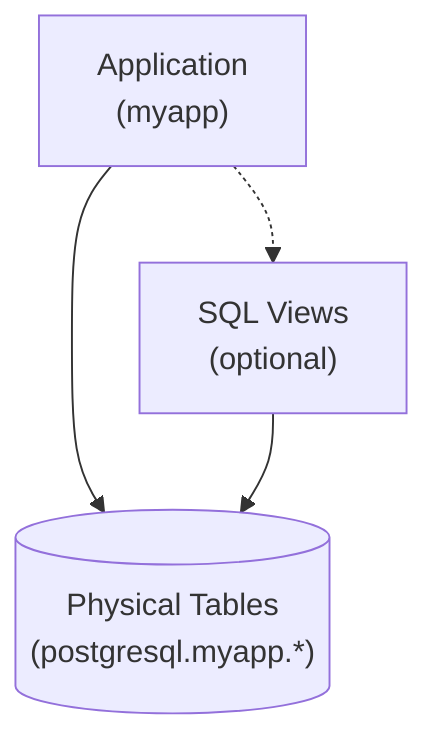
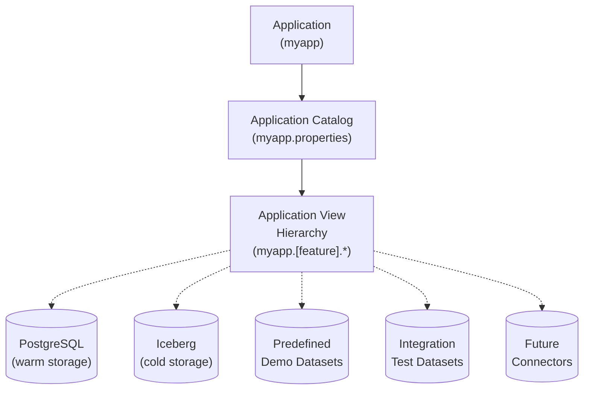
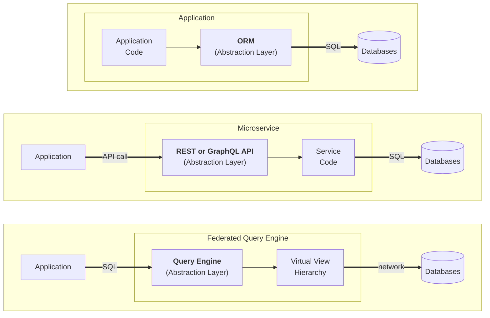
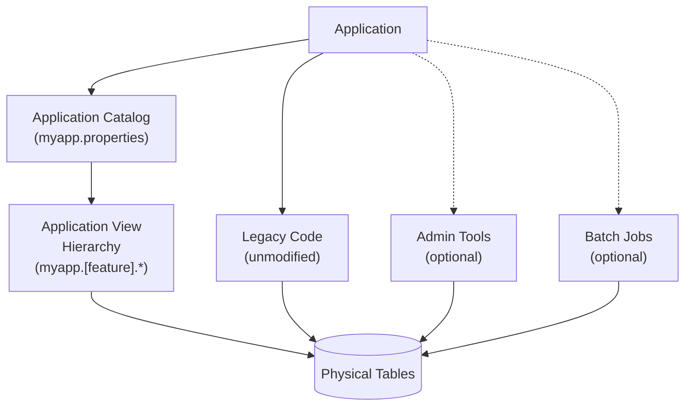
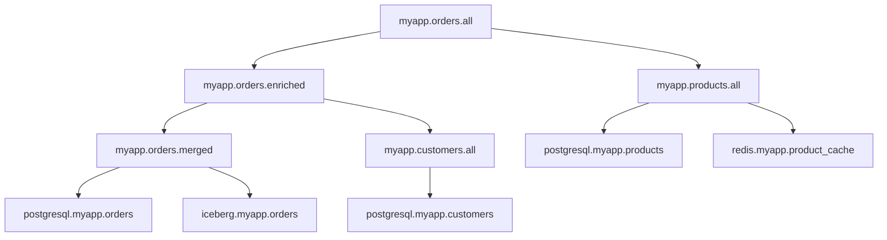
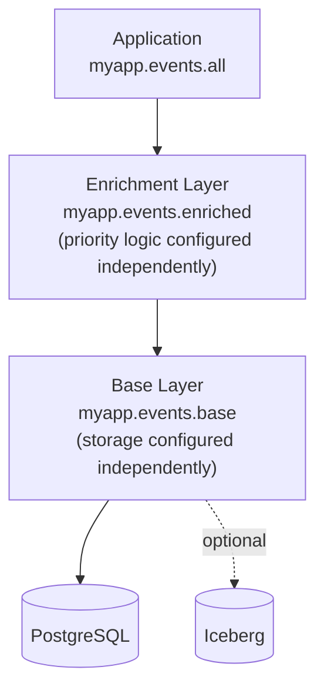
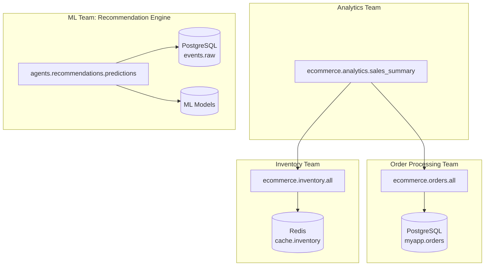
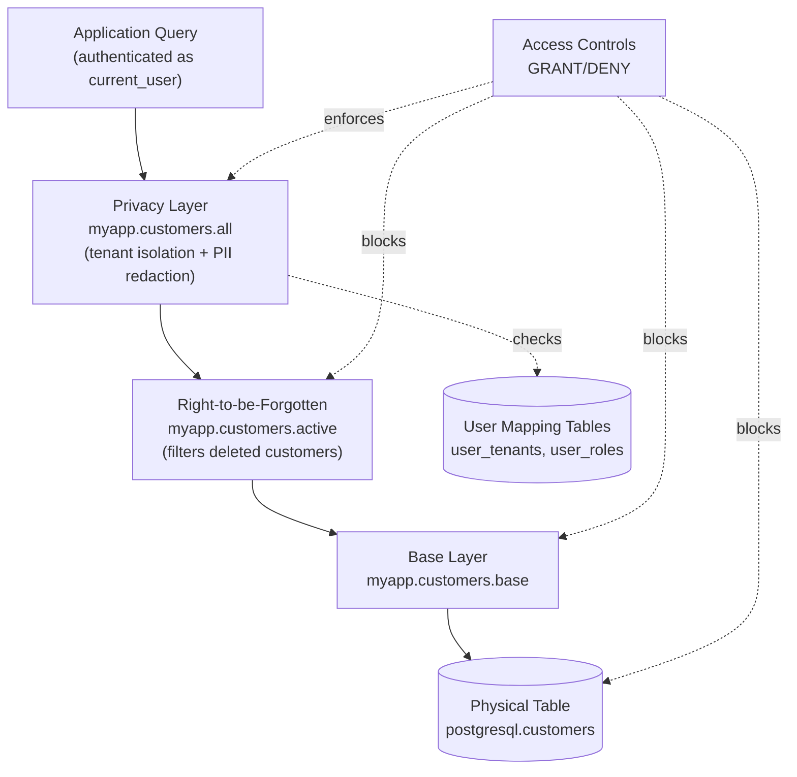

# The Virtual View Manifesto
**Stop treating SQL views like decoration. Start using them as your application's data contract.**

Classical SQL views are boring schema decoration for hiding joins, adding computed columns, and enforcing permissions. **Virtual views** are different. They're architectural components that decouple applications and agents from physical storage, enable prototyping and testing with static data, allow seamless migration to Iceberg, and support zero-downtime schema evolution. Virtual views are layered into **hierarchies**, where any layer in the hierarchy can be replaced (even at runtime) without disrupting other layers or active queries.

For SQL-native applications and data platforms, virtual views provide an alternative to ORMs and microservices for decoupling applications and agents from physical storage. Virtual views operate at the query engine layer rather than in application code, and require no extra network calls. 

Virtual views can be implemented using Trino, Starburst Enterprise or Galaxy, Amazon Athena, Presto, and most databases that support SQL views (including PostgreSQL and MySQL). Trino is used for all examples here.

This manifesto isn't just theory, it provides practical strategies and examples to follow when introducing virtual views into your architecture, and links to free tools to discover and manage view hierarchies with Trino.

> [!CAUTION]
> This is a work in progress and is neither complete nor peer reviewed.

---

## Table of Contents

- [Introduction: Views as Architecture, Not Decoration](#introduction-views-as-architecture-not-decoration)
- [Principles of Virtual View Hierarchies](#principles-of-virtual-view-hierarchies)
- [Use Cases: When Virtual Views Shine](#use-cases-when-virtual-views-shine)
- [Common Pitfalls and Solutions](#common-pitfalls-and-solutions)
- [When NOT to Use Virtual Views](#when-not-to-use-virtual-views)
- [Related Tools](#related-tools)
- [Glossary](#glossary)

---

## Introduction: Views as Architecture, Not Decoration

### A Quick Primer on Classical SQL Views

SQL views are saved SELECT statements that can be queried like regular tables. Traditional use cases for views are hiding complexity (so that joins and other complex expressions don't have to be repeated over and over in queries) and re-shaping the rows and columns returned by queries.



**Example of hiding a join**:
```sql
CREATE VIEW customer_orders AS 
SELECT c.name, c.email, o.order_id, o.total, o.order_date
FROM postgresql.myapp.customers c 
JOIN postgresql.myapp.orders o ON c.customer_id = o.customer_id;
```

**Example of adding computed columns**:
```sql
CREATE VIEW users_enhanced AS
SELECT 
  user_id,
  first_name,
  last_name,
  first_name || ' ' || last_name as full_name,
  YEAR(CURRENT_DATE) - YEAR(birth_date) as age
FROM postgresql.myapp.users;
```

**Example of redacting sensitive data**:
```sql
-- Omit SSN column, filter to current user's data
CREATE VIEW my_profile AS
SELECT user_id, name, email, phone
FROM postgresql.myapp.users
WHERE user_id = CURRENT_USER_ID();
```

**Example of caching results (materialized views)**:
```sql
CREATE MATERIALIZED VIEW daily_sales_summary AS
SELECT 
  date_trunc('day', order_date) as day,
  SUM(total) as revenue,
  COUNT(*) as order_count
FROM postgresql.myapp.orders
GROUP BY date_trunc('day', order_date);
```

With these classical use cases, views are just icing on your physical schema to make queries a little easier. Applications mostly use physical tables, except when views are needed for security or convenience.

---

### The Cost of Tight Coupling to Physical Schemas

When applications query physical schemas directly, tight coupling creates friction:
- Applications must know which connector(s) to query
- Views live in the same database/connector as their tables
- Migrating storage means changing queries wherever they appear

**Example of the migration problem**:
```sql
-- Application queries PostgreSQL directly
SELECT * FROM postgresql.myapp.customers;

-- Want to move to Iceberg? Change the query...
SELECT * FROM iceberg.myapp.customers;

-- Have data in both? Handle the complexity...
SELECT * FROM postgresql.myapp.customers WHERE active = true
UNION ALL
SELECT * FROM iceberg.myapp.customers WHERE active = false;
```

---

### The Virtual View Approach

Unlike physical tables and traditional views, virtual views are organized by application or feature, designed to be replaced with different implementations while maintaining the same interface. Virtual views decouple applications from physical storage, through layers of views that can evolve independently, even dynamically at runtime.

Virtual views are always:
- **Application-first** - Named by application domain or feature, not storage technology
- **Detached from physical schemas** - Views are used for most application queries, not physical tables
- **Layered into hierarchies** - Views depend on other views, creating swappable layers
- **Independently replaceable** - Each layer can be swapped without affecting others
- **Multi-connector capable** - Each layer can use one or more (real or fake) data sources



---

### Why Not Just Use ORMs or Microservices?

Decoupling through ORMs or microservices absolutely works. If every database query flows through application code, then virtual views may not add value.

**When ORMs/Microservices are sufficient:**
- All data access goes through application code
- Query patterns are simple CRUD operations
- Single database, no federation needed
- Team prefers application-layer abstraction

**When virtual views complement or replace them:**
- SQL is your native query language (analytics, BI tools, SQL-heavy apps)
- Need to federate across multiple databases
- Want environment switching without code deployment
- Need independent evolution of data and application layers

Virtual views operate at the query engine layer. For SQL-native applications, this provides abstraction without serialization overhead, or compounding network hops between microservices.



> [!TIP]
> As architectural patterns, virtual views and microservices aren't mutually exclusive. Microservices that query SQL databases directly (without ORMs) can benefit from virtual views just as much as larger applications. Building microservices on top of virtual views provides decoupling at both the service boundary and the data access layer, and is simpler than introducing an ORM.

---

## Principles of Virtual View Hierarchies

1. [Virtual Views Belong to Applications, Not Physical Schemas](#principle-1-virtual-views-belong-to-applications-not-physical-schemas)
2. [Every Virtual View Has Multiple Versions](#principle-2-every-virtual-view-has-multiple-versions)
3. [Applications Query Virtual Views (Usually)](#principle-3-applications-query-virtual-views-usually)
4. [Assign One Owner Per Virtual View](#principle-4-assign-one-owner-per-virtual-view)
5. [Never Change Column Types](#principle-5-never-change-column-types)
6. [Use Invoker Permissions](#principle-6-use-invoker-permissions)
7. [Store Views in a Canonical Location](#principle-7-store-views-in-a-canonical-location)
8. [Map Complexity, Don't Memorize It](#principle-8-map-complexity-dont-memorize-it)

---

### Principle 1: Virtual Views Belong to Applications, Not Physical Schemas

**Rule**: Organize views by application or feature, not by physical data source.

**Why**: Physical schemas reflect storage concerns. Applications have different concerns. When views mirror physical schema organization, they are rigid and provide no abstraction value. Instead, assume that virtual views can use data from zero to many databases, and keep virtual views in catalogs of their own.

**Simple example**:
```sql
-- Good: Organized by application, by feature (customers)
CREATE VIEW myapp.customers.active AS ...

-- Bad: View stored in physical schema with tables
CREATE VIEW postgresql.myapp.active_customers AS
SELECT ... FROM postgresql.myapp.tbl_cust
```

**Realistic example**:
```sql
-- Application: E-commerce platform
-- Features: order processing, inventory, analytics

-- Good: Organized by app, then feature
CREATE VIEW myapp.orders.current AS ...
CREATE VIEW myapp.orders.historical AS ...
CREATE VIEW myapp.products.catalog AS ...
CREATE VIEW myapp.products.pricing AS ...
CREATE VIEW myapp.stock.available AS ...
CREATE VIEW myapp.stock.reserved AS ...

-- Bad: Separate catalog for views, but still mirrors physical schema
CREATE VIEW postgresql_views.myapp.orders AS
SELECT ... FROM postgresql.myapp.tbl_ord
```

**Implementation**:
- Create application-specific catalogs (`myapp`, `feature_analytics`, `ecommerce`)
- Create feature-specific schemas (`customers`, `logging`, `preferences`)
- Use domain-specific language in all names (`customer_orders`, not `table_23_denorm`)
- Avoid naming virtual schemas to directly mirror physical schemas (like `postgresql_virtual.xxx`)

---

### Principle 2: Every Virtual View Has Multiple Versions

**Rule**: Design each view expecting to be replaced with static versions (for testing), live versions (for development, staging, production) and hybrid versions (for migrations or future integrations). Assume that view definitions will change at runtime, not just during upgrades or when applications are offline.

**Why**: Enables prototyping, testing, and seamless migrations, with current and future data sources. If a view only ever has one definition, you're not using this pattern to its full potential.

**Simple example (providing data for development and testing)**:
```sql
-- Good static data: typical values
CREATE VIEW myapp.users.all SECURITY INVOKER AS
SELECT * FROM (VALUES
  (1, 'alice', 'alice@example.com'),
  (2, 'bob', 'bob@example.com')
) AS t (id, name, email);

-- Edge case static data: boundary conditions for testing
CREATE OR REPLACE VIEW myapp.users.all SECURITY INVOKER AS
SELECT * FROM (VALUES
  (1, 'alice', 'alice@example.com'),
  (9223372036854775807, 'max_id_user', 'test@example.com'),
  (3, NULL, 'no-name@example.com'),
  (4, 'unicode_user', 'emoji-👋@example.com')
) AS t (id, name, email);
```

**Realistic example (moving from prototype to live database)**:
```sql
-- Version 1: Prototype with static data
CREATE VIEW myapp.orders.all SECURITY INVOKER AS
SELECT * FROM (VALUES
  (1, 101, TIMESTAMP '2024-01-15 10:30:00', 'pending'),
  (2, 102, TIMESTAMP '2024-01-16 14:22:00', 'shipped'),
  (3, 101, TIMESTAMP '2024-01-17 09:15:00', 'delivered')
) AS t (order_id, customer_id, order_time, status);

-- Version 2: Replace with live database when ready
CREATE OR REPLACE VIEW myapp.orders.all SECURITY INVOKER AS
SELECT
  CAST(order_id AS BIGINT) as order_id,
  CAST(customer_id AS BIGINT) as customer_id,
  CAST(order_time AS TIMESTAMP(3)) as order_time,
  CAST(status AS VARCHAR) as status
FROM postgresql.myapp.orders;
```

**Advanced example (swappable view layers in a hierarchy)**:
```sql
-- Owned by data engineering, updated during migrations
CREATE OR REPLACE VIEW myapp.users.merged SECURITY INVOKER AS ...

-- Owned by privacy system, updated when policies change
CREATE OR REPLACE VIEW myapp.users.filtered SECURITY INVOKER AS
SELECT ... FROM myapp.users.merged

-- Owned by dev team, updated during releases
CREATE OR REPLACE VIEW myapp.users.all SECURITY INVOKER AS
SELECT ... FROM myapp.users.filtered;

-- Applications use entry point when querying
SELECT ... FROM myapp.users.all ...

-- Now replace merge layer with a new version, without changing any other layers 🤩
-- Doesn't disrupt application entry point, no queries canceled or restarted here
CREATE OR REPLACE VIEW myapp.users.merged SECURITY INVOKER AS (new data sources)
```

**Implementation**:
- Start new projects and feature prototypes with static data views
- Keep test views in version control alongside production definitions
- Think through the progression from staging to production to possible future data providers
- Use views as designated entry points for application queries
- Add swappable layers for specific features or use-cases as they arise

> [!CAUTION]
> The core idea of being able to replace layers in a virtual view hierarchy, without having to rebuild the entire hierarchy, is not standardized in ANSI/ISO SQL. Runtime behaviors when replacing views do vary between database systems. Existing standards generally assume that view definitions are frozen at creation time and only updated during migrations (when applications are offline).

> [!CAUTION]
> This manifesto admittedly relies on multi-database platforms like Trino as the "practical standard" for how view replacement at runtime should behave. Even the most restrictive platforms (like Postgresql) generally allow views to be replaced if the column types do not change. But error handling and type checking varies by platform, so take care to validate these details when implementing virtual view hierarchies.

---

### Principle 3: Applications Query Virtual Views (Usually)

**Rule**: Applications should reference virtual views by default to get all the benefits of this pattern. Direct physical table access is acceptable for legacy code and performance-critical paths.

**Why**: Enables major storage changes without major application changes, but recognizes pragmatic constraints of real systems. Use virtual views for new code and high-value refactoring, and direct access when necessary. Both approaches can coexist peacefully, using standard SQL in each case.



**When direct access is acceptable**:
- Legacy applications too costly to refactor
- Administrative, operational or reporting jobs
- Large queries or batch jobs with specific performance hints
- Ultra-low-latency requirements where view overhead matters (rare)

**When virtual views are preferred**:
- New development of major features
- High-level APIs and user-facing queries
- Features likely to need storage virtualization in the future
- Anywhere flexibility matters more than microseconds

**Simple example**:
```sql
-- Use virtual view (preferred, hides filtering for active customers)
SELECT * FROM myapp.customers.active

-- Use direct access (same query results, but not virtualized)
SELECT * FROM postgresql.myapp.customers WHERE active = true
```

**Realistic example**:
```sql
-- API endpoint (uses virtual view for flexibility)
@GetMapping("/orders")
public List<Order> getOrders() {
    return jdbc.query(
        "SELECT * FROM myapp.orders.pending WHERE user_id = ?", userId
    );
}

-- Nightly batch job (uses direct access for performance)
@Scheduled(cron = "0 2 * * *")
public void generateReports() {
    // Direct access acceptable - runs once daily, performance critical
    // 10M+ rows, needs partition pruning optimization
    return jdbc.query(
        "SELECT * FROM iceberg.warehouse.orders_partitioned " +
        "WHERE order_date = ? AND partition_key = ?", date, partition
    );
}
```

**Implementation**:
- For new code and new features, use virtual views by default
- For legacy code, migrate opportunistically during refactors
- Document what paths use direct access and why

---

### Principle 4: Assign One Owner Per Virtual View

**Rule**: Assign each layer in a virtual view hierarchy to a single actor, agent or team. Always coordinate changes through this owner.

**Why**: Prevents race conditions, conflicting updates, and unclear responsibility. Views have no locking mechanism during definition replacement, and queries won't be canceled or restarted if definitions change.

**Simple example**:
```sql
-- Owned by data engineering, updated during migrations
CREATE VIEW myapp.users.merged SECURITY INVOKER AS
SELECT id, name, email, account_type, tenant_id
FROM postgresql.myapp.users
UNION ALL
SELECT id, name, email, account_type, tenant_id
FROM iceberg.myapp.users;

-- Owned by privacy system, updated when policies change
CREATE VIEW myapp.users.filtered SECURITY INVOKER AS
SELECT id, name, email, account_type
FROM myapp.users.merged
WHERE tenant_id = current_tenant() OR is_admin();

-- Owned by dev team, updated during releases
CREATE VIEW myapp.users.all SECURITY INVOKER AS
SELECT id, name, email, account_type
FROM myapp.users.filtered;
```

**Documented example with ownership matrix**:

| Layer   | View Name              | Owner            | Update Trigger    |
|---------|------------------------|------------------|-------------------|
| Entry   | `myapp.users.all`      | Dev team         | Feature release   |
| Privacy | `myapp.users.filtered` | Privacy system   | Policy change     |
| Merge   | `myapp.users.merged`   | Data engineering | Storage migration |

**Implementation**:
- Document layer ownership in team wiki or repository README
- Use synchronized/coordinated access for programmatic updates
- Avoid concurrent modifications to same view definition

> [!CAUTION]
> Trino has no locking mechanism for `ALTER VIEW` or `CREATE OR REPLACE VIEW` statements. Queries use the view definition active when query planning occurs. Replacing a view doesn't terminate or restart running queries using the old definition.

---

### Principle 5: Never Change Column Types

**Rule**: When replacing a view definition, avoid changing column types. It's a good habit to explicitly set column types using `CAST` whenever new columns are declared in a view.

**Why**: Accidentally changing column types is the easiest way to break a view hierarchy. Trino does NOT validate types when replacing views. Breaking changes only surface at query time, potentially in production.

**Working example with `CAST`**:
```sql
-- Original view
CREATE VIEW myapp.events.all SECURITY INVOKER AS
SELECT
  CAST(id AS BIGINT) as event_id,
  CAST(name AS VARCHAR) as event_name
FROM postgresql.myapp.events;

-- Good replacement: types preserved
CREATE OR REPLACE VIEW myapp.events.all SECURITY INVOKER AS
SELECT
  CAST(event_id AS BIGINT) as event_id,
  CAST(event_name AS VARCHAR) as event_name
FROM iceberg.myapp.events;
```

**Breaking example with cascading failure**:
```sql
-- Base view (originally BIGINT)
CREATE VIEW myapp.events.base SECURITY INVOKER AS
SELECT
  CAST(id AS BIGINT) as event_id,
  CAST(timestamp AS TIMESTAMP(3)) as event_time
FROM postgresql.myapp.events;

-- Dependent view (expects BIGINT)
CREATE VIEW myapp.events.hourly SECURITY INVOKER AS
SELECT
  event_id,
  date_trunc('hour', event_time) as hour,
  count(*) as event_count
FROM myapp.events.base
GROUP BY event_id, date_trunc('hour', event_time);

-- Someone changes base view type
CREATE OR REPLACE VIEW myapp.events.base SECURITY INVOKER AS
SELECT
  CAST(id AS VARCHAR) as event_id,  -- Now VARCHAR!
  CAST(timestamp AS TIMESTAMP(3)) as event_time
FROM iceberg.myapp.events;

-- Query breaks with cryptic error:
-- "Cannot apply operator: bigint = varchar" when joining
-- or "Invalid cast from varchar to bigint" in aggregations
```

**Implementation**:
- Use explicit `CAST` in base layers to lock types
- Consider using Iceberg types even in base views if Iceberg is a future target
- Document expected types in view comments or external documentation
- If you MUST change types, use a phased approach

**When you must change types**:
1. Create new view with new name (`myapp.events_v2`)
2. Deprecate old view (add comment, log warnings)
3. Migrate consumers gradually
4. Monitor old view usage until zero
5. Remove old view

---

### Principle 6: Use Invoker Permissions

**Rule**: Define virtual views with `SECURITY INVOKER` to avoid granting excessive access through views.

**Why**: Views with `SECURITY DEFINER` (the default in some systems) give all users the view creator's permissions, becoming a privilege escalation vector.

**Simple example**:
```sql
-- Preferred: Users need permissions to underlying tables
CREATE VIEW myapp.users.all
SECURITY INVOKER
AS SELECT id, name, email FROM postgresql.myapp.users;

-- Avoid: All users get view creator's permissions
CREATE VIEW myapp.users.all
SECURITY DEFINER
AS SELECT id, name, email FROM postgresql.myapp.users;
```

**Realistic example**:
```sql
-- Scenario: View spans multiple sources with different permissions

-- Sales team should only see aggregated data
CREATE VIEW myapp.sales.revenue_summary
SECURITY INVOKER
AS SELECT 
  date_trunc('month', order_date) as month,
  SUM(total) as revenue
FROM postgresql.finance.orders  -- Finance team has access, sales team does not
GROUP BY date_trunc('month', order_date);

-- With SECURITY INVOKER:
-- * Finance team: Can query the view (they have access to underlying table)
-- * Sales team: Cannot query the view (they lack access to finance.orders)

-- With SECURITY DEFINER:
-- * Both teams can query the view (using view creator's permissions)
-- * Violates principle of least privilege
```

**Implementation**:
- Default to `SECURITY INVOKER` for all virtual views
- Document permission requirements for each view
- Test views with user accounts that have minimal permissions
- Consider using `SECURITY DEFINER` only for controlled privilege escalation with strong justification

> [!TIP]
> Trino's default behavior may vary by connector. Always specify explicitly, like all our examples.

---

### Principle 7: Store Views in a Canonical Location

**Rule**: Choose one authoritative connector for virtual view storage and commit to it, or use [ViewZoo](https://github.com/robfromboulder/viewzoo) to store current and future views with minimal overhead.

**Why**: View definitions must always be persisted somewhere, even when views are backed by static data (and there are no real data sources).

**Recommended decision tree**:
```
Do you already use Iceberg?
├─ Yes → Store views in Iceberg connector
│         (Views live alongside data, one system to manage)
│
└─ No → Will you definitely use Iceberg within 6 months?
    ├─ Yes → Store views in Iceberg connector now
    │         (Prepare for eventual data migration)
    │
    └─ No → Need maximum flexibility?
        ├─ Yes → Store views in ViewZoo connector
        │         (Filesystem-based, no external dependencies)
        │         (Git integration for version control)
        │
        └─ No → Use your most stable connector
                  (PostgreSQL, MySQL, whatever won't disappear)
                  (Use ViewZoo for testing edge cases)
```

**Implementation**:
- Choose storage location during project setup
- Document the decision in project wiki or README
- If migrating storage later, use `SHOW CREATE VIEW` to export/import definitions

**Link to ViewZoo documentation**: [github.com/robfromboulder/viewzoo](https://github.com/robfromboulder/viewzoo)

---

### Principle 8: Map Complexity, Don't Memorize It

**Rule**: Use tools like [ViewMapper](https://github.com/robfromboulder/viewmapper) to discover and visualize view dependencies rather than expecting humans to parse view definitions and track relationships mentally.

**Why**: View hierarchies become complex quickly. SQL definitions don't show the dependency graph. `SHOW CREATE VIEW` is for debugging, not understanding architecture. Traditional ERD tools aren't a big help.

**Simple example**:
```sql
-- These four views form a hierarchy, but how?
CREATE VIEW myapp.users.base SECURITY INVOKER AS
  SELECT * FROM postgresql.myapp.users;
CREATE VIEW myapp.users.enriched SECURITY INVOKER AS
  SELECT * FROM myapp.users.base;
CREATE VIEW myapp.users.filtered SECURITY INVOKER AS
  SELECT * FROM myapp.users.enriched;
CREATE VIEW myapp.users.all SECURITY INVOKER AS
  SELECT * FROM myapp.users.filtered;

-- SHOW CREATE VIEW only shows one level at a time
-- Developers must manually trace dependencies
```

**Realistic example (but still small)**:
```sql
-- 10+ views spanning multiple layers
-- Some views join multiple sources
-- Manual tracking becomes difficult, even at this scale

myapp.orders.all (entry)
  ├─ depends on myapp.orders.enriched
  │   ├─ depends on myapp.orders.merged
  │   │   ├─ depends on postgresql.myapp.orders
  │   │   └─ depends on iceberg.myapp.orders
  │   └─ depends on myapp.customers.all
  │       └─ depends on postgresql.myapp.customers
  └─ depends on myapp.products.all
      ├─ depends on postgresql.myapp.products
      └─ depends on redis.myapp.product_cache
```

**Implementation**:
- Use tools to generate dependency diagrams
- Keep generated diagrams in documentation (Git repository)
- Regenerate after significant changes
- Include diagrams in code review for view changes

**Example ViewMapper output**:


**Link to ViewMapper**: [github.com/robfromboulder/viewmapper](https://github.com/robfromboulder/viewmapper)

---

## Use Cases: When Virtual Views Shine

1. [Rapid Prototyping](#use-case-1-rapid-prototyping)
2. [Testing Data Edge Cases](#use-case-2-testing-data-edge-cases)
3. [Live Schema Reconfiguration](#use-case-3-live-schema-reconfiguration)
4. [Modular Storage for Features and Agents](#use-case-4-modular-storage-for-features-and-agents)
5. [Zero-Downtime Schema Evolution](#use-case-5-zero-downtime-schema-evolution)
6. [Privacy Filtering and Compliance](#use-case-6-privacy-filtering-and-compliance)
7. [Extending Applications to Iceberg](#use-case-7-extending-applications-to-iceberg)

---

### Use Case 1: Rapid Prototyping

**The Challenge**: Build, integrate, and demonstrate new applications or new features, without having to first invest time in provisioning new databases, designing physical schemas or implementing data pipelines.

**The Solution**: Define static datasets that enable UI and workflow development, system integrations, and stakeholder demos without prematurely implementing physical schemas, or even committing to a specific database platform for storage yet.

**Simple example** (prototyping a new application):
```sql
-- Day 1: No database yet, use static data
CREATE OR REPLACE VIEW myapp.customers.all SECURITY INVOKER AS
SELECT * FROM (VALUES
  (1, 'Acme Corp', 'acme@example.com'),
  (2, 'Widgets Inc', 'widgets@example.com'),
  (3, 'Gadgets LLC', 'gadgets@example.com')
) AS t (customer_id, company_name, email);
-- New application development proceeds
-- UI, workflows, integrations all work against this view

-- Day 15: Decision made to use Postgresql instead of MySQL
-- Application code: unchanged! 😀

-- Day 30: Database ready, swap in real data
CREATE OR REPLACE VIEW myapp.customers.all SECURITY INVOKER AS
SELECT
  CAST(id AS BIGINT) as customer_id,
  CAST(name AS VARCHAR) as company_name,
  CAST(email AS VARCHAR) as email
FROM postgresql.myapp.customers;
-- Application code: unchanged! 😀
```

**Realistic example** (adding a new feature to an existing application):
```sql
-- Prototyping a new analytics feature
-- Requires joining customer, order, and product data
-- Some tables don't exist yet, some APIs not ready

-- Start with mock data for all sources
CREATE OR REPLACE VIEW analytics.reports.customer_lifetime_value SECURITY INVOKER AS
SELECT
  customer_id,
  SUM(order_total) as lifetime_value,
  COUNT(*) as order_count,
  MAX(order_date) as last_order_date
FROM (VALUES
  (1, 100.00, DATE '2024-01-01'),
  (1, 250.00, DATE '2024-02-15'),
  (2, 75.00, DATE '2024-01-10'),
  (2, 125.00, DATE '2024-02-20'),
  (2, 200.00, DATE '2024-03-01')
) AS mock_orders (customer_id, order_total, order_date)
GROUP BY customer_id;

-- Build dashboards, demonstrate workflows, validate with stakeholders
-- Only implement real data pipelines after prototype is approved

-- Later: Swap to real, complex query
CREATE OR REPLACE VIEW analytics.reports.customer_lifetime_value SECURITY INVOKER AS
SELECT
  c.customer_id,
  SUM(o.total) as lifetime_value,
  COUNT(o.order_id) as order_count,
  MAX(o.order_date) as last_order_date
FROM postgresql.myapp.customers c
JOIN postgresql.myapp.orders o ON c.customer_id = o.customer_id
WHERE o.status IN ('completed', 'shipped')
GROUP BY c.customer_id;
```

**Benefits**:
- Start building and verifying before physical data sources are ready
- Verify requirements with stakeholders using realistic UI, workflows, and integrations
- Keep demo dataset definitions under source control as SQL statements 
- Rely on predictable, fast performance for small prototype datasets
- Delay implementation and optimization of physical schema until features have jelled
- Smooth out transitions between prototypes and fully working implementations

> [!TIP]
> Writing static datasets in SQL syntax can be tedious, but Claude and other AI copilots excel at generating realistic demo data, especially for larger datasets with diverse, believable values.

> [!TIP]
> For Trino users: The [Google Sheets connector](https://trino.io/docs/current/connector/googlesheets.html) and [faker connector](https://trino.io/docs/current/connector/faker.html) enable creative options for implementing static datasets, without writing SQL VALUES clauses.

---

### Use Case 2: Testing Data Edge Cases

**The Challenge**: Perform regular testing of application behaviors for common edge cases (like null values, invalid enums, duplicate keys, and broken foreign keys) before physical schemas exist, or when schemas are already configured to reject these values. Some frameworks and methods rely on disabling column or foreign key checks (literally using `ALTER TABLE` to relax these constraints), but this is awkward and doesn't reflect the normal state of the system.

**The Solution**: Use view definitions with deliberately invalid values that violate database constraints, and easily swap between these static datasets in your automated tests, without re-provisioning databases or relaxing any normal schema constraints. 

**Simple example (testing column-level checks)**:
```sql
-- Normal view used for most tests
CREATE OR REPLACE VIEW myapp.products.all SECURITY INVOKER AS
SELECT
  CAST(product_id AS BIGINT) as product_id,
  CAST(name AS VARCHAR) as name,
  CAST(price AS DECIMAL(10,2)) as price,
  CAST(inventory_count AS INTEGER) as inventory_count
FROM postgresql.myapp.products;

-- Test view used to validate edge cases
CREATE OR REPLACE VIEW myapp.products.all SECURITY INVOKER AS
SELECT * FROM (VALUES
  (1, 'Normal Product', 10.00, 100),
  (2, 'Zero Price', 0.00, 50),          -- Edge case
  (3, 'Negative Inventory', 5.00, -10), -- Edge case
  (4, NULL, 15.00, 20),                 -- NULL name
  (5, 'Very Long Name That Might Break UI Components Because It Is Extremely Long', 15.00, 5)
) AS t (product_id, name, price, inventory_count);
```

**Realistic example (testing broken foreign keys)**:

```sql
-- Parent table: departments
CREATE OR REPLACE VIEW myapp.departments AS
SELECT * FROM (VALUES
(1, 'Engineering', 'alice@example.com'),
(2, 'Sales', 'sales-mgr@example.com')
) AS t (id, name, manager_email);

-- Child table: employees with foreign key to departments
CREATE OR REPLACE VIEW myapp.employees AS
SELECT * FROM (VALUES
(101, 'Alice Chen', 1),      -- Valid: department_id=1 exists
(102, 'Bob Smith', 99)       -- Invalid: department_id=99 doesn't exist
) AS t (id, name, department_id);
```

**Benefits**:
- Exercise invalid column and foreign key values without relaxing schema constraints
- Integrate tightly with automated test cases and keep test data under version control
- Rely on predictable, fast performance for small test datasets
- Run more tests in parallel (since tests don't need to restart the database with different constraints)
- Reduce risk of accidentally applying `ALTER TABLE` modifications to production databases

> [!TIP]
> For Trino users: The [ViewZoo connector](https://github.com/robfromboulder/viewzoo) allows reading and writing views in JSON format to the local filesystem, which is convenient for temporary storage of views while running tests in isolation, or when storing test view definitions in separate git repositories or branches.

> [!CAUTION]
> This discussion is for **functional testing** of data edge cases, not performance or load testing. For testing query performance at scale, use real infrastructure with representative data volumes.

---

### Use Case 3: Live Schema Reconfiguration

**The Challenge**: Dynamically alter and adapt data sources based on environment, feature flags, or runtime configuration, without redeploying application code or interrupting application queries.

**The Solution**: Use view hierarchies where layers can be independently replaced, and coordinate changes to each layer through a single owner or team.

**Simple example (switching data providers)**:
```python
def configure_base_layer(config):
    """Update view definitions based on current configuration"""

    if config.environment == 'staging':
        # Staging database
        execute_sql("""
            CREATE OR REPLACE VIEW myapp.events.base SECURITY INVOKER AS
            SELECT * FROM postgresql.staging.events
        """)
    elif config.environment == 'production' and config.feature_flags.get('use_iceberg'):
        # Production with Iceberg hybrid (hot + cold storage)
        execute_sql("""
            CREATE OR REPLACE VIEW myapp.events.base SECURITY INVOKER AS
            SELECT * FROM postgresql.prod.events
            WHERE event_time > CURRENT_DATE - INTERVAL '7' DAYS
            UNION ALL
            SELECT * FROM iceberg.warehouse.events
            WHERE event_time <= CURRENT_DATE - INTERVAL '7' DAYS
        """)
    else:
        # Production PostgreSQL only
        execute_sql("""
            CREATE OR REPLACE VIEW myapp.events.base SECURITY INVOKER AS
            SELECT * FROM postgresql.prod.events
        """)

# Called at application startup, or whenever config changes 😀
configure_base_layer(current_config)
```

**Realistic example (computed columns with runtime business logic)**:

A. Define a three-layer hierarchy with independent configuration points

```sql
-- Base layer: physical data source (initialized via configure_base_layer above)

-- Enrichment layer: adds computed priority column (configurable)
CREATE OR REPLACE VIEW myapp.events.enriched SECURITY INVOKER AS
SELECT
  *,
  'unknown' as priority  -- Default: everything is unknown priority
FROM myapp.events.base;

-- Application layer: stable interface
CREATE OR REPLACE VIEW myapp.events.all SECURITY INVOKER AS
SELECT * FROM myapp.events.enriched;
```



B. Configure the enrichment layer independently to change how priority is computed

```python
def configure_priority_logic(priority_config):
    """Dynamically reconfigure priority computation without application restart"""

    if priority_config.mode == 'simple':
        # Simple type-based priority
        execute_sql("""
            CREATE OR REPLACE VIEW myapp.events.enriched SECURITY INVOKER AS
            SELECT
              *,
              CASE event_type
                WHEN 'error' THEN 'high'
                WHEN 'warning' THEN 'medium'
                ELSE 'low'
              END as priority
            FROM myapp.events.base
        """)

    elif priority_config.mode == 'pattern':
        # Pattern matching for critical events
        execute_sql(f"""
            CREATE OR REPLACE VIEW myapp.events.enriched SECURITY INVOKER AS
            SELECT
              *,
              CASE
                WHEN regexp_like(event_type, '{priority_config.critical_pattern}')
                  THEN 'critical'
                WHEN regexp_like(event_type, '{priority_config.high_pattern}')
                  THEN 'high'
                ELSE 'low'
              END as priority
            FROM myapp.events.base
        """)

    elif priority_config.mode == 'multifactor':
        # Multi-factor priority based on type, source, and payload
        execute_sql(f"""
            CREATE OR REPLACE VIEW myapp.events.enriched SECURITY INVOKER AS
            SELECT
              *,
              CASE
                -- Critical: errors from production systems with specific payload patterns
                WHEN event_type = 'error'
                  AND source IN {priority_config.production_sources}
                  AND json_extract_scalar(payload, '$.severity') = 'fatal'
                  THEN 'critical'
                -- High: errors from production, or warnings with escalation flag
                WHEN (event_type = 'error' AND source IN {priority_config.production_sources})
                  OR (event_type = 'warning' AND json_extract_scalar(payload, '$.escalate') = 'true')
                  THEN 'high'
                -- Medium: warnings from production
                WHEN event_type = 'warning'
                  AND source IN {priority_config.production_sources}
                  THEN 'medium'
                -- Low: everything else
                ELSE 'low'
              END as priority
            FROM myapp.events.base
        """)
```

C. Example configurations at runtime

```python
# Simple type-based priority
configure_priority_logic(PriorityConfig(mode='simple'))

# Pattern-based priority (incidents with specific keywords)
configure_priority_logic(PriorityConfig(
    mode='pattern',
    critical_pattern='(outage|breach|down)',
    high_pattern='(degraded|slow|timeout)'
))

# Multi-factor priority (production context matters)
configure_priority_logic(PriorityConfig(
    mode='multifactor',
    production_sources="('api-gateway', 'payment-processor', 'auth-service')"
))
```

> [!IMPORTANT]
> `configure_base_layer()` and `configure_priority_logic()` operate on different layers independently. The base layer can switch between storage backends while the enrichment layer's business logic remains unchanged, or vice versa.

**Benefits**:
- Allow applications to dynamically control data sources and data policies
- Easily enrich data sources with configurable custom functions
- Seamlessly switch between single and multiple data sources
- Configure base storage and data enrichment views independently
- Change data sources and policies without restarting Trino or applications
- Scale out to multiple layers (base → transform → filter → application) with minimal overhead

> [!CAUTION]
> The easiest way to break an existing view hierarchy is by accidentally changing column types. Using `CAST` to specify column types is a good habit.

---

### Use Case 4: Modular Storage for Features and Agents

**The Challenge**: Teams need independent control over designing, implementing, and migrating their databases and view hierarchies, without unexpectedly blocking or breaking work by other teams.

**The Solution**: Create isolated view hierarchies per feature or agent, enabling teams to develop, test, and deploy their data layers independently with less cross-team coordination. New features and agents often need data that doesn't naturally align to existing tables or view schemas. Virtual views let teams define new base layers tailored to their specific requirements, then build hierarchies on top without constantly relitigating physical infrastructure.

**Example**:
```sql
-- Feature 1: Order Processing (owned by checkout team)
CREATE OR REPLACE VIEW ecommerce.orders.all SECURITY INVOKER AS
SELECT
  order_id, customer_id, order_date, status, total
FROM postgresql.myapp.orders;

-- Feature 2: Inventory Management (owned by warehouse team)
CREATE OR REPLACE VIEW ecommerce.inventory.all SECURITY INVOKER AS
SELECT
  product_id, warehouse_id, quantity_available, last_updated
FROM redis.cache.inventory;

-- Feature 3: Analytics (owned by data team, references other teams' views)
CREATE OR REPLACE VIEW ecommerce.analytics.sales_summary SECURITY INVOKER AS
SELECT
  o.order_date,
  COUNT(*) as order_count,
  SUM(o.total) as revenue,
  COUNT(DISTINCT i.product_id) as products_sold
FROM ecommerce.orders.all o
JOIN ecommerce.inventory.all i ON o.product_id = i.product_id
GROUP BY o.order_date;

-- Agent: Recommendation Engine (owned by ML team, custom base layer)
CREATE OR REPLACE VIEW agents.recommendations.predictions SECURITY INVOKER AS
SELECT
  user_id,
  product_id,
  prediction_score,
  model_version
FROM (
  -- Custom base layer filtering and transforming raw events
  SELECT
    user_id,
    event_type,
    product_id,
    json_extract_scalar(payload, '$.session_id') as session_id
  FROM postgresql.events.raw
  WHERE event_type IN ('view', 'click', 'purchase')
) events
JOIN ml_models.trained_model ON ...;
```

**Architecture visualization**:


**Benefits**:
- Use views as data contracts between teams just as between applications
- Build and maintain related applications across multiple teams with greater autonomy and less friction
- Understand scope and blast radius of changes more easily, especially those with trickle-down effects
- De-provision agents simply by dropping view hierarchies without changing permissions on physical tables

> [!TIP]
> Use mapping tools like [ViewMapper](https://github.com/robfromboulder/viewmapper) or use `SHOW CREATE VIEW catalog.schema.view` to inspect current view definitions and understand team contracts. The database should be the single source of truth for how hierarchies are structured.

---

### Use Case 5: Zero-Downtime Schema Evolution

**The Challenge**: Schema evolution usually requires coordinating changes across teams, maintaining backward compatibility during transitions, and rehearsing migrations in production-like environments. Traditional approaches involve extensive planning, off-hours deployment windows, dedicated tooling, and risk of breaking changes that affect multiple teams simultaneously.

**The Solution**: Allow teams to incrementally change their own view hierarchies or create updated copies, enabling schema migrations under direct application control, without downtime or after-hours coordination across teams.

> [!NOTE]
> Virtual views complement migration tools like Flyway and Liquibase by scoping migrations to **team-owned view hierarchies** rather than company-wide database schemas, reducing the coordination surface area and blast radius of changes.

**Simple example (renaming columns)**:
```sql
-- Original physical schema (poor naming)
-- postgresql.myapp.users_v1 (columns: userid, fname, lname, addr)

-- Virtual view provides better names
CREATE OR REPLACE VIEW myapp.users.all SECURITY INVOKER AS
SELECT
  userid as user_id,
  fname as first_name,
  lname as last_name,
  addr as address
FROM postgresql.myapp.users_v1;

-- Later: Migrate to improved physical schema
-- postgresql.myapp.users_v2 (columns: user_id, first_name, last_name, street_address)

-- Update view, application unchanged
CREATE OR REPLACE VIEW myapp.users.all SECURITY INVOKER AS
SELECT
  user_id,
  first_name,
  last_name,
  street_address as address
FROM postgresql.myapp.users_v2;
```

**Realistic example (backward compatibility between stages)**:
```sql
-- V1 schema: Monolithic user table
CREATE OR REPLACE VIEW myapp.users.all SECURITY INVOKER AS
SELECT
  CAST(user_id AS BIGINT) as user_id,
  CAST(email AS VARCHAR) as email,
  CAST(first_name AS VARCHAR) as first_name,
  CAST(last_name AS VARCHAR) as last_name,
  CAST(address AS VARCHAR) as address,
  CAST(city AS VARCHAR) as city,
  CAST(state AS VARCHAR) as state,
  CAST(zip AS VARCHAR) as zip
FROM postgresql.myapp.users_v1;

-- V2 schema: Normalized into users + addresses tables
-- Keep backward compatibility during migration
CREATE OR REPLACE VIEW myapp.users.all SECURITY INVOKER AS
SELECT
  CAST(u.user_id AS BIGINT) as user_id,
  CAST(u.email AS VARCHAR) as email,
  CAST(u.first_name AS VARCHAR) as first_name,
  CAST(u.last_name AS VARCHAR) as last_name,
  CAST(a.street AS VARCHAR) as address,
  CAST(a.city AS VARCHAR) as city,
  CAST(a.state AS VARCHAR) as state,
  CAST(a.zip AS VARCHAR) as zip
FROM postgresql.myapp.users_v2 u
LEFT JOIN postgresql.myapp.addresses_v2 a
  ON u.user_id = a.user_id
  AND a.is_primary = true;

-- V3 schema: Changed email validation, need to handle legacy bad data
CREATE OR REPLACE VIEW myapp.users.all SECURITY INVOKER AS
SELECT
  CAST(u.user_id AS BIGINT) as user_id,
  CAST(
    CASE
      WHEN u.email LIKE '%@%' THEN u.email
      ELSE u.legacy_email  -- Fallback for pre-validation data
    END AS VARCHAR
  ) as email,
  CAST(u.first_name AS VARCHAR) as first_name,
  CAST(u.last_name AS VARCHAR) as last_name,
  CAST(a.street AS VARCHAR) as address,
  CAST(a.city AS VARCHAR) as city,
  CAST(a.state AS VARCHAR) as state,
  CAST(a.zip AS VARCHAR) as zip
FROM postgresql.myapp.users_v3 u
LEFT JOIN postgresql.myapp.addresses_v3 a
  ON u.user_id = a.user_id
  AND a.is_primary = true;
```

**Advanced example (multi-layer hierarchy evolution)**:

When evolving hierarchies where views depend on other views, use a clone-on-modify strategy to avoid breaking intermediate states during the transition.

```sql
-- Scenario: Deprecate ssn column in multi-layer hierarchy
-- Goal: Restructure hierarchy without breaking application contract

-- Current v1 hierarchy (reading ssn from physical table)
CREATE VIEW myapp.users_v1.base SECURITY INVOKER AS
SELECT user_id, first_name, last_name, email, ssn
FROM postgresql.myapp.users;

CREATE VIEW myapp.users_v1.enriched SECURITY INVOKER AS
SELECT
  user_id, first_name, last_name, email, ssn,
  first_name || ' ' || last_name as full_name
FROM myapp.users_v1.base;

CREATE VIEW myapp.users.all SECURITY INVOKER AS
SELECT user_id, first_name, last_name, email, ssn, full_name
FROM myapp.users_v1.enriched;

-- Step 1: Create v2 hierarchy that removes ssn internally but maintains contract
CREATE OR REPLACE VIEW myapp.users_v2.base SECURITY INVOKER AS
SELECT
  user_id, first_name, last_name, email
  -- ssn no longer read here
FROM postgresql.myapp.users;

CREATE OR REPLACE VIEW myapp.users_v2.enriched SECURITY INVOKER AS
SELECT
  user_id, first_name, last_name, email,
  CAST(NULL AS VARCHAR) as ssn,  -- maintain application contract during transition
  first_name || ' ' || last_name as full_name
FROM myapp.users_v2.base;

CREATE OR REPLACE VIEW myapp.users_v2.all SECURITY INVOKER AS
SELECT user_id, first_name, last_name, email, ssn, full_name
FROM myapp.users_v2.enriched;

-- Step 2: Atomic cutover - applications still see deprecated ssn column (but is now always NULL)
CREATE OR REPLACE VIEW myapp.users.all SECURITY INVOKER AS
SELECT * FROM myapp.users_v2.all;

-- Step 3: After cutover, clean up v1 hierarchy
DROP VIEW myapp.users_v1.enriched;
DROP VIEW myapp.users_v1.base;
```

**Benefits**:
- Scope schema evolution to team-owned or application-owned hierarchies, not company-wide coordination
- Evolve schemas with fewer application redeployments and downtime
- Support gradual migrations between parallel systems in stages
- Maintain backward compatibility during transitions

> [!TIP]
> Using explicit column lists in view definitions (rather than `SELECT *`) makes contracts clearer and gives you precise control over what each layer exposes during schema evolution. This is especially important for multi-version hierarchies to control exactly what columns are present in each version.

> [!CAUTION]
> The easiest way to break an existing view hierarchy is by accidentally changing column types. Using `CAST` to specify column types is a good habit.

---

### Use Case 6: Privacy Filtering and Compliance

**The Challenge**: Implement tenant isolation, right-to-be-forgotten filtering, and PII redaction without having to repeat these restrictions in every query.

**The Solution**: Apply system-wide privacy rules and tenant isolation using dedicated layers in view hierarchies, combined with access controls that prevent bypassing these filters. This provides a centralized filtering layer and audit point that applies automatically to all queries. Require that applications connect to Trino with authenticated database users, so views enforce filtering based on those credentials.

**Simple example (right to erasure)**:

```sql
-- GDPR Article 17: Right to Erasure
-- Pattern: exclude records with approved deletion requests
CREATE OR REPLACE VIEW myapp.users.all SECURITY INVOKER AS
SELECT u.user_id, u.email, u.name, u.created_at
FROM myapp.users.base u
LEFT JOIN postgresql.myapp.gdpr_deletion_requests d
  ON u.user_id = d.user_id
  AND d.status = 'approved'
WHERE d.user_id IS NULL;
```

**Realistic example (PII redaction within a hierarchy)**:
```sql
-- User roles mapping (managed by security team)
CREATE TABLE postgresql.myapp.user_roles (
  username VARCHAR,
  role VARCHAR  -- 'admin', 'analyst', 'viewer'
);

-- Base data layer
CREATE OR REPLACE VIEW myapp.logs.raw SECURITY INVOKER AS
SELECT
  log_id, event_type, user_id,
  user_email, ip_address, event_time
FROM postgresql.myapp.logs;

-- Privacy layer (redact PII except for admins)
CREATE OR REPLACE VIEW myapp.logs.all SECURITY INVOKER AS
SELECT
  log_id, event_type, user_id,
  -- Redact based on current user's role
  CASE
    WHEN EXISTS (
      SELECT 1 FROM postgresql.myapp.user_roles
      WHERE username = current_user AND role = 'admin'
    ) THEN user_email
    ELSE 'REDACTED'
  END as user_email,
  CASE
    WHEN EXISTS (
      SELECT 1 FROM postgresql.myapp.user_roles
      WHERE username = current_user AND role = 'admin'
    ) THEN ip_address
    ELSE 'REDACTED'
  END as ip_address,
  event_time
FROM myapp.logs.raw;

-- Access control: prevent bypassing privacy layer
GRANT SELECT ON myapp.logs.all TO ROLE app_users;
DENY SELECT ON myapp.logs.raw TO ROLE app_users;
DENY SELECT ON postgresql.myapp.logs TO ROLE app_users;
```

**Advanced example (multi-layer hierarchy with tenant isolation)**:
```sql
-- Multi-tenant SaaS application
-- Requirements: tenant isolation, right-to-be-forgotten, PII redaction

-- User-to-tenant mapping (managed by security team)
CREATE TABLE postgresql.myapp.user_tenants (
  username VARCHAR,
  tenant_id INTEGER,
  is_superuser BOOLEAN
);

-- Base data layer (all tenants, all customers)
CREATE OR REPLACE VIEW myapp.customers.base SECURITY INVOKER AS
SELECT
  customer_id, tenant_id, email, name,
  address, phone, deleted_at
FROM postgresql.myapp.customers;

-- Right-to-be-forgotten filtering layer
CREATE OR REPLACE VIEW myapp.customers.active SECURITY INVOKER AS
SELECT
  c.customer_id, c.tenant_id, c.email, c.name, c.address, c.phone
FROM myapp.customers.base c
LEFT JOIN postgresql.myapp.deletion_requests d
  ON c.customer_id = d.customer_id
  AND d.status = 'approved'
WHERE c.deleted_at IS NULL
  AND d.customer_id IS NULL;  -- exclude customers with approved deletion requests

-- Application entry point (with tenant isolation + PII redaction)
CREATE OR REPLACE VIEW myapp.customers.all SECURITY INVOKER AS
SELECT
  c.customer_id, c.email, c.name,
  -- Redact address for users without privileged role
  CASE
    WHEN EXISTS (
      SELECT 1 FROM postgresql.myapp.user_roles r
      WHERE r.username = current_user AND r.role IN ('admin', 'privileged')
    ) THEN c.address
    ELSE 'REDACTED'
  END as address,
  c.phone
FROM myapp.customers.active c
WHERE EXISTS (
  SELECT 1 FROM postgresql.myapp.user_tenants ut
  WHERE ut.username = current_user
    AND (ut.tenant_id = c.tenant_id OR ut.is_superuser = true)
);

-- Access control: only application view is accessible
GRANT SELECT ON myapp.customers.all TO ROLE app_users;
DENY SELECT ON myapp.customers.active TO ROLE app_users;
DENY SELECT ON myapp.customers.base TO ROLE app_users;
DENY SELECT ON postgresql.myapp.customers TO ROLE app_users;
```



**Benefits**:
- Centralize privacy rules in view definitions instead of repeating in application queries
- Combine with access controls to prevent bypassing privacy filters
- Update privacy rules dynamically without application redeployment
- Review view definitions as part of compliance audits
- Apply consistent filtering across multiple applications querying the same views

> [!NOTE]
> Virtual views work well when privacy rules need to span multiple federated data sources, require dynamic runtime reconfiguration, or involve complex multi-layer filtering logic.

> [!CAUTION]
> Virtual views provide **data filtering** in the query layer. They complement, but don't replace, database-native security features like row-level security (RLS), column-level permissions, and encryption. Effective privacy and compliance requires defense in depth: access controls preventing direct access to base layers, proper authentication, encryption, and audit logging.

---

### Use Case 7: Extending Applications to Iceberg

**The Challenge**: Existing application runs on PostgreSQL (or MySQL, Redis, whatever). Want to optionally add Iceberg for cost-effective long-term storage, but can't require significant rewrites to application code. Need seamless storage integration whether or not Iceberg storage is enabled, without downtime or dual codebases, and without teaching customers how to change their queries based on the storage engines used.

**The Solution**: Replace physical table references with virtual views pointing to legacy storage, then optionally add Iceberg using `UNION ALL` for historical data, and finish by implementing a replication agent (usually time based) to move old records into Iceberg when enabled. Iceberg support can be gated with a licensing check or feature flag, so that evaluation or small-scale users get PostgreSQL behind the scenes by default, but large enterprise customers can use Iceberg storage at scale (without having to install a different product version). 

**Phase 1: Establish the abstraction**

Before:
```sql
-- Application queries physical table directly
SELECT * FROM postgresql.myapp.logs WHERE event_time > ?
```

After:
```sql
-- Create virtual view as intermediary
CREATE OR REPLACE VIEW myapp.data.logs SECURITY INVOKER AS
SELECT
  CAST(id AS BIGINT) as log_id,
  CAST(event AS VARCHAR) as event_type,
  CAST(timestamp AS TIMESTAMP(3)) as event_time,
  CAST(user_id AS BIGINT) as user_id
FROM postgresql.myapp.logs;

-- Application code changes once (connection string only)
-- Now queries: SELECT * FROM myapp.data.logs WHERE event_time > ?
```

**Phase 2: Test the abstraction**

* All integration tests should pass at this point
* Performance should not be measurably different than before
* It's a good time to add automated tests for any missing data edge cases
* Might include this in a minor release ahead of the Iceberg cycle

**Phase 3: Support Iceberg in hybrid mode**

Use PostgreSQL by default, but swap in Iceberg hybrid when feature flag is enabled:
```sql
-- Union PostgreSQL (hot, recent data) with Iceberg (cold, historical)
CREATE OR REPLACE VIEW myapp.data.logs SECURITY INVOKER AS
-- Recent data still in PostgreSQL
SELECT log_id, event_type, event_time, user_id
FROM postgresql.myapp.logs
WHERE event_time > CURRENT_DATE - INTERVAL '30' DAYS
  AND replicated = false
UNION ALL
-- Historical data in Iceberg
SELECT log_id, event_type, event_time, user_id
FROM iceberg.myapp.logs
WHERE event_time <= CURRENT_DATE - INTERVAL '30' DAYS;
```

**Benefits**:
- Optionally enable Iceberg with zero application downtime
- Avoid "big bang" rewrite risk by adopting Iceberg in phases
- Roll out Iceberg integration incrementally, first as beta feature
- If Iceberg storage goes down, roll back to PostgreSQL alone by replacing view definition

> [!CAUTION]
> This manifesto doesn't attempt to cover how replication should work, Iceberg table maintenance, partition strategies, compaction, or any of those details related to Iceberg databases. Virtual views provide the **mechanism** to hide replication details away from consumers, but actually implementing the replication agent (including failure recovery) is not trivial, and is beyond the scope of this document. 

---

## Common Pitfalls and Solutions

1. [Type Mismatch Chaos](#pitfall-1-type-mismatch-chaos)
2. [Forgetting to Update Dependent Layers](#pitfall-2-forgetting-to-update-dependent-layers)
3. [Breaking Application Assumptions](#pitfall-3-breaking-application-assumptions)
4. [Permission Confusion](#pitfall-4-permission-confusion)
5. [Attempting to Delete Base Views](#pitfall-5-attempting-to-delete-base-views)
6. [Lost View Definitions](#pitfall-6-lost-view-definitions)
7. [Circular Dependencies](#pitfall-7-circular-dependencies)

---

### Pitfall 1: Type Mismatch Chaos

**Problem**: Replace view without explicit casts, types change, dependent queries break mysteriously. This is the most common problem when migrating view hierarchies or making them dynamically reconfigurable.

**Example**:
```sql
-- Original: Returns BIGINT implicitly from PostgreSQL
CREATE VIEW myapp.users.base SECURITY INVOKER AS
SELECT user_id, name, email
FROM postgresql.myapp.users;

-- Replacement: Returns INTEGER from different source (different precision)
CREATE OR REPLACE VIEW myapp.users.base SECURITY INVOKER AS
SELECT user_id, name, email
FROM mysql.myapp.users;

-- Dependent views expecting BIGINT start failing
SELECT u.user_id, o.order_id
FROM myapp.users.base u
JOIN myapp.orders.all o ON u.user_id = o.customer_id;  -- Type mismatch error
```

**Solution**: Always use explicit CAST in base views.
```sql
CREATE VIEW myapp.users.base SECURITY INVOKER AS
SELECT
  CAST(user_id AS BIGINT) as user_id,
  CAST(name AS VARCHAR) as name,
  CAST(email AS VARCHAR) as email
FROM postgresql.myapp.users;

-- Type is now locked regardless of source
CREATE OR REPLACE VIEW myapp.users.base SECURITY INVOKER AS
SELECT
  CAST(user_id AS BIGINT) as user_id,
  CAST(name AS VARCHAR) as name,
  CAST(email AS VARCHAR) as email
FROM mysql.myapp.users;
```

---

### Pitfall 2: Forgetting to Update Dependent Layers

**Problem**: Replace base view, forget middle layers exist, they break.

**Example**:
```sql
-- Base view
CREATE VIEW myapp.users.base SECURITY INVOKER AS
SELECT
  CAST(user_id AS BIGINT) as user_id,
  CAST(name AS VARCHAR) as name
FROM postgresql.myapp.users;

-- Middle layer
CREATE VIEW myapp.users.enriched SECURITY INVOKER AS
SELECT
  user_id,
  UPPER(name) as name
FROM myapp.users.base;

-- Top layer
CREATE VIEW myapp.users.all SECURITY INVOKER AS
SELECT * FROM myapp.users.enriched;

-- Replace base, add new column
CREATE OR REPLACE VIEW myapp.users.base SECURITY INVOKER AS
SELECT
  CAST(user_id AS BIGINT) as user_id,
  CAST(name AS VARCHAR) as name,
  CAST(email AS VARCHAR) as email
FROM postgresql.myapp.users;

-- Middle layer doesn't expose email!
-- Top layer consumers can't access it
```

**Solution**: Use ViewMapper to identify all dependents before making changes. Update layers bottom-up. Try migrations in a development or staging environment prior to running in production.

---

### Pitfall 3: Breaking Application Assumptions

**Problem**: View replacement changes behavior in ways application doesn't expect.

**Example**:
```sql
-- Original: Always returns rows in id order
CREATE VIEW myapp.events.all SECURITY INVOKER AS
SELECT * FROM postgresql.myapp.events
ORDER BY event_id;

-- Replacement: No ORDER BY, application breaks expecting sorted data
CREATE OR REPLACE VIEW myapp.events.all SECURITY INVOKER AS
SELECT * FROM iceberg.myapp.events;  -- No ORDER BY!
```

**Solution**:
- Use ViewMapper to identify dependency relationships
- Document view contracts (sort order, NULL behavior, uniqueness)
- Maintain behavior during replacements
- If changing behavior, update application code first
- Add ORDER BY in view if application depends on it (and verify performance)
- Consider sorting data in application code rather than views

---

### Pitfall 4: Permission Confusion

**Problem**: Users can query view but not underlying tables (or vice versa).

**Example**:
```sql
-- View created by admin with SECURITY INVOKER
CREATE VIEW myapp.users.all
SECURITY INVOKER
AS SELECT * FROM postgresql.myapp.users;

-- User has access to myapp catalog but not postgresql catalog
SELECT * FROM myapp.users.all;  -- Fails with permission error
```

**Solution**:
- Use `SECURITY INVOKER` explicitly and grant underlying permissions
- Only use `SECURITY DEFINER` intentionally for controlled privilege escalation
- Document permission requirements clearly in view comments

```sql
COMMENT ON VIEW myapp.users.all IS
'Requires SELECT permission on postgresql.myapp.users table';
```

---

### Pitfall 5: Attempting to Delete Base Views

**Problem**: Attempting to drop a base view before its dependents.

**Example**:
```sql
-- Create small hierarchy
CREATE VIEW myapp.events.filtered AS SELECT * FROM ...;
CREATE VIEW myapp.events.all AS SELECT * FROM myapp.events.filtered;

-- Try to drop referenced view
DROP VIEW myapp.events.filtered;
-- Error: Cannot drop view 'filtered': depended upon by view 'all'
```

**Solution**: Use ViewMapper to identify all dependents before dropping views.

---

### Pitfall 6: Lost View Definitions

**Problem**: Views stored in connector that gets decommissioned or isn't working properly at runtime.

**Example**:
```sql
-- Views stored in test PostgreSQL instance
CREATE VIEW test.myapp.users_all SECURITY INVOKER AS
SELECT * FROM postgresql.myapp.users;

-- Test instance deleted, all view definitions lost
```

**Solution**:
- Follow Principle 7: choose canonical storage carefully
- Store views in a system that is regularly backed up
- Alternatively export view definitions to version control
- Use `SHOW CREATE VIEW` to inspect definitions

---

### Pitfall 7: Circular Dependencies

**Problem**: View A → View B → View A

**Trino prevents this**:
```sql
CREATE VIEW a AS SELECT * FROM b;
CREATE VIEW b AS SELECT * FROM a;
-- Error: Circular dependency detected: a -> b -> a
```

---

## When NOT to Use Virtual Views

The previous section covered mistakes to avoid when using virtual views. This section is different. It identifies scenarios where the virtual view pattern itself may not be the right architectural choice.

These aren't failures of implementation, they're legitimate decisions to skip the abstraction entirely. Virtual views solve specific problems, and when those problems don't exist, the overhead isn't justified. Recognizing these boundaries separates pragmatic thinking from cargo-cult architecture.

Virtual views are typically contraindicated for:
1. [Single-Layer Hierarchies](#anti-pattern-1-single-layer-hierarchies)
2. [Performance-Critical Hot Paths](#anti-pattern-2-performance-critical-hot-paths)
3. [Ad-Hoc Analytics and Exploration](#anti-pattern-3-ad-hoc-analytics-and-exploration)

---

### Anti-Pattern 1: Single-Layer Hierarchies

**Symptom**: View has no dependents, will never have multiple versions, exists in isolation. No filtering, no computed columns, view created "just because."

**Problem**: You don't have a hierarchy, just a view. The overhead may not be worth it.

**Example**:
```sql
-- This isn't a hierarchy, just one view
-- No layers, no swappability, no real abstraction
-- Just an extra indirection
CREATE VIEW myapp.config.config SECURITY INVOKER AS
SELECT key, value FROM postgresql.myapp.config;
```

**When it becomes worthwhile**:
- When adding more layers
- When adding filtered or computed columns
- When planning to swap implementations (prototype → prod)

**Rule**: A single view is meh. A hierarchy with swappable layers is powerful. One view pretending to be a hierarchy may be overhead without benefit, unless you're confident that layers will be added in the future.

---

### Anti-Pattern 2: Performance-Critical Hot Paths

**Symptom**: Microsecond latency requirements, extremely high query volume, proven bottleneck.

**Problem**: Views add query planning overhead (usually negligible, but matters at extremes) and may not allow the level of control needed for advanced queries.

**When direct access is justified**:
- High-frequency trading systems (submillisecond latency)
- Real-time bidding platforms (thousands of queries per second)
- You've profiled and proven views are the bottleneck (not the database, not the network)

**Example**:
```python
# Ultra-low-latency requirement
@endpoint("/bid")
def process_bid(request):
    # Direct access acceptable - every microsecond counts
    # This query runs 10,000+ times per second
    result = query(
        "SELECT price, quantity FROM postgresql.market.bids "
        "WHERE symbol = ? ORDER BY price LIMIT 1",
        symbol
    )
    return compute_bid(result)

# vs. normal application endpoint
@endpoint("/orders")
def get_orders(user_id):
    # Virtual view preferred - flexibility over microseconds
    # This query runs 100 times per second
    result = query(
        "SELECT * FROM myapp.orders.all WHERE user_id = ?",
        user_id
    )
    return result
```

**Rule of thumb**: If you can't measure the view overhead in your application profile (< 1% of query time), it doesn't matter. Use virtual views for flexibility.

**When overhead actually matters**:
- Queries must complete in < 10ms end-to-end
- Query volume > 10,000 QPS per Trino node
- You've measured (not assumed) that views are the bottleneck

**The pragmatic approach**:
1. Default to virtual views for flexibility
2. Profile your application under realistic load
3. Optimize to direct access only when measurements prove it's necessary
4. Document why direct access was chosen

---

### Anti-Pattern 3: Ad-Hoc Analytics and Exploration

**Symptom**: Data scientists need to explore data, build one-off reports, and run administrative queries, outside the established structure of application and feature hierarchies.

**Problem**: Virtual views add indirection that confuses exploratory analysis. Fixed structure limits flexibility.

**Better approach**: Allow direct schema access for power users.

**Example**:
```sql
-- Data scientist exploring patterns
-- Better to query physical tables directly for flexibility
SELECT 
  event_type,
  COUNT(*) as event_count,
  percentile_cont(0.95) WITHIN GROUP (ORDER BY duration) as p95_duration,
  AVG(duration) as avg_duration
FROM postgresql.raw.events
WHERE event_time > CURRENT_DATE - INTERVAL '7' DAYS
  AND user_agent LIKE '%Chrome%'  -- Exploring browser-specific patterns
  AND duration > 0
GROUP BY event_type
HAVING COUNT(*) > 100
ORDER BY event_count DESC;

-- Virtual view would constrain exploration unnecessarily
-- Data scientist doesn't know what columns they need yet
```

**When to use virtual views for analytics**:
- Shared dashboards with stable queries
- Recurring reports run on schedule
- Production data products consumed by applications
- When consistent interface is valuable

**When to allow direct access**:
- Exploratory data analysis
- One-off ad-hoc queries
- Data quality investigations
- Schema discovery and profiling

---

## Related Tools

### ViewMapper

**Purpose**: Agentic schema mapper for Trino views

**Repository**: [github.com/robfromboulder/viewmapper](https://github.com/robfromboulder/viewmapper)

**Use when**: Hierarchies grow beyond 5-6 views or span teams

**Features**:
- Generates Mermaid diagrams from Trino metadata
- Shows cross-catalog dependencies
- Identifies highest impact, highest centrality, and leaf views
- Exports to Markdown for documentation
- Detects circular dependencies
- Apache 2 licensed

---

### ViewZoo

**Purpose**: Lightweight storage for Trino views

**Repository**: [github.com/robfromboulder/viewzoo](https://github.com/robfromboulder/viewzoo)

**Use when**: Need maximum flexibility, want git integration, avoiding commitment to specific connector

**Features**:
- File-based view storage (JSON on coordinator filesystem)
- No external dependencies (no database or object store required)
- Git integration for version control workflows
- Easy to backup and migrate (just copy directory)
- Apache 2 licensed

---

## Glossary

**Virtual View**: A view organized by application or feature rather than physical schema, designed to be swappable between different implementations while maintaining a consistent interface.

**View Hierarchy**: A directed acyclic graph (DAG) of views depending on other views, creating layers of abstraction. Each layer serves a specific purpose and can be replaced independently.

**Layer**: A level in a view hierarchy with single responsibility (e.g., entry point, filtering, merging, normalization). Layers are owned by single actors and replaced independently.

**Application Catalog**: A Trino catalog containing views organized around application or feature needs rather than physical storage structure. Named by domain (e.g., `myapp`, `analytics`, `ecommerce`).

**Physical Schema**: The actual table structure in databases like PostgreSQL, MySQL, Iceberg, etc. Virtual views abstract over these to hide physical details from applications.

**Canonical Connector**: The authoritative storage location for virtual view definitions. Could be Iceberg, ViewZoo, or any stable connector chosen during project setup.

**Invoker Permissions** (`SECURITY INVOKER`): View security mode where queries execute with permissions of the querying user, not the view creator. Follows principle of least privilege.

**Definer Permissions** (`SECURITY DEFINER`): View security mode where queries execute with permissions of the view creator. Can be privilege escalation vector if misused.

**Static View**: A view returning hardcoded data using `VALUES` clause, useful for prototyping before infrastructure exists or for testing edge cases.

**Hybrid View**: A view merging multiple physical sources, typically combining old and new storage with `UNION ALL` during migrations.

**DAG (Directed Acyclic Graph)**: Graph structure where edges have direction and no cycles exist. View hierarchies must be DAGs to prevent infinite loops.

---

## License

**Copyright**: © 2026 by Rob Dickinson (robfromboulder)

This work is dedicated to the public domain via [CC0 1.0 Universal (CC0 1.0)](https://creativecommons.org/publicdomain/zero/1.0/).

To the extent possible under law, the author has waived all copyright and related rights to this work.

---

## Thanks and Acknowledgments

- To the contributors like Roey Ogen and Ron Mirer who volunteer their time
- To the practitioners who've used these patterns in production and provided feedback
- To Starburst and the Trino community for the query engines that make federation routine
- To the Iceberg community for creating an open table format for everyone
- To Claude and Claude Code as thinking partners and co-authors

---

**Version**: 0.69
**Last Updated**: 2026-01-08
