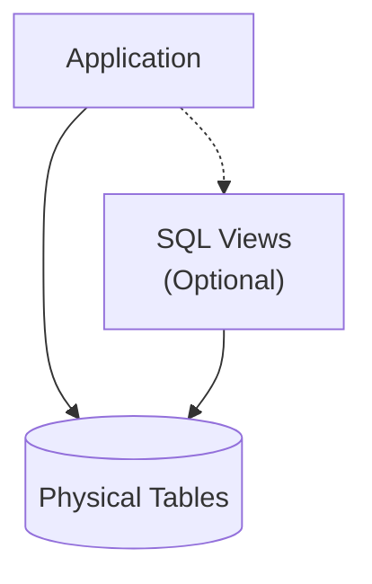
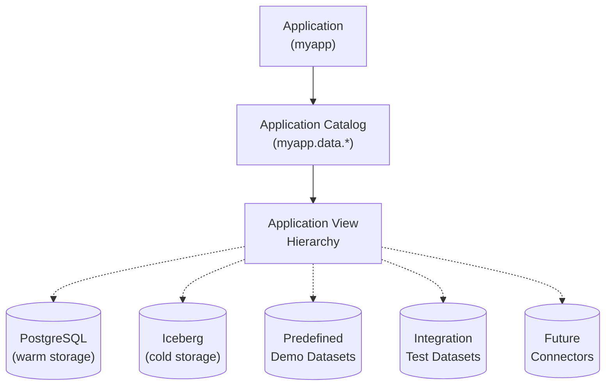
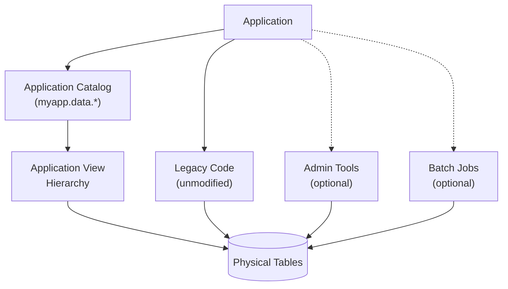
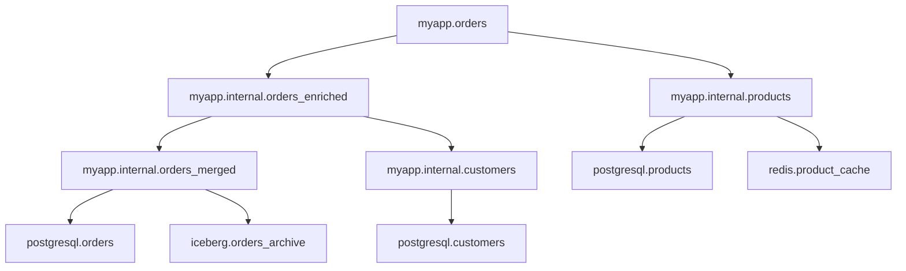
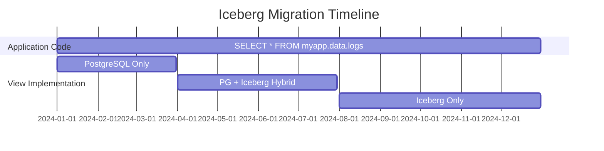
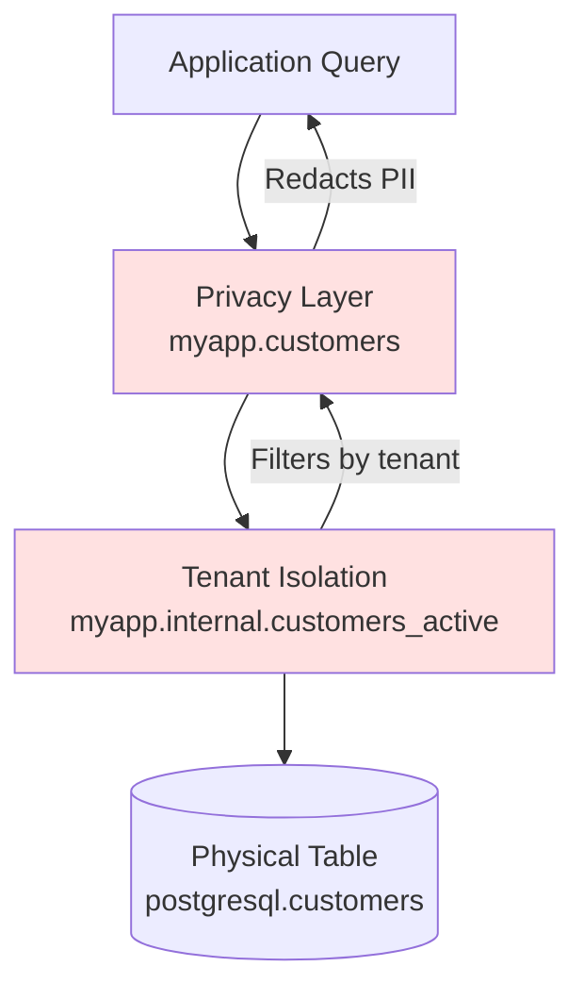
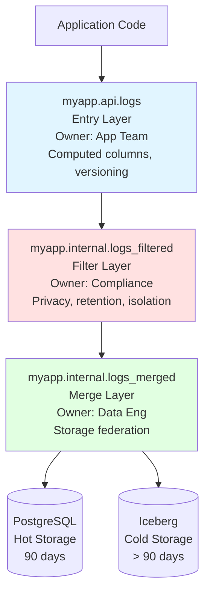
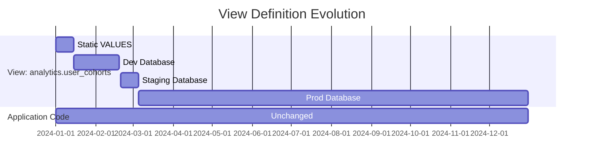
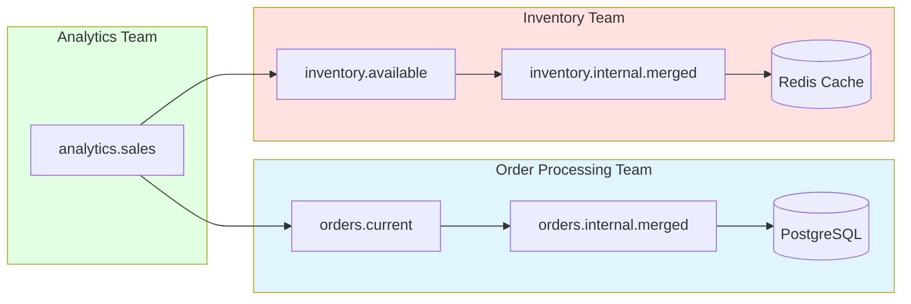
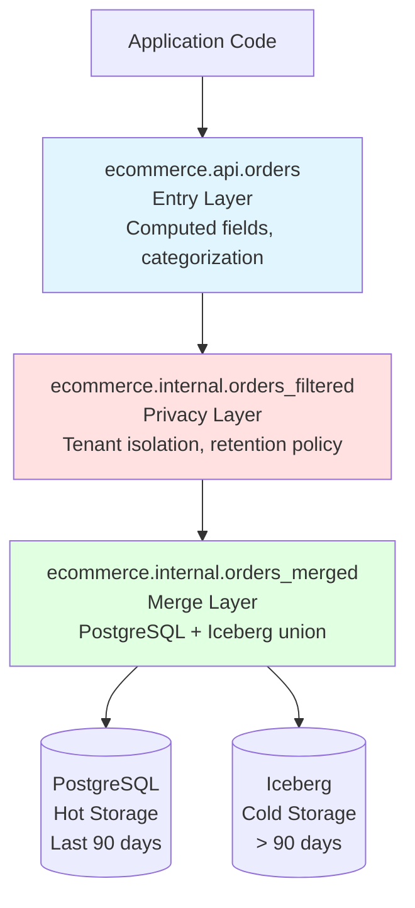

# The Virtual View Manifesto
**Stop treating SQL views like decoration. Start using them as your application's data contract.**

Classical SQL views are boring schema decoration for hiding joins, adding computed columns, and enforcing permissions. **Virtual views** are different. They're architectural components that decouple applications from physical storage, enable prototyping and testing with static data, allow seamless migration to Iceberg, and support zero-downtime schema evolution. Virtual views can be layered into **hierarchies**, where any layer in the hierarchy can be replaced (even at runtime) without disrupting other layers or active queries.

Virtual view hierarchies can be implemented using Trino, Starburst Enterprise or Galaxy, Amazon Athena, Presto, and most databases that support SQL views (including Postgresql and MySQL). Trino is used for all examples here.

This manifesto isn't just theory, it provides practical strategies and examples to follow when introducing virtual views into your architecture, and links to free tools to discover and manage view hierarchies with Trino.  

> [!CAUTION]
> This is a work in progress and is neither complete nor peer reviewed.

### What's Novel Here

This manifesto synthesizes several existing ideas:
1. **View hierarchies**: Not new, but rarely used systematically
2. **Application-centric organization**: Adapts DDD patterns to data layer
3. **Swappable data providers**: Switch between dev, test, staging, and production environments
4. **Multi-database abstraction**: Use federation capabilities in Trino/Starburst/Athena/Presto
5. **Iceberg migration focus**: Specific, pragmatic, and common use case for adoption

The novelty is the **combination and systematic approach** and documentation as a **repeatable pattern**, not individual techniques. Like the [AJAX pattern](https://en.wikipedia.org/wiki/Ajax_(programming)) for web applications, which used capabilities already available in modern browsers, the capabilities for virtual views are already present in most modern database platforms, without requiring any configuration changes or custom extensions.

### What's Controversial Here

The core idea of being able to replace layers in a virtual view hierarchy, without having to rebuild the entire hierarchy, is not standardized in ANSI/ISO SQL. Runtime behaviors when replacing views do vary between database systems. Existing standards generally assume that view definitions are frozen at creation time and only updated during migrations (when applications are offline).

This manifesto admittedly relies on multi-database platforms like Trino as the "practical standard" for how view replacement at runtime should behave. Even the most restrictive platforms (like Postgresql) generally allow views to be replaced if the column types do not change. But error handling and type checking varies by platform, so take care to validate these details when implementing virtual view hierarchies.

---

## Table of Contents

- [Introduction: Views as Architecture, Not Decoration](#introduction-views-as-architecture-not-decoration)
- [The Eight Principles of Virtual View Hierarchies](#the-eight-principles-of-virtual-view-hierarchies)
- [Use Cases: When Virtual Views Shine](#use-cases-when-virtual-views-shine)
- [Practical Patterns: Common Hierarchy Designs](#practical-patterns-common-hierarchy-designs)
- [Implementation Guide](#implementation-guide)
- [View Lifecycle Management](#view-lifecycle-management)
- [Common Pitfalls and Solutions](#common-pitfalls-and-solutions)
- [When NOT to Use Virtual Views](#when-not-to-use-virtual-views)
- [Related Tools](#related-tools)
- [Glossary](#glossary)
- [Appendix: Complete Example](#appendix-complete-example)

---

## Introduction: Views as Architecture, Not Decoration

### A Quick Primer on Classical SQL Views

SQL views are saved SELECT statements that can be queried like regular tables. Traditional use cases for views are hiding complexity (so that joins and other complex expressions don't have to be repeated over and over in queries) and re-shaping the rows and columns returned by queries.

With these classical use cases, views are just icing on your physical schema to make queries a little easier. Applications mostly use physical tables, except when views are needed for security or convenience.



**Example of hiding a join**:
```sql
CREATE VIEW customer_orders AS 
SELECT c.name, c.email, o.order_id, o.total, o.order_date
FROM customers c 
JOIN orders o ON c.customer_id = o.customer_id;
```

**Example of adding computed columns**:
```sql
CREATE VIEW users_enhanced AS
SELECT 
  user_id,
  first_name,
  last_name,
  first_name || ' ' || last_name as full_name,
  YEAR(CURRENT_DATE) - YEAR(birth_date) as age
FROM users;
```

**Example of redacting sensitive data**:
```sql
-- Omit SSN column, filter to current user's data
CREATE VIEW my_profile AS
SELECT user_id, name, email, phone
FROM users
WHERE user_id = CURRENT_USER_ID();
```

**Example of caching results (materialized views)**:
```sql
CREATE MATERIALIZED VIEW daily_sales_summary AS
SELECT 
  date_trunc('day', order_date) as day,
  SUM(total) as revenue,
  COUNT(*) as order_count
FROM orders
GROUP BY date_trunc('day', order_date);
```

Even though views like the examples above can be very helpful for reusing SQL statements, many applications only use views sparingly, with most queries directly referencing the physical schema.

### The Cost of Tight Coupling to Physical Schemas

Many database applications (especially those with light use of views) have a fundamental and widely accepted constraint. They are tightly coupled to their physical databases, tables and views.

Because of this tight coupling by default:
- Applications must know which connector(s) to query
- Views live in the same database/connector as their tables
- Migrating storage or schema always means changing application code

**Example of the problem**:
```sql
-- Application queries PostgreSQL directly
SELECT * FROM postgresql.app_schema.users;

-- Want to move to Iceberg? Change application code like this...
SELECT * FROM iceberg.app_schema.users;

-- Have data in both? Application must again handle the complexity like this...
SELECT * FROM postgresql.app_schema.users WHERE active = true
UNION ALL
SELECT * FROM iceberg.app_schema.users WHERE active = false;
```

As good architects, we can hope to isolate these queries in the data access layers of our applications, but every storage change still has to ripple through any code that directly references the database. This makes evolution and migrations painful and time consuming. 

### The Virtual View Approach

Unlike physical tables and traditional views, virtual views are organized by application or feature, designed to be replaced with different implementations while maintaining the same interface. Virtual views decouple applications from physical storage, through layers of views that can evolve independently, even dynamically at runtime.

Virtual views are always:
- **Application-first** - Named by application domain or feature, not storage technology
- **Detached from physical schemas** - Views are used for most application queries, not physical tables  
- **Layered into hierarchies** - Views depend on other views, creating swappable layers
- **Independently replaceable** - Each layer can be swapped without affecting others
- **Multi-connector capable** - Each layer can use one or more (real or fake) data sources



---

## The Eight Principles of Virtual View Hierarchies

1. [Virtual Views Belong to Applications, Not Physical Schemas](#principle-1-virtual-views-belong-to-applications-not-physical-schemas)
2. [Applications Query Virtual Views (Usually)](#principle-2-applications-query-virtual-views-usually)
3. [Every Virtual View Has Multiple Versions](#principle-3-every-virtual-view-has-multiple-versions)
4. [Assign One Owner Per Layer](#principle-4-assign-one-owner-per-layer)
5. [Never Change Column Types](#principle-5-never-change-column-types)
6. [Use Invoker Permissions](#principle-6-use-invoker-permissions)
7. [Store Views in a Canonical Location](#principle-7-store-views-in-a-canonical-location)
8. [Map Complexity, Don't Memorize It](#principle-8-map-complexity-dont-memorize-it)

---

### Principle 1: Virtual Views Belong to Applications, Not Physical Schemas

**Rule**: Organize views by application or feature, not by physical data source.

**Why**: Physical schemas reflect storage concerns. Applications have different concerns. When views mirror physical schema organization, they are rigid and provide no abstraction value.

**Simple example**:
```sql
-- Bad: Organized by storage technology
CREATE VIEW postgres_mirror.public.user_data AS 
SELECT * FROM postgresql.public.users;

-- Good: Organized by application domain
CREATE VIEW myapp.users.profile AS
SELECT user_id, name, email FROM postgresql.public.users;
```

**Realistic example**:
```sql
-- Application: E-commerce platform
-- Features: order processing, inventory, analytics

-- Bad: Everything mixed in physical schemas
CREATE VIEW postgresql.orders.current_orders AS ...
CREATE VIEW postgresql.inventory.stock_levels AS ...
CREATE VIEW mysql.legacy.product_catalog AS ...

-- Good: Organized by feature
CREATE VIEW ecommerce.orders.current AS ...
CREATE VIEW ecommerce.orders.historical AS ...
CREATE VIEW ecommerce.inventory.available_stock AS ...
CREATE VIEW ecommerce.inventory.reserved_stock AS ...
CREATE VIEW ecommerce.products.catalog AS ...
CREATE VIEW ecommerce.products.pricing AS ...
```

**Implementation**:
- Create application-specific catalogs (`myapp`, `feature_analytics`, `ecommerce`)
- Create feature-specific schemas (`billing`, `logging`, `preferences`)
- Use domain-specific language in all names (`customer_orders`, not `table_23_denorm`)
- Avoid naming virtual schemas to directly mirror physical schemas (like `postgres_virtual.xxx`)

---

### Principle 2: Applications Query Virtual Views (Usually)

**Rule**: Application code should reference virtual views whenever possible. Direct physical table access is acceptable for legacy code and performance-critical paths.

**Why**: Enables major storage changes without major application changes, but recognizes pragmatic constraints of real systems. Use virtual views for new code and high-value refactoring, and direct access when proven necessary. Both patterns can coexist peacefully.



**When direct access is acceptable**:
- Legacy applications too costly to refactor
- Administrative, operational or reporting jobs
- Large queries or batch jobs with specific performance hints
- Ultra-low-latency requirements where view overhead matters (rare)

**When virtual views are preferred**:
- New development of major features
- High-level APIs and user-facing queries
- Features likely to need storage virtualization in the future
- Anywhere flexibility matters more than microseconds

**Simple example**:
```sql
-- Application code (preferred)
SELECT * FROM myapp.users WHERE active = true;

-- vs. direct access (sometimes necessary, but not by default)
SELECT * FROM postgresql.app_schema.users WHERE active = true;
```

**Realistic example**:
```sql
-- API endpoint (uses virtual view for flexibility)
@GetMapping("/orders")
public List<Order> getOrders() {
    return jdbc.query(
        "SELECT * FROM ecommerce.orders.current WHERE user_id = ?", userId
    );
}

-- Nightly batch job (uses direct access for performance)
@Scheduled(cron = "0 2 * * *")
public void generateReports() {
    // Direct access acceptable - runs once daily, performance critical
    // 10M+ rows, needs partition pruning optimization
    return jdbc.query(
        "SELECT * FROM iceberg.warehouse.orders_partitioned " +
        "WHERE order_date = ? AND partition_key = ?", date, partition
    );
}
```

**Implementation**:
- New code: use virtual views by default
- Legacy code: migrate opportunistically during refactors
- Document what paths use direct access and why
- Performance test to verify view overhead is acceptable (usually negligible)
---

### Principle 3: Every Virtual View Has Multiple Versions

**Rule**: Design each view expecting to be replaced with static versions (for testing), live versions (for development, staging, production) and hybrid versions (for migrations and dynamic configurations).

**Why**: Enables prototyping, testing, and seamless migrations, with current and future data sources. If a view only ever has one definition, you're not using this pattern to its full potential.

**Simple example (prototyping)**:
```sql
-- Version 1: Prototype with static data
CREATE VIEW myapp.users AS 
SELECT * FROM (VALUES 
  (1, 'alice', 'alice@example.com'),
  (2, 'bob', 'bob@example.com')
) AS t (id, name, email);

-- Version 2: Development database
CREATE OR REPLACE VIEW myapp.users AS
SELECT 
  CAST(id AS BIGINT) as id,
  CAST(name AS VARCHAR) as name,
  CAST(email AS VARCHAR) as email
FROM postgresql.dev.users;
```

**Realistic example (optional hybrid storage)**:
```sql
-- Initially: All data in PostgreSQL
CREATE VIEW myapp.events AS
SELECT 
  CAST(event_id AS BIGINT) as event_id,
  CAST(event_type AS VARCHAR) as event_type,
  CAST(event_time AS TIMESTAMP(3)) as event_time,
  CAST(user_id AS BIGINT) as user_id
FROM postgresql.app.events;

-- When enabled by feature flag: hybrid PostgreSQL + Iceberg
-- Data older than 7 days is replicated separately
CREATE OR REPLACE VIEW myapp.events AS
SELECT event_id, event_type, event_time, user_id
FROM postgresql.app.events 
WHERE event_time > CURRENT_DATE - INTERVAL '7' DAYS
UNION ALL
SELECT event_id, event_type, event_time, user_id
FROM iceberg.archive.events
WHERE event_time <= CURRENT_DATE - INTERVAL '7' DAYS;
```

**Implementation**:
- Start every project with static data views
- Keep test views in version control alongside production definitions
- Document expected version progression path
- Use environment-specific catalogs if needed (`myapp_dev`, `myapp_prod`)

---

### Principle 4: Assign One Owner Per Layer

**Rule**: Assign each layer in a view hierarchy to a single actor or agent. Coordinate changes through that owner.

**Why**: Prevents race conditions, conflicting updates, and unclear responsibility. Views have no locking mechanism during definition replacement, and queries won't be canceled or restarted if definitions change.

**Simple example**:
```sql
-- Owned by data engineering, updated during migrations
CREATE VIEW myapp.internal.users_merged AS
SELECT id, name, email, account_type, tenant_id
FROM postgresql.users 
UNION ALL 
SELECT id, name, email, account_type, tenant_id
FROM iceberg.users_archive;

-- Owned by privacy system, updated when policies change
CREATE VIEW myapp.internal.users_filtered AS
SELECT id, name, email, account_type 
FROM myapp.internal.users_merged
WHERE tenant_id = current_tenant() OR is_admin();

-- Owned by dev team, updated during releases
CREATE VIEW myapp.users AS
SELECT id, name, email, account_type 
FROM myapp.internal.users_filtered;
```

**Documented example with ownership matrix**:

| Layer   | View Name                       | Owner            | Update Trigger    |
|---------|---------------------------------|------------------|-------------------|
| Entry   | `myapp.users`                   | Dev team         | Feature release   |
| Privacy | `myapp.internal.users_filtered` | Privacy system   | Policy change     |
| Merge   | `myapp.internal.users_merged`   | Data engineering | Storage migration |

**Implementation**:
- Document layer ownership in team wiki or repository README
- Use synchronized/coordinated access for programmatic updates
- Avoid concurrent modifications to same view definition

> [!CAUTION]
> Trino has no locking mechanism for `ALTER VIEW` or `CREATE OR REPLACE VIEW` statements. Queries use the view definition active when query planning occurs. Replacing a view doesn't terminate or restart running queries using the old definition.

---

### Principle 5: Never Change Column Types

**Rule**: When replacing a view definition, avoid changing column types. It's a good habit to explicitly set column types using `CAST` whenever new columns are declared in a view.

**Why**: Accidentally changing column types is the easiest way to break a view hierarchy. Trino does NOT validate types when replacing views. Breaking changes only surface at query time, potentially in production.

**Working example with `CAST`**:
```sql
-- Original view
CREATE VIEW myapp.events AS
SELECT 
  CAST(id AS BIGINT) as event_id,
  CAST(name AS VARCHAR) as event_name
FROM source_table;

-- Good replacement: types preserved
CREATE OR REPLACE VIEW myapp.events AS
SELECT 
  CAST(event_id AS BIGINT) as event_id,
  CAST(event_name AS VARCHAR) as event_name
FROM different_source;
```

**Breaking example with cascading failure**:
```sql
-- Base view (originally BIGINT)
CREATE VIEW myapp.internal.events_raw AS
SELECT CAST(id AS BIGINT) as event_id, ...;

-- Dependent view (expects BIGINT)
CREATE VIEW myapp.events_hourly AS
SELECT 
  event_id, 
  date_trunc('hour', event_time) as hour, 
  count(*) as event_count
FROM myapp.internal.events_raw
GROUP BY event_id, date_trunc('hour', event_time);

-- Someone changes base view type
CREATE OR REPLACE VIEW myapp.internal.events_raw AS
SELECT CAST(id AS VARCHAR) as event_id, ...;  -- Now VARCHAR!

-- Query breaks with cryptic error:
-- "Cannot apply operator: bigint = varchar" when joining
-- or "Invalid cast from varchar to bigint" in aggregations
```

**Implementation**:
- Use explicit `CAST` in base layers to lock types
- Consider using Iceberg types even in base views if Iceberg is a future target
- Document expected types in view comments or external documentation
- If you MUST change types, use a phased approach

**When you must change types**:
1. Create new view with new name (`myapp.events_v2`)
2. Deprecate old view (add comment, log warnings)
3. Migrate consumers gradually
4. Monitor old view usage until zero
5. Remove old view

---

### Principle 6: Use Invoker Permissions

**Rule**: Define virtual views with `SECURITY INVOKER` to avoid granting excessive access through views.

**Why**: Views with `SECURITY DEFINER` (the default in some systems) give all users the view creator's permissions, becoming a privilege escalation vector.

**Simple example**:
```sql
-- Preferred: Users need permissions to underlying tables
CREATE VIEW myapp.users
SECURITY INVOKER
AS SELECT id, name, email FROM postgresql.users;

-- Avoid: All users get view creator's permissions
CREATE VIEW myapp.users
SECURITY DEFINER
AS SELECT id, name, email FROM postgresql.users;
```

**Realistic example**:
```sql
-- Scenario: View spans multiple sources with different permissions

-- Sales team should only see aggregated data
CREATE VIEW sales.revenue_summary
SECURITY INVOKER
AS SELECT 
  date_trunc('month', order_date) as month,
  SUM(total) as revenue
FROM finance.orders  -- Finance team has access, sales team does not
GROUP BY date_trunc('month', order_date);

-- With SECURITY INVOKER:
-- * Finance team: Can query the view (they have access to underlying table)
-- * Sales team: Cannot query the view (they lack access to finance.orders)

-- With SECURITY DEFINER:
-- * Both teams can query the view (using view creator's permissions)
-- * Violates principle of least privilege
```

**Implementation**:
- Default to `SECURITY INVOKER` for all virtual views
- Document permission requirements for each view
- Test views with user accounts that have minimal permissions
- Consider using `SECURITY DEFINER` only for controlled privilege escalation with strong justification

>[!TIP]
> Trino's default behavior may vary by connector. Always specify explicitly.

---

### Principle 7: Store Views in a Canonical Location

**Rule**: Choose one authoritative connector for virtual view storage and commit to it, or use [ViewZoo](https://github.com/robfromboulder/viewzoo) to store current and future views using any connector.

**Why**: View definitions must be persisted somewhere, even when using static data (no real data sources) or spanning multiple data sources.

**Simple example**:
```sql
-- Option A: Store in Iceberg (if always available)
CREATE VIEW iceberg.myapp.logs AS SELECT ... 

-- Option B: Store in ViewZoo (lightweight, filesystem-based)
CREATE VIEW viewzoo.myapp.logs AS SELECT ...
```

**Recommended decision tree**:
```
Do you already use Iceberg?
├─ Yes → Store views in Iceberg catalog
│         (Views live alongside data, one system to manage)
│
└─ No → Will you definitely use Iceberg within 6 months?
    ├─ Yes → Store views in Iceberg catalog now
    │         (Prepare for eventual data migration)
    │
    └─ No → Need maximum flexibility?
        ├─ Yes → Use ViewZoo
        │         (Filesystem-based, no external dependencies)
        │         (Git integration for version control)
        │
        └─ No → Use your most stable connector
                  (PostgreSQL, MySQL, whatever won't disappear)
```

**Implementation**:
- Choose storage location during project setup
- Document the decision in project wiki or README
- If migrating storage later, use `SHOW CREATE VIEW` to export/import definitions

**Link to ViewZoo documentation**: [github.com/robfromboulder/viewzoo](https://github.com/robfromboulder/viewzoo)

---

### Principle 8: Map Complexity, Don't Memorize It

**Rule**: Use tools like [ViewMapper](https://github.com/robfromboulder/viewmapper) to discover and visualize view dependencies rather than expecting humans to parse view definitions and track relationships mentally.

**Why**: View hierarchies become complex quickly. SQL definitions don't show the dependency graph. `SHOW CREATE VIEW` is for debugging, not understanding architecture. Traditional ERD tools aren't a big help.

**Simple example**:
```sql
-- These four views form a hierarchy, but how?
CREATE VIEW myapp.internal.users_base AS 
  SELECT * FROM postgresql.users;
CREATE VIEW myapp.internal.users_enriched AS 
  SELECT * FROM myapp.internal.users_base;
CREATE VIEW myapp.internal.users_filtered AS 
  SELECT * FROM myapp.internal.users_enriched;
CREATE VIEW myapp.users AS 
  SELECT * FROM myapp.internal.users_filtered;

-- SHOW CREATE VIEW only shows one level at a time
-- Developers must manually trace dependencies
```

**Realistic example (but still small)**:
```sql
-- 10+ views spanning multiple layers
-- Some views join multiple sources
-- Some views are used by multiple parents
-- Manual tracking becomes difficult, even at this scale

myapp.orders (entry)
  ├─ depends on myapp.internal.orders_enriched
  │   ├─ depends on myapp.internal.orders_merged
  │   │   ├─ depends on postgresql.orders
  │   │   └─ depends on iceberg.orders_archive
  │   └─ depends on myapp.internal.customers
  │       └─ depends on postgresql.customers
  └─ depends on myapp.internal.products
      ├─ depends on postgresql.products
      └─ depends on redis.product_cache
```

**Implementation**:
- Use tools to generate dependency diagrams
- Keep generated diagrams in documentation (Git repository)
- Regenerate after significant changes
- Include diagrams in code review for view changes

**Example ViewMapper output**:


**Link to ViewMapper**: [github.com/robfromboulder/viewmapper](https://github.com/robfromboulder/viewmapper)

---

## Use Cases: When Virtual Views Shine

Virtual views aren't universally applicable—they solve specific architectural problems. The following use cases represent scenarios where the pattern delivers clear value.

1. [Extending Applications to Iceberg](#use-case-1-extending-applications-to-iceberg)
2. [Rapid Prototyping](#use-case-2-rapid-prototyping)
3. [Zero-Downtime Schema Evolution](#use-case-3-zero-downtime-schema-evolution)
4. [Privacy and Compliance Layers](#use-case-4-privacy-and-compliance-layers)
5. [Testing and Simulation](#use-case-5-testing-and-simulation)
6. [Multi-Source Federation](#use-case-6-multi-source-federation)

---

### Use Case 1: Extending Applications to Iceberg

**The Challenge**:

Existing application runs on PostgreSQL (or MySQL, etc.). Want to add Iceberg for cost-effective long-term storage, but can't rewrite application code. Need seamless transition, no downtime, no dual codebases.

**The Virtual View Solution**:

**Phase 1: Establish the abstraction**

Before:
```sql
-- Application queries physical table directly
SELECT * FROM postgresql.myapp.logs WHERE event_time > ?
```

After:
```sql
-- Create virtual view as intermediary
CREATE VIEW myapp.data.logs AS
SELECT 
  CAST(id AS BIGINT) as log_id,
  CAST(event AS VARCHAR) as event_type,
  CAST(timestamp AS TIMESTAMP(3)) as event_time,
  CAST(user_id AS BIGINT) as user_id
FROM postgresql.myapp.logs;

-- Application code changes once (connection string only)
-- Now queries: SELECT * FROM myapp.data.logs WHERE event_time > ?
```

**Phase 2: Add Iceberg in hybrid mode**

```sql
-- Union PostgreSQL (hot, recent data) with Iceberg (cold, historical)
CREATE OR REPLACE VIEW myapp.data.logs AS
-- Recent data still in PostgreSQL
SELECT log_id, event_type, event_time, user_id
FROM postgresql.myapp.logs
WHERE event_time > CURRENT_DATE - INTERVAL '30' DAYS
  AND replicated = false
UNION ALL
-- Historical data in Iceberg
SELECT log_id, event_type, event_time, user_id
FROM iceberg.archive.logs
WHERE event_time <= CURRENT_DATE - INTERVAL '30' DAYS;
```

Zero application changes. Behind the scenes, a replication job moves old data from PostgreSQL to Iceberg and marks rows as replicated.

**Phase 3: Eventually migrate entirely (optional)**

```sql
-- Once all data is in Iceberg and PostgreSQL is ready to decommission
CREATE OR REPLACE VIEW myapp.data.logs AS
SELECT log_id, event_type, event_time, user_id
FROM iceberg.warehouse.logs;
```

**What we're NOT covering**: How replication works, Iceberg table maintenance, partition strategies, compaction. This manifesto focuses on the view architecture that enables migration.

**Benefits**:
- Zero application downtime during migration
- No "big bang" rewrite risk
- Test Iceberg integration incrementally
- Rollback is trivial (replace view definition)
- Works with monoliths and microservices



---

### Use Case 2: Rapid Prototyping

**The Challenge**: Need to build and test application logic before infrastructure exists or before schema is finalized.

**Simple example**:
```sql
-- Day 1: No database yet, use static data
CREATE VIEW myapp.customers AS
SELECT * FROM (VALUES
  (1, 'Acme Corp', 'acme@example.com'),
  (2, 'Widgets Inc', 'widgets@example.com'),
  (3, 'Gadgets LLC', 'gadgets@example.com')
) AS t (customer_id, company_name, email);

-- Application development proceeds
-- UI, business logic, tests all work against this view

-- Day 30: Database ready, swap in real data
CREATE OR REPLACE VIEW myapp.customers AS
SELECT 
  CAST(id AS BIGINT) as customer_id,
  CAST(name AS VARCHAR) as company_name,
  CAST(email AS VARCHAR) as email
FROM postgresql.crm.customers;

-- Application code: unchanged
```

**Realistic example**:
```sql
-- Prototyping a new analytics feature
-- Requires joining customer, order, and product data
-- Some tables don't exist yet, some APIs not ready

-- Start with mock data for all sources
CREATE VIEW analytics.customer_lifetime_value AS
SELECT 
  customer_id,
  SUM(order_total) as lifetime_value,
  COUNT(*) as order_count,
  MAX(order_date) as last_order_date
FROM (VALUES
  (1, 100.00, DATE '2024-01-01'),
  (1, 250.00, DATE '2024-02-15'),
  (2, 75.00, DATE '2024-01-10'),
  (2, 125.00, DATE '2024-02-20'),
  (2, 200.00, DATE '2024-03-01')
) AS mock_orders (customer_id, order_total, order_date)
GROUP BY customer_id;

-- Build dashboards, test business logic, validate with stakeholders
-- Only implement real data pipelines after prototype is approved

-- Later: Swap to real, complex query
CREATE OR REPLACE VIEW analytics.customer_lifetime_value AS
SELECT 
  c.customer_id,
  SUM(o.total) as lifetime_value,
  COUNT(o.order_id) as order_count,
  MAX(o.order_date) as last_order_date
FROM postgresql.crm.customers c
JOIN postgresql.orders.orders o ON c.customer_id = o.customer_id
WHERE o.status IN ('completed', 'shipped')
GROUP BY c.customer_id;
```

**Benefits**:
- Start building before infrastructure is ready
- Validate requirements with stakeholders using realistic UI
- Avoid wasting time on infrastructure for features that get cancelled
- Smooth transition from prototype to production

---

### Use Case 3: Zero-Downtime Schema Evolution

**The Challenge**: Need to rename columns, restructure data, or migrate between schema versions without application downtime.

**Simple example**:
```sql
-- Original physical schema (poor naming)
-- postgresql.app.users_v1 (columns: userid, fname, lname, addr)

-- Virtual view provides better names
CREATE VIEW myapp.users AS
SELECT 
  userid as user_id, 
  fname as first_name, 
  lname as last_name,
  addr as address
FROM postgresql.app.users_v1;

-- Later: Migrate to improved physical schema
-- postgresql.app.users_v2 (columns: user_id, first_name, last_name, street_address)

-- Update view, application unchanged
CREATE OR REPLACE VIEW myapp.users AS
SELECT 
  user_id, 
  first_name, 
  last_name,
  street_address as address
FROM postgresql.app.users_v2;
```

**Realistic example with backward compatibility**:
```sql
-- V1 schema: Monolithic user table
CREATE VIEW myapp.users AS
SELECT 
  CAST(user_id AS BIGINT) as user_id,
  CAST(email AS VARCHAR) as email,
  CAST(first_name AS VARCHAR) as first_name,
  CAST(last_name AS VARCHAR) as last_name,
  CAST(address AS VARCHAR) as address,
  CAST(city AS VARCHAR) as city,
  CAST(state AS VARCHAR) as state,
  CAST(zip AS VARCHAR) as zip
FROM postgresql.app.users_v1;

-- V2 schema: Normalized into users + addresses tables
-- Keep backward compatibility during migration
CREATE OR REPLACE VIEW myapp.users AS
SELECT 
  CAST(u.user_id AS BIGINT) as user_id,
  CAST(u.email AS VARCHAR) as email,
  CAST(u.first_name AS VARCHAR) as first_name,
  CAST(u.last_name AS VARCHAR) as last_name,
  CAST(a.street AS VARCHAR) as address,
  CAST(a.city AS VARCHAR) as city,
  CAST(a.state AS VARCHAR) as state,
  CAST(a.zip AS VARCHAR) as zip
FROM postgresql.app.users_v2 u
LEFT JOIN postgresql.app.addresses_v2 a 
  ON u.user_id = a.user_id 
  AND a.is_primary = true;

-- V3 schema: Changed email validation, need to handle legacy bad data
CREATE OR REPLACE VIEW myapp.users AS
SELECT 
  CAST(u.user_id AS BIGINT) as user_id,
  CAST(
    CASE 
      WHEN u.email LIKE '%@%' THEN u.email
      ELSE u.legacy_email  -- Fallback for pre-validation data
    END AS VARCHAR
  ) as email,
  CAST(u.first_name AS VARCHAR) as first_name,
  CAST(u.last_name AS VARCHAR) as last_name,
  CAST(a.street AS VARCHAR) as address,
  CAST(a.city AS VARCHAR) as city,
  CAST(a.state AS VARCHAR) as state,
  CAST(a.zip AS VARCHAR) as zip
FROM postgresql.app.users_v3 u
LEFT JOIN postgresql.app.addresses_v3 a 
  ON u.user_id = a.user_id 
  AND a.is_primary = true;
```

**Benefits**:
- Evolve schemas without application deployments
- Support gradual migrations with parallel systems
- Maintain backward compatibility during transitions
- Hide physical schema complexity from applications

---

### Use Case 4: Privacy and Compliance Layers

**The Challenge**: Implement system-wide privacy rules, data redaction, or tenant isolation without modifying every query.

**Simple example**:
```sql
-- Base data view (internal only)
CREATE VIEW myapp.internal.logs_raw AS
SELECT 
  log_id, event_type, user_id, 
  user_email, ip_address, event_time
FROM postgresql.logs;

-- Privacy layer: Redact PII for most users
CREATE VIEW myapp.logs AS
SELECT 
  log_id,
  event_type,
  user_id,
  -- Redact email and IP unless admin
  CASE WHEN is_admin() THEN user_email ELSE 'REDACTED' END as user_email,
  CASE WHEN is_admin() THEN ip_address ELSE 'REDACTED' END as ip_address,
  event_time
FROM myapp.internal.logs_raw;
```

**Realistic example with tenant isolation**:
```sql
-- Multi-tenant application
-- Each customer should only see their own data

-- Base data (all tenants mixed)
CREATE VIEW myapp.internal.orders_all AS
SELECT 
  order_id, tenant_id, customer_id, 
  order_total, order_date, payment_method
FROM postgresql.orders;

-- Tenant-isolated view (automatic filtering)
CREATE VIEW myapp.orders AS
SELECT 
  order_id, customer_id, order_total, 
  order_date, payment_method
FROM myapp.internal.orders_all
WHERE tenant_id = current_tenant_id()
   OR is_superuser();

-- Right-to-be-forgotten implementation
CREATE VIEW myapp.internal.customers_active AS
SELECT 
  customer_id, email, name, address, phone
FROM postgresql.customers
WHERE deleted_at IS NULL
  AND customer_id NOT IN (
    SELECT customer_id 
    FROM postgresql.deletion_requests 
    WHERE status = 'approved'
  );

-- Application view with both privacy and tenant isolation
CREATE VIEW myapp.customers AS
SELECT 
  customer_id, 
  email, 
  name, 
  -- Redact address for non-privileged users
  CASE 
    WHEN is_privileged_user() THEN address 
    ELSE 'REDACTED' 
  END as address,
  phone
FROM myapp.internal.customers_active
WHERE tenant_id = current_tenant_id();
```

**Benefits**:
- Single point of control for privacy rules
- Enforce compliance without trusting application code
- Easy to audit (one view to review, not hundreds of queries)
- Update privacy rules without application deployment



---

### Use Case 5: Testing and Simulation

**The Challenge**: Test application behavior with edge cases, invalid data, or failure scenarios without corrupting production data.

**Simple example**:
```sql
-- Production view
CREATE VIEW myapp.products AS
SELECT 
  CAST(product_id AS BIGINT) as product_id,
  CAST(name AS VARCHAR) as name,
  CAST(price AS DECIMAL(10,2)) as price,
  CAST(inventory_count AS INTEGER) as inventory_count
FROM postgresql.products;

-- Test view with edge cases
CREATE OR REPLACE VIEW myapp.products AS
SELECT * FROM (VALUES
  (1, 'Normal Product', 10.00, 100),
  (2, 'Zero Price', 0.00, 50),          -- Edge case
  (3, 'Negative Inventory', 5.00, -10), -- Edge case
  (4, NULL, 15.00, 20),                 -- NULL name
  (5, 'Very Long Name That Might Break UI Components Because It Is Extremely Long', 15.00, 5)
) AS t (product_id, name, price, inventory_count);

-- Switch between production and test by replacing view definition
```

**Realistic example with git-based configuration**:

ViewZoo's filesystem-based storage enables powerful testing workflows:

```bash
# Production branch: Real database views
git checkout main
/var/trino/views/myapp/data/orders.json:
{
  "viewSql": "SELECT * FROM postgresql.prod.orders"
}

# Test branch: Static edge-case data
git checkout feature/test-edge-cases
/var/trino/views/myapp/data/orders.json:
{
  "viewSql": "SELECT * FROM (VALUES 
    (1, 100, 999999.99, 'pending'),  -- Very large amount
    (2, 101, 0.01, 'completed'),      -- Tiny amount
    (3, 102, NULL, 'shipped'),        -- NULL amount
    (4, NULL, 50.00, 'pending')       -- NULL customer
  ) AS t (order_id, customer_id, total, status)"
}

# Developer switches branches, ViewZoo reads new definitions immediately
# No database updates needed
# Each developer can have custom test data in their local branch
```

**Benefits with git-based views**:
- Version control for test scenarios
- Pull requests for test case additions
- Per-developer test configurations
- Easy rollback to previous test states
- CI/CD integration for automated testing

**Runtime configuration example**:
```python
def configure_test_mode(config):
    """Update view definitions based on test configuration"""
    
    if config.test_mode == 'edge_cases':
        execute_sql("""
            CREATE OR REPLACE VIEW myapp.payment_gateway AS
            SELECT * FROM (VALUES
              ('timeout', 'TIMEOUT', NULL),
              ('decline', 'DECLINED', 'Insufficient funds'),
              ('error', 'ERROR', 'Gateway unavailable')
            ) AS t (transaction_id, status, error_message)
        """)
    elif config.test_mode == 'production':
        execute_sql("""
            CREATE OR REPLACE VIEW myapp.payment_gateway AS
            SELECT transaction_id, status, error_message
            FROM payments_api.transactions
        """)

# Switch modes without code changes
configure_test_mode(current_config)
```

**Benefits**:
- Test failure scenarios safely
- Validate edge case handling
- No risk of corrupting production data
- Easy to switch between test and production modes
- Git branches enable team collaboration on test scenarios

---

### Use Case 6: Multi-Source Federation

**The Challenge**: Application needs data from multiple sources (PostgreSQL + MySQL + Iceberg + Redis).

**Simple example**:
```sql
-- Join across two databases
CREATE VIEW myapp.customer_orders AS
SELECT 
  c.customer_id,
  c.customer_name,
  o.order_id,
  o.order_total
FROM postgresql.crm.customers c
JOIN mysql.orders.orders o ON c.customer_id = o.customer_id;
```

**Realistic example**:
```sql
-- Complex federation: CRM in PostgreSQL, orders in Iceberg, product cache in Redis

CREATE VIEW myapp.analytics.order_summary AS
SELECT 
  c.customer_id,
  c.company_name,
  c.industry,
  o.order_id,
  o.order_date,
  o.total as order_total,
  p.product_name,
  p.category,
  p.current_price as catalog_price,
  -- Compute margin
  (o.total - (oi.quantity * p.cost_price)) as margin
FROM postgresql.crm.customers c
JOIN iceberg.warehouse.orders o ON c.customer_id = o.customer_id
JOIN iceberg.warehouse.order_items oi ON o.order_id = oi.order_id
LEFT JOIN redis.cache.products p ON oi.product_id = p.product_id
WHERE o.order_date > CURRENT_DATE - INTERVAL '90' DAYS;

-- Application queries one view, Trino handles federation
SELECT * FROM myapp.analytics.order_summary 
WHERE industry = 'manufacturing'
  AND margin > 1000;
```

**Benefits**:
- Hide federation complexity from application
- Single SQL query across multiple sources
- No manual ETL or data duplication
- Change underlying sources without application changes
- Leverage Trino's query optimization across connectors

---

### Additional Use Cases

**Feature Flagging Data Sources**:
- Programmatically enable/disable data sources via view replacement
- Gradually roll out new connectors to subset of users
- A/B test different storage backends for performance comparison

**Gradual Connector Migration**:
- Move from MySQL to PostgreSQL table by table
- UNION old and new sources during transition period
- Eventually remove old source when migration complete

**Cost Optimization**:
- Route expensive analytical queries to cheaper cold storage
- Tier data by access patterns (hot/warm/cold)
- Implement intelligent caching layers

**Development Environment Isolation**:
- Each developer gets own catalog with custom view definitions
- Test schema changes without affecting team
- Merge view definitions like code via pull requests

---

## Practical Patterns: Common Hierarchy Designs

### Pattern 1: The Three-Layer Stack

**When to use**: Most production applications with multiple concerns (business logic, privacy, storage).

**Structure**:
1. **Entry Layer**: Application-facing view, computed columns, version mapping
2. **Filter Layer**: Privacy, security, tenant isolation, compliance
3. **Merge Layer**: Physical source merging, replication management

**Ownership**:
- Entry → Application team (updates during feature releases)
- Filter → Compliance/Security team (updates when policies change)
- Merge → Data Engineering/Platform team (updates during migrations)

**Complete example**:
```sql
-- Layer 1: Entry point (owned by application team)
-- Updated during feature releases
CREATE VIEW myapp.api.logs AS
SELECT 
  log_id,
  event_type,
  event_time,
  user_id,
  -- Computed fields
  date_trunc('hour', event_time) as event_hour,
  CASE 
    WHEN event_type IN ('error', 'fatal') THEN true 
    ELSE false 
  END as is_critical
FROM myapp.internal.logs_filtered;

-- Layer 2: Privacy filter (owned by compliance system)
-- Updated when privacy policies change
CREATE VIEW myapp.internal.logs_filtered AS
SELECT log_id, event_type, event_time, user_id
FROM myapp.internal.logs_merged
WHERE 
  -- Tenant isolation
  tenant_id = current_tenant_id()
  -- Right to be forgotten
  AND user_id NOT IN (
    SELECT user_id FROM myapp.internal.deleted_users
  )
  -- Data retention policy (2 years)
  AND event_time > CURRENT_DATE - INTERVAL '2' YEAR;

-- Layer 3: Source merger (owned by ingestion engine)
-- Updated during storage migrations
CREATE VIEW myapp.internal.logs_merged AS
-- Hot data in PostgreSQL
SELECT log_id, event_type, event_time, user_id, tenant_id
FROM postgresql.logs.events
WHERE replicated = false
  AND event_time > CURRENT_DATE - INTERVAL '90' DAYS
UNION ALL
-- Cold data in Iceberg
SELECT log_id, event_type, event_time, user_id, tenant_id
FROM iceberg.archive.logs
WHERE event_time <= CURRENT_DATE - INTERVAL '90' DAYS;
```

**Mermaid diagram**:


---

### Pattern 2: The Prototyping Progression

**When to use**: New features, MVP development, uncertain requirements.

**Structure**: Same view name, evolved definitions over time.

**Stages**:
1. **Static VALUES**: UI and business logic development
2. **Test database**: Integration testing
3. **Staging database**: Beta testing with real-like data
4. **Production database**: Live traffic
5. **Hybrid (optional)**: Add Iceberg for scale

**Timeline example**:
```sql
-- Week 1: Static data, no infrastructure
CREATE VIEW analytics.user_cohorts AS
SELECT cohort_name, user_count, retention_rate
FROM (VALUES
  ('2024-01', 1000, 0.45),
  ('2024-02', 1200, 0.52),
  ('2024-03', 1350, 0.48)
) AS t (cohort_name, user_count, retention_rate);

-- Week 3: Development database ready
CREATE OR REPLACE VIEW analytics.user_cohorts AS
SELECT 
  date_trunc('month', signup_date) as cohort_name,
  COUNT(DISTINCT user_id) as user_count,
  COUNT(DISTINCT CASE 
    WHEN last_seen > CURRENT_DATE - INTERVAL '30' DAYS 
    THEN user_id 
  END)::DOUBLE / COUNT(DISTINCT user_id) as retention_rate
FROM postgresql.dev.users
GROUP BY date_trunc('month', signup_date);

-- Week 8: Production launch
CREATE OR REPLACE VIEW analytics.user_cohorts AS
SELECT 
  date_trunc('month', signup_date) as cohort_name,
  COUNT(DISTINCT user_id) as user_count,
  COUNT(DISTINCT CASE 
    WHEN last_seen > CURRENT_DATE - INTERVAL '30' DAYS 
    THEN user_id 
  END)::DOUBLE / COUNT(DISTINCT user_id) as retention_rate
FROM postgresql.prod.users
WHERE signup_date > CURRENT_DATE - INTERVAL '2' YEAR
GROUP BY date_trunc('month', signup_date);
```

**Gantt diagram**:


---

### Pattern 3: Per-Feature Hierarchies

**When to use**: Microservices, modular monoliths, team independence.

**Structure**: Multiple independent hierarchies, one per feature or service.

**Example**:
```sql
-- Feature 1: Order Processing (owned by checkout team)
CREATE VIEW ecommerce.orders.current AS ...;
CREATE VIEW ecommerce.orders.historical AS ...;
CREATE VIEW ecommerce.orders.internal.merged AS ...;

-- Feature 2: Inventory Management (owned by warehouse team)
CREATE VIEW ecommerce.inventory.available AS ...;
CREATE VIEW ecommerce.inventory.reserved AS ...;
CREATE VIEW ecommerce.inventory.internal.merged AS ...;

-- Feature 3: Analytics (owned by data team, may reference others)
CREATE VIEW ecommerce.analytics.sales_summary AS ...;
CREATE VIEW ecommerce.analytics.inventory_turnover AS ...;
```

**Benefits**:
- Teams work independently
- Clear ownership boundaries
- No coordination needed for most changes
- Easy to understand scope and blast radius
- Feature can be developed, tested, deployed independently

**Mermaid diagram**:


---

### Pattern 4: Runtime Configuration Switching

**When to use**: Feature flags, A/B testing, debugging, environment-specific behavior.

**Structure**: Programmatically swap view definitions based on runtime configuration.

**Example** (pseudocode):
```python
def configure_data_layer(config):
    """Update view definitions based on current configuration"""
    
    if config.feature_flags.get('use_iceberg'):
        # Production with Iceberg
        execute_sql("""
            CREATE OR REPLACE VIEW myapp.data.events AS
            SELECT * FROM iceberg.warehouse.events
        """)
    elif config.environment == 'staging':
        # Staging database
        execute_sql("""
            CREATE OR REPLACE VIEW myapp.data.events AS
            SELECT * FROM postgresql.staging.events
        """)
    elif config.environment == 'development':
        # Static test data
        execute_sql("""
            CREATE OR REPLACE VIEW myapp.data.events AS
            SELECT * FROM (VALUES 
              (1, 'test', CURRENT_TIMESTAMP)
            ) AS t (id, event, ts)
        """)
    else:
        # Production PostgreSQL
        execute_sql("""
            CREATE OR REPLACE VIEW myapp.data.events AS
            SELECT * FROM postgresql.prod.events
        """)

# Called at application startup or when config changes
configure_data_layer(current_config)
```

**Git-based configuration with ViewZoo**:
```bash
# Feature flag: Enable Iceberg backend
git checkout feature/iceberg-storage

# ViewZoo reads updated view definitions from filesystem
# No programmatic CREATE OR REPLACE needed
# Just switch branches and restart Trino workers

# A/B test: 50% of traffic to new backend
# Use separate Trino clusters reading different git branches
```

**Use cases**:
- Feature flags for gradual rollout
- Environment-specific data sources (dev/staging/prod)
- Debug mode with synthetic data
- A/B testing different storage backends for performance
- Per-customer configurations in multi-tenant systems

---

## Implementation Guide

### Helpful Strategies

* **Start small**: Pick one feature. Create one virtual view with static data. Build your application against it. Prove the concept works in your environment.
* **Build incrementally**: Don't design a complex 5-layer hierarchy on day one. Add layers as needs emerge. Refactor when complexity justifies abstraction.
* **Document relentlessly**: View dependencies are invisible in code. Use ViewMapper to generate diagrams. Write READMEs. Update documentation when views change. Future you will thank current you.
* **Share your patterns**: If you discover useful patterns not covered here, share them with the community. Open issues, write blog posts, give talks. This manifesto is a starting point, not the final word.
* **Question assumptions**: When writing application code that queries physical tables directly, ask: "Should this be a virtual view?" Sometimes the answer is no (performance, exploration, legacy constraints). Often it's yes (flexibility, evolution, abstraction).
* **Remember the goal**: Virtual views aren't about purity or perfection. They're about making evolution easier. Choose pragmatism over dogma.

### Getting Started Checklist

- [ ] Choose view storage location (Iceberg/ViewZoo/other)
- [ ] Create application catalog structure
- [ ] Define initial view with static data
- [ ] Build application against view interface
- [ ] Verify application queries work with mock data
- [ ] Swap in real data source
- [ ] Document view ownership and update procedures
- [ ] Set up ViewMapper for dependency visualization

### Step 1: Choose View Storage

Follow Principle 7 decision tree. Most common choices:

**Use Iceberg if**: Already using it or definitely will within 6 months  
**Use ViewZoo if**: Maximum flexibility, git integration desired, no external dependencies  
**Use existing connector if**: Have stable PostgreSQL/MySQL that won't disappear

**ViewZoo setup**: See [github.com/robfromboulder/viewzoo](https://github.com/robfromboulder/viewzoo) for installation.

**Git integration with ViewZoo**:
```bash
# Initialize git repository for view definitions
cd /var/trino/views
git init
git remote add origin git@github.com:yourorg/trino-views.git

# Create branch structure
git checkout -b main
git checkout -b staging
git checkout -b development

# View definitions are now version controlled
# Pull requests for view changes
# Rollback via git history
```

### Step 2: Create Application Catalog

```sql
-- Create schemas for your application
CREATE SCHEMA IF NOT EXISTS myapp.data;
CREATE SCHEMA IF NOT EXISTS myapp.internal;
CREATE SCHEMA IF NOT EXISTS myapp.api;
```

### Step 3: Define Initial Views

Start simple with static data:

```sql
CREATE VIEW myapp.data.users AS
SELECT * FROM (VALUES
  (1, 'Alice', 'alice@example.com'),
  (2, 'Bob', 'bob@example.com')
) AS t (user_id, name, email);

CREATE VIEW myapp.data.orders AS
SELECT * FROM (VALUES
  (101, 1, 50.00, DATE '2024-01-01'),
  (102, 2, 75.00, DATE '2024-01-02')
) AS t (order_id, user_id, total, order_date);
```

### Step 4: Update Application Connection

```java
// Before: Direct PostgreSQL connection
Connection conn = DriverManager.getConnection(
    "jdbc:trino://localhost:8080/postgresql/myapp_schema"
);

// After: Application catalog connection
Connection conn = DriverManager.getConnection(
    "jdbc:trino://localhost:8080/myapp/data"
);

// Queries unchanged
ResultSet rs = conn.createStatement().executeQuery(
    "SELECT * FROM users WHERE user_id = 1"
);
```

### Step 5: Verify with Mock Data

Run full application test suite against static views. This validates that view interfaces match application expectations before infrastructure exists.

### Step 6: Swap to Real Data

```sql
-- Replace with real PostgreSQL data
CREATE OR REPLACE VIEW myapp.data.users AS
SELECT 
  CAST(id AS BIGINT) as user_id,
  CAST(name AS VARCHAR) as name,
  CAST(email AS VARCHAR) as email
FROM postgresql.prod.users;

CREATE OR REPLACE VIEW myapp.data.orders AS
SELECT 
  CAST(order_id AS BIGINT) as order_id,
  CAST(user_id AS BIGINT) as user_id,
  CAST(total AS DECIMAL(10,2)) as total,
  CAST(created_at AS DATE) as order_date
FROM postgresql.prod.orders;
```

### Step 7: Document

Create README in your repository:

```markdown
# MyApp Virtual Views

## View Ownership

| View | Owner | Update Trigger | Contact |
|------|-------|----------------|---------|
| myapp.data.users | Backend Team | Schema changes | @backend-team |
| myapp.data.orders | Backend Team | Schema changes | @backend-team |

## Storage Location

Views stored in: ViewZoo connector (`viewzoo.myapp.*`)

Git repository: git@github.com:yourorg/trino-views.git

## View Dependencies

See [view_dependencies.md] for visualization (generated by ViewMapper)

## Making Changes

1. Create feature branch: `git checkout -b feature/new-view`
2. Update view definition JSON files
3. Test with application
4. Create pull request
5. Merge to main (auto-deploys to production Trino cluster)
```

### Step 8: Set Up Dependency Mapping

Install and run ViewMapper:

```bash
# See ViewMapper docs for installation
# github.com/robfromboulder/viewmapper

# Generate dependency diagram
viewmapper --catalog myapp --output docs/view_dependencies.md

# Commit to repository
git add docs/view_dependencies.md
git commit -m "Add view dependency visualization"
```

---

## View Lifecycle Management

### Creating Views

```sql
CREATE VIEW myapp.data.events AS
SELECT 
  CAST(1 AS BIGINT) as event_id,
  CAST('startup' AS VARCHAR) as event_type,
  CAST(CURRENT_TIMESTAMP AS TIMESTAMP(3)) as event_time;
```

### Replacing Views (Zero Downtime)

```sql
CREATE OR REPLACE VIEW myapp.data.events AS
SELECT 
  CAST(id AS BIGINT) as event_id,
  CAST(type AS VARCHAR) as event_type,
  CAST(timestamp AS TIMESTAMP(3)) as event_time
FROM postgresql.events;
```

**Important notes**:
- No query locks needed
- No transaction coordination required
- Running queries use old definition until they create new query plan
- New queries use new definition immediately
- No way to lock a view during replacement

**Caution**: No atomic multi-view updates. If replacing multiple views in a hierarchy, replace bottom-up to avoid temporary inconsistencies.

**Example bottom-up replacement**:
```sql
-- Replace base layer first
CREATE OR REPLACE VIEW myapp.internal.events_base AS ...;

-- Then middle layer
CREATE OR REPLACE VIEW myapp.internal.events_filtered AS ...;

-- Finally top layer
CREATE OR REPLACE VIEW myapp.events AS ...;
```

### Dropping Views

```sql
-- Remove dependent views first (top-down)
DROP VIEW IF EXISTS myapp.data.events_summary;
DROP VIEW IF EXISTS myapp.internal.events_filtered;
DROP VIEW IF EXISTS myapp.data.events;
```

Trino prevents dropping views that have dependents, so work top-down when removing hierarchies.

### Exporting Definitions

```sql
-- Export for backup or migration
SHOW CREATE VIEW myapp.data.events;

-- Returns the CREATE VIEW statement
-- Save to version control
```

**Git-based backup with ViewZoo**:
```bash
# View definitions already in git
# Backup is automatic via git history
git log -- myapp/data/events.json

# Restore previous version
git checkout <commit-hash> -- myapp/data/events.json
```

---

## Common Pitfalls and Solutions

### Pitfall 1: Type Mismatch Chaos

**Problem**: Replace view without explicit casts, types change, dependent queries break mysteriously.

**Example**:
```sql
-- Original: Returns BIGINT implicitly
CREATE VIEW base AS SELECT id FROM table1;

-- Replacement: Returns INTEGER (different precision)
CREATE OR REPLACE VIEW base AS SELECT id FROM table2;

-- Dependent views expecting BIGINT start failing
SELECT b.id, o.order_id 
FROM base b
JOIN orders o ON b.id = o.customer_id;  -- Type mismatch error
```

**Solution**: Always use explicit CAST in base views:
```sql
CREATE VIEW base AS
SELECT CAST(id AS BIGINT) as id FROM source;

-- Type is now locked regardless of source
CREATE OR REPLACE VIEW base AS
SELECT CAST(id AS BIGINT) as id FROM different_source;
```

### Pitfall 2: Circular Dependencies

**Problem**: View A → View B → View A

**Trino prevents this**, but error message appears during creation:
```sql
CREATE VIEW a AS SELECT * FROM b;
CREATE VIEW b AS SELECT * FROM a;
-- Error: Circular dependency detected: a -> b -> a
```

**Solution**: Design hierarchies as directed acyclic graphs (DAGs). Use ViewMapper to visualize and detect cycles.

### Pitfall 3: Permission Confusion

**Problem**: Users can query view but not underlying tables (or vice versa).

**Example**:
```sql
-- View created by admin with SECURITY INVOKER
CREATE VIEW myapp.users 
SECURITY INVOKER
AS SELECT * FROM postgresql.users;

-- User has access to myapp catalog but not postgresql catalog
SELECT * FROM myapp.users;  -- Fails with permission error
```

**Solution**:
- Use `SECURITY INVOKER` and grant underlying permissions
- Or use `SECURITY DEFINER` intentionally for controlled privilege escalation
- Document permission requirements clearly in view comments

```sql
COMMENT ON VIEW myapp.users IS 
'Requires SELECT permission on postgresql.users table';
```

### Pitfall 4: Lost View Definitions

**Problem**: Views stored in connector that gets decommissioned.

**Example**:
```sql
-- Views stored in test PostgreSQL instance
CREATE VIEW postgresql_test.myapp.users AS ...

-- Test instance deleted, all view definitions lost
```

**Solution**:
- Follow Principle 7: choose canonical storage carefully
- Export view definitions to version control regularly
- Use ViewZoo with git for automatic version control
- Use `SHOW CREATE VIEW` for manual backups

**ViewZoo advantage**: View definitions are files in git repository, making backup and recovery trivial.

### Pitfall 5: Breaking Application Assumptions

**Problem**: View replacement changes behavior in ways application doesn't expect.

**Example**:
```sql
-- Original: Always returns rows in id order
CREATE VIEW myapp.events AS
SELECT * FROM postgresql.events 
ORDER BY id;

-- Replacement: No ORDER BY, application breaks expecting sorted data
CREATE OR REPLACE VIEW myapp.events AS
SELECT * FROM iceberg.events;  -- No ORDER BY!
```

**Solution**:
- Document view contracts (sort order, NULL behavior, uniqueness)
- Maintain behavior during replacements
- If changing behavior, update application code first
- Add ORDER BY in view if application depends on it

```sql
-- Preserve ordering in view definition
CREATE OR REPLACE VIEW myapp.events AS
SELECT * FROM iceberg.events 
ORDER BY id;
```

### Pitfall 6: Forgetting to Update Dependent Layers

**Problem**: Replace base view, forget middle layers exist, they break.

**Example**:
```sql
-- Base view
CREATE VIEW base AS SELECT CAST(id AS BIGINT) as id, name FROM source1;

-- Middle layer
CREATE VIEW middle AS SELECT id, UPPER(name) as name FROM base;

-- Top layer
CREATE VIEW top AS SELECT * FROM middle;

-- Replace base, add new column
CREATE OR REPLACE VIEW base AS 
SELECT CAST(id AS BIGINT) as id, name, email FROM source2;

-- Middle layer doesn't expose email!
-- Top layer consumers can't access it
```

**Solution**: Use ViewMapper to identify all dependents before making changes. Update layers bottom-up.

---

## When NOT to Use Virtual Views

The previous section covered mistakes to avoid when using virtual views. This section is different. It identifies scenarios where the virtual view pattern itself may not be the right architectural choice.

These aren't failures of implementation. They're legitimate decisions to skip the abstraction entirely. Virtual views solve specific problems; when those problems don't exist, the overhead isn't justified. Recognizing these boundaries separates pragmatic thinking from cargo-cult architecture.

### Anti-Pattern 1: Over-Abstraction for Simple Cases

**Symptom**: Single table, no plans to change storage, no filtering, no computed columns, view created "just because."

**Problem**: Adds overhead without benefit.

**Example of unnecessary view**:
```sql
-- Table is simple and stable
CREATE TABLE postgresql.app.settings (
  setting_key VARCHAR,
  setting_value VARCHAR
);

-- Unnecessary view adds no value
CREATE VIEW myapp.settings AS
SELECT setting_key, setting_value 
FROM postgresql.app.settings;

-- Just query the table directly
SELECT * FROM postgresql.app.settings 
WHERE setting_key = 'api_timeout';
```

**When to add the view**: Later, when you actually need to:
- Swap storage backends
- Add computed columns
- Implement filtering logic
- Create a hierarchy of related views

**Rule**: Don't add abstraction until you need it. Wait for the second use case.

---

### Anti-Pattern 2: Performance-Critical Hot Paths

**Symptom**: Microsecond latency requirements, extremely high query volume, proven bottleneck.

**Problem**: Views add query planning overhead (usually negligible, but matters at extremes).

**When direct access is justified**:
- High-frequency trading systems (submillisecond latency)
- Real-time bidding platforms (thousands of queries per second)
- You've profiled and proven views are the bottleneck (not the database, not the network)

**Example**:
```python
# Ultra-low-latency requirement
@endpoint("/bid")
def process_bid(request):
    # Direct access acceptable - every microsecond counts
    # This query runs 10,000+ times per second
    result = query(
        "SELECT price, quantity FROM postgresql.market.bids "
        "WHERE symbol = ? ORDER BY price LIMIT 1",
        symbol
    )
    return compute_bid(result)

# vs. normal application endpoint
@endpoint("/orders")
def get_orders(user_id):
    # Virtual view preferred - flexibility over microseconds
    # This query runs 100 times per second
    result = query(
        "SELECT * FROM myapp.orders WHERE user_id = ?",
        user_id
    )
    return result
```

**Rule of thumb**: If you can't measure the view overhead in your application profile (< 1% of query time), it doesn't matter. Use virtual views for flexibility.

**When overhead actually matters**:
- Queries must complete in < 10ms end-to-end
- Query volume > 10,000 QPS per Trino node
- You've measured (not assumed) that views are the bottleneck

**The pragmatic approach**:
1. Default to virtual views for flexibility
2. Profile your application under realistic load
3. Optimize to direct access only when measurements prove it's necessary
4. Document why direct access was chosen

---

### Anti-Pattern 3: Ad-Hoc Analytics and Exploration

**Symptom**: Data scientists exploring data, one-off reports, administrative queries.

**Problem**: Virtual views add indirection that confuses exploratory analysis. Fixed structure limits flexibility.

**Better approach**: Allow direct schema access for power users.

**Example**:
```sql
-- Data scientist exploring patterns
-- Better to query physical tables directly for flexibility
SELECT 
  event_type,
  COUNT(*) as event_count,
  percentile_cont(0.95) WITHIN GROUP (ORDER BY duration) as p95_duration,
  AVG(duration) as avg_duration
FROM postgresql.raw.events
WHERE event_time > CURRENT_DATE - INTERVAL '7' DAYS
  AND user_agent LIKE '%Chrome%'  -- Exploring browser-specific patterns
  AND duration > 0
GROUP BY event_type
HAVING COUNT(*) > 100
ORDER BY event_count DESC;

-- Virtual view would constrain exploration unnecessarily
-- Data scientist doesn't know what columns they need yet
```

**When to use virtual views for analytics**:
- Shared dashboards with stable queries
- Recurring reports run on schedule
- Production data products consumed by applications
- When consistent interface is valuable

**When to allow direct access**:
- Exploratory data analysis
- One-off ad-hoc queries
- Data quality investigations
- Schema discovery and profiling

---

### Anti-Pattern 4: Single-Layer "Hierarchies"

**Symptom**: View has no dependents, will never have multiple versions, exists in isolation.

**Problem**: You don't have a hierarchy, just a view. The overhead may not be worth it.

**Example**:
```sql
-- This isn't a hierarchy, just one view
CREATE VIEW myapp.config AS
SELECT key, value FROM postgresql.config;

-- No layers, no swappability, no real abstraction
-- Just an extra indirection
```

**When it becomes worthwhile**:
- When you add a second layer
- When you plan to swap implementations (prototype → prod)
- When you need to hide complexity or span multiple sources
- When you build dependent views on top

**Rule**: A single view is fine. A hierarchy with swappable layers is powerful. One view pretending to be a hierarchy is overhead without benefit.

---

## Related Tools

### ViewMapper

**Purpose**: Agentic schema mapper for Trino views

**Repository**: [github.com/robfromboulder/viewmapper](https://github.com/robfromboulder/viewmapper)

**Use when**: Hierarchies grow beyond 5-6 views or span teams

**Features**:
- Generates Mermaid diagrams from Trino metadata
- Shows cross-catalog dependencies
- Identifies orphaned views (no dependents, no dependencies)
- Exports to Markdown for documentation
- Detects circular dependencies
- Apache 2 licensed

---

### ViewZoo

**Purpose**: Lightweight storage for Trino views

**Repository**: [github.com/robfromboulder/viewzoo](https://github.com/robfromboulder/viewzoo)

**Use when**: Need maximum flexibility, want git integration, avoiding commitment to specific connector

**Features**:
- File-based view storage (JSON on coordinator filesystem)
- No external dependencies (no database or object store required)
- Git integration for version control workflows
- Easy to backup and migrate (just copy directory)
- Apache 2 licensed

---

## Glossary

**Virtual View**: A view organized by application or feature rather than physical schema, designed to be swappable between different implementations while maintaining a consistent interface.

**View Hierarchy**: A directed acyclic graph (DAG) of views depending on other views, creating layers of abstraction. Each layer serves a specific purpose and can be replaced independently.

**Layer**: A level in a view hierarchy with single responsibility (e.g., entry point, filtering, merging, normalization). Layers are owned by single actors and replaced independently.

**Application Catalog**: A Trino catalog containing views organized around application or feature needs rather than physical storage structure. Named by domain (e.g., `myapp`, `analytics`, `ecommerce`).

**Physical Schema**: The actual table structure in databases like PostgreSQL, MySQL, Iceberg, etc. Virtual views abstract over these to hide physical details from applications.

**Canonical Connector**: The authoritative storage location for virtual view definitions. Could be Iceberg, ViewZoo, or any stable connector chosen during project setup.

**Invoker Permissions** (`SECURITY INVOKER`): View security mode where queries execute with permissions of the querying user, not the view creator. Follows principle of least privilege.

**Definer Permissions** (`SECURITY DEFINER`): View security mode where queries execute with permissions of the view creator. Can be privilege escalation vector if misused.

**Static View**: A view returning hardcoded data using `VALUES` clause, useful for prototyping before infrastructure exists or for testing edge cases.

**Hybrid View**: A view merging multiple physical sources, typically combining old and new storage with `UNION ALL` during migrations.

**DAG (Directed Acyclic Graph)**: Graph structure where edges have direction and no cycles exist. View hierarchies must be DAGs to prevent infinite loops.

---

## Appendix: Complete Example

### Scenario
E-commerce application needs order data. Starts as prototype, moves to PostgreSQL, eventually adds Iceberg for historical orders.

### Phase 1: Prototype (Week 1)

**Goal**: Build UI and business logic before infrastructure exists.

```sql
-- Static test data, no database needed
CREATE VIEW ecommerce.orders AS
SELECT * FROM (VALUES 
  (1, 101, 50.00, 'pending', TIMESTAMP '2024-01-01 10:00:00'),
  (2, 102, 75.00, 'shipped', TIMESTAMP '2024-01-01 11:00:00'),
  (3, 101, 120.00, 'delivered', TIMESTAMP '2024-01-02 09:00:00')
) AS t (order_id, customer_id, total, status, created_at);

-- Application code
SELECT * FROM ecommerce.orders WHERE status = 'pending';
```

UI development, business logic tests, stakeholder demos all work with this mock data.

### Phase 2: PostgreSQL Development (Week 3)

**Goal**: Connect to real database, validate with real data patterns.

```sql
-- Swap to development PostgreSQL
CREATE OR REPLACE VIEW ecommerce.orders AS
SELECT 
  CAST(order_id AS BIGINT) as order_id,
  CAST(customer_id AS BIGINT) as customer_id,
  CAST(total_amount AS DECIMAL(10,2)) as total,
  CAST(order_status AS VARCHAR) as status,
  CAST(created_at AS TIMESTAMP(3)) as created_at
FROM postgresql.dev.orders;

-- Application code unchanged
SELECT * FROM ecommerce.orders WHERE status = 'pending';
```

### Phase 3: PostgreSQL Production (Week 8)

**Goal**: Launch to customers.

```sql
-- Point to production database
CREATE OR REPLACE VIEW ecommerce.orders AS
SELECT 
  CAST(order_id AS BIGINT) as order_id,
  CAST(customer_id AS BIGINT) as customer_id,
  CAST(total_amount AS DECIMAL(10,2)) as total,
  CAST(order_status AS VARCHAR) as status,
  CAST(created_at AS TIMESTAMP(3)) as created_at
FROM postgresql.prod.orders;

-- Application code still unchanged
SELECT * FROM ecommerce.orders WHERE status = 'pending';
```

### Phase 4: Add Iceberg for Historical Data (Month 6)

**Goal**: Reduce PostgreSQL costs, move old orders to object storage.

```sql
-- Hybrid: Recent in PostgreSQL, historical in Iceberg
CREATE OR REPLACE VIEW ecommerce.orders AS
-- Hot data: Last 90 days in PostgreSQL
SELECT 
  CAST(order_id AS BIGINT) as order_id,
  CAST(customer_id AS BIGINT) as customer_id,
  CAST(total_amount AS DECIMAL(10,2)) as total,
  CAST(order_status AS VARCHAR) as status,
  CAST(created_at AS TIMESTAMP(3)) as created_at
FROM postgresql.prod.orders
WHERE created_at > CURRENT_DATE - INTERVAL '90' DAYS
  AND replicated = false

UNION ALL

-- Cold data: Older than 90 days in Iceberg
SELECT 
  CAST(order_id AS BIGINT) as order_id,
  CAST(customer_id AS BIGINT) as customer_id,
  CAST(total_amount AS DECIMAL(10,2)) as total,
  CAST(order_status AS VARCHAR) as status,
  CAST(created_at AS TIMESTAMP(3)) as created_at
FROM iceberg.archive.orders
WHERE created_at <= CURRENT_DATE - INTERVAL '90' DAYS;

-- Application code STILL unchanged
SELECT * FROM ecommerce.orders WHERE status = 'pending';
```

Behind the scenes, a replication job:
1. Identifies orders > 90 days old
2. Copies them to Iceberg
3. Marks as `replicated = true` in PostgreSQL
4. Eventually deletes from PostgreSQL (optional)

### Phase 5: Build View Hierarchy (Month 12)

**Goal**: Add privacy layer, separate concerns, enable independent updates.

```sql
-- Layer 1: Entry point (application-facing)
CREATE VIEW ecommerce.api.orders AS
SELECT 
  order_id,
  customer_id,
  total,
  status,
  created_at,
  -- Computed fields
  date_trunc('day', created_at) as order_date,
  CASE 
    WHEN status IN ('delivered') THEN 'complete'
    WHEN status IN ('pending', 'processing', 'shipped') THEN 'active'
    WHEN status IN ('cancelled', 'refunded') THEN 'closed'
    ELSE 'other'
  END as order_category
FROM ecommerce.internal.orders_filtered;

-- Layer 2: Privacy/security layer
CREATE VIEW ecommerce.internal.orders_filtered AS
SELECT 
  order_id, customer_id, total, status, created_at, tenant_id
FROM ecommerce.internal.orders_merged
WHERE 
  -- Tenant isolation
  tenant_id = current_tenant_id()
  -- Data retention (2 year policy)
  AND created_at > CURRENT_DATE - INTERVAL '2' YEAR;

-- Layer 3: Storage merger (unchanged from Phase 4)
CREATE VIEW ecommerce.internal.orders_merged AS
-- Hot data in PostgreSQL
SELECT 
  CAST(order_id AS BIGINT) as order_id,
  CAST(customer_id AS BIGINT) as customer_id,
  CAST(total_amount AS DECIMAL(10,2)) as total,
  CAST(order_status AS VARCHAR) as status,
  CAST(created_at AS TIMESTAMP(3)) as created_at,
  CAST(tenant_id AS BIGINT) as tenant_id
FROM postgresql.prod.orders
WHERE created_at > CURRENT_DATE - INTERVAL '90' DAYS
  AND replicated = false
UNION ALL
-- Cold data in Iceberg
SELECT 
  CAST(order_id AS BIGINT) as order_id,
  CAST(customer_id AS BIGINT) as customer_id,
  CAST(total_amount AS DECIMAL(10,2)) as total,
  CAST(order_status AS VARCHAR) as status,
  CAST(created_at AS TIMESTAMP(3)) as created_at,
  CAST(tenant_id AS BIGINT) as tenant_id
FROM iceberg.archive.orders
WHERE created_at <= CURRENT_DATE - INTERVAL '90' DAYS;

-- Update application to use new entry point
SELECT * FROM ecommerce.api.orders WHERE status = 'pending';
```

### View Dependency Diagram



### Key Achievements

Throughout this entire evolution:
- Application code changed **once** (connection string in Phase 1)
- All subsequent phases: zero application changes
- No downtime during any transition
- Rollback possible at any phase (just replace view)
- Different teams own different layers
- Infrastructure complexity completely hidden from application
- Can add more layers later without disrupting existing layers

This is the power of virtual view hierarchies.

---

## License

**Copyright**: © 2025 by Rob Dickinson (robfromboulder)

This work is dedicated to the public domain via [CC0 1.0 Universal (CC0 1.0)](https://creativecommons.org/publicdomain/zero/1.0/).

To the extent possible under law, the author has waived all copyright and related rights to this work.

---

## Thanks and Acknowledgments

- To the contributors like Roey Ogen and Ron Mirer who volunteer their time
- To the practitioners who've used these patterns in production and provided feedback
- To the Trino community for building the query engine that makes federation practical
- To the Iceberg community for creating an open table format for everyone
- To Claude and Claude Code as thinking partners and co-authors

---

**Version**: 0.3
**Last Updated**: 2025-12-15
