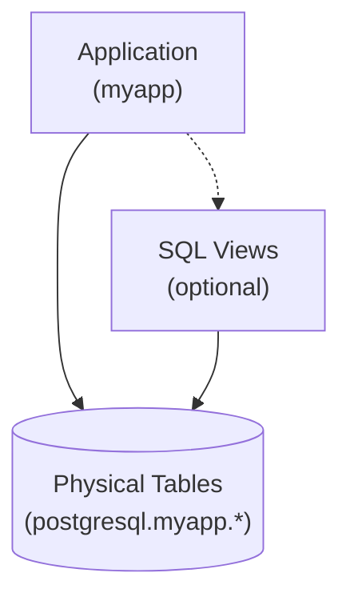
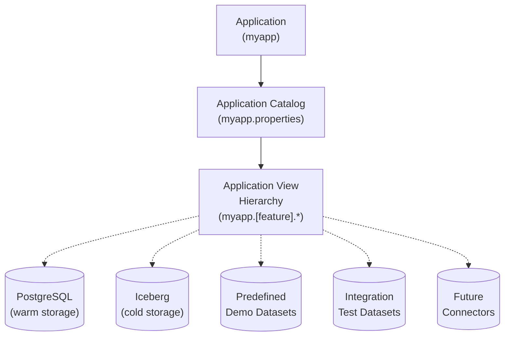
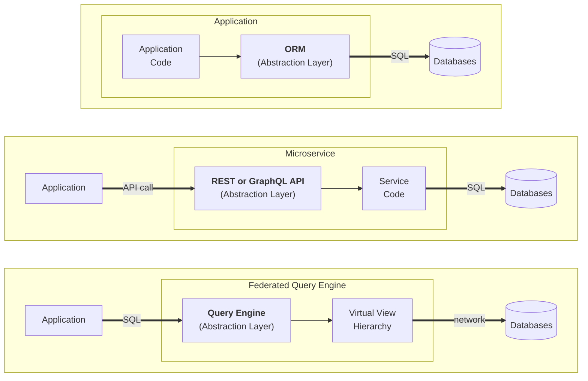

---

## Introduction: Views as Architecture, Not Decoration

### A Quick Primer on Classical SQL Views

SQL views are saved SELECT statements that can be queried like regular tables. Traditional use cases for views are hiding complexity (so that joins and other complex expressions don't have to be repeated over and over in queries) and re-shaping the rows and columns returned by queries.



**Example of hiding a join**:
```sql
CREATE VIEW customer_orders AS 
SELECT c.name, c.email, o.order_id, o.total, o.order_date
FROM postgresql.myapp.customers c 
JOIN postgresql.myapp.orders o ON c.customer_id = o.customer_id;
```

**Example of adding computed columns**:
```sql
CREATE VIEW users_enhanced AS
SELECT 
  user_id,
  first_name,
  last_name,
  first_name || ' ' || last_name as full_name,
  YEAR(CURRENT_DATE) - YEAR(birth_date) as age
FROM postgresql.myapp.users;
```

**Example of redacting sensitive data**:
```sql
-- Omit SSN column, filter to current user's data
CREATE VIEW my_profile AS
SELECT user_id, name, email, phone
FROM postgresql.myapp.users
WHERE user_id = CURRENT_USER_ID();
```

**Example of caching results (materialized views)**:
```sql
CREATE MATERIALIZED VIEW daily_sales_summary AS
SELECT 
  date_trunc('day', order_date) as day,
  SUM(total) as revenue,
  COUNT(*) as order_count
FROM postgresql.myapp.orders
GROUP BY date_trunc('day', order_date);
```

With these classical use cases, views are just icing on your physical schema to make queries a little easier. Applications mostly use physical tables, except when views are needed for security or convenience.

---

### The Cost of Tight Coupling to Physical Schemas

When applications query physical schemas directly, tight coupling creates friction:
- Applications must know which connector(s) to query
- Views live in the same database/connector as their tables
- Migrating storage means changing queries wherever they appear

**Example of the migration problem**:
```sql
-- Application queries PostgreSQL directly
SELECT * FROM postgresql.myapp.customers;

-- Want to move to Iceberg? Change the query...
SELECT * FROM iceberg.myapp.customers;

-- Have data in both? Handle the complexity...
SELECT * FROM postgresql.myapp.customers WHERE active = true
UNION ALL
SELECT * FROM iceberg.myapp.customers WHERE active = false;
```

---

### The Virtual View Approach

Unlike physical tables and traditional views, virtual views are organized by application or feature, designed to be replaced with different implementations while maintaining the same interface. Virtual views decouple applications from physical storage, through layers of views that can evolve independently, even dynamically at runtime.

Virtual views are always:
- **Application-first** - Named by application domain or feature, not storage technology
- **Detached from physical schemas** - Views are used for most application queries, not physical tables
- **Layered into hierarchies** - Views depend on other views, creating swappable layers
- **Independently replaceable** - Each layer can be swapped without affecting others
- **Multi-connector capable** - Each layer can use one or more (real or fake) data sources



---

### Why Not Just Use ORMs or Microservices?

Decoupling through ORMs or microservices absolutely works. If every database query flows through application code, then virtual views may not add value.

**When ORMs/Microservices are sufficient:**
- All data access goes through application code
- Query patterns are simple CRUD operations
- Single database, no federation needed
- Team prefers application-layer abstraction

**When virtual views complement or replace them:**
- SQL is your native query language (analytics, BI tools, SQL-heavy apps)
- Need to federate across multiple databases
- Want environment switching without code deployment
- Need independent evolution of data and application layers

Virtual views operate at the query engine layer. For SQL-native applications, this provides abstraction without serialization overhead, or compounding network hops between microservices.



> [!TIP]
> As architectural patterns, virtual views and microservices aren't mutually exclusive. Microservices that query SQL databases directly (without ORMs) can benefit from virtual views just as much as larger applications. Building microservices on top of virtual views provides decoupling at both the service boundary and the data access layer, and is simpler than introducing an ORM.
