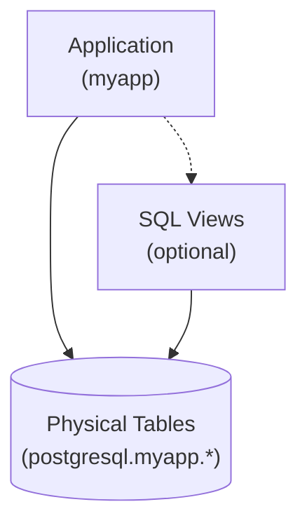
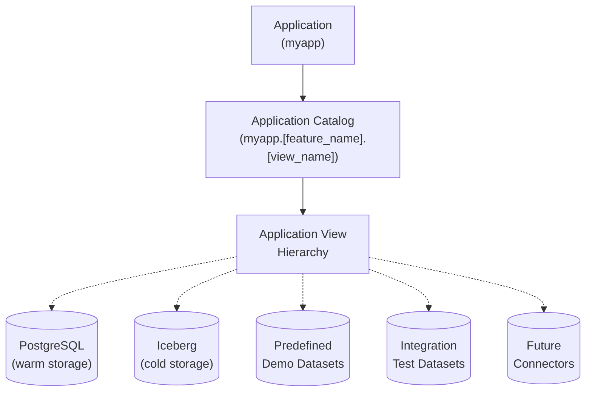

---

## Introduction: Views as Architecture, Not Decoration

### A Quick Primer on Classical SQL Views

SQL views are saved SELECT statements that can be queried like regular tables. Traditional use cases for views are hiding complexity (so that joins and other complex expressions don't have to be repeated over and over in queries) and re-shaping the rows and columns returned by queries.

With these classical use cases, views are just icing on your physical schema to make queries a little easier. Applications mostly use physical tables, except when views are needed for security or convenience.



**Example of hiding a join**:
```sql
CREATE VIEW customer_orders AS 
SELECT c.name, c.email, o.order_id, o.total, o.order_date
FROM postgresql.myapp.customers c 
JOIN postgresql.myapp.orders o ON c.customer_id = o.customer_id;
```

**Example of adding computed columns**:
```sql
CREATE VIEW users_enhanced AS
SELECT 
  user_id,
  first_name,
  last_name,
  first_name || ' ' || last_name as full_name,
  YEAR(CURRENT_DATE) - YEAR(birth_date) as age
FROM postgresql.myapp.users;
```

**Example of redacting sensitive data**:
```sql
-- Omit SSN column, filter to current user's data
CREATE VIEW my_profile AS
SELECT user_id, name, email, phone
FROM postgresql.myapp.users
WHERE user_id = CURRENT_USER_ID();
```

**Example of caching results (materialized views)**:
```sql
CREATE MATERIALIZED VIEW daily_sales_summary AS
SELECT 
  date_trunc('day', order_date) as day,
  SUM(total) as revenue,
  COUNT(*) as order_count
FROM postgresql.myapp.orders
GROUP BY date_trunc('day', order_date);
```

Even though views like the examples above can be very helpful for reusing SQL statements, many applications only use views sparingly, with most queries directly referencing the physical schema.

### The Cost of Tight Coupling to Physical Schemas

Many database applications (especially those with light use of views) have a fundamental and widely accepted constraint. They are tightly coupled to their physical databases, tables and views.

Because of this tight coupling by default:
- Applications must know which connector(s) to query
- Views live in the same database/connector as their tables
- Migrating storage or schema always means changing application code

**Example of the problem**:
```sql
-- Application queries PostgreSQL directly
SELECT * FROM postgresql.myapp.customers;

-- Want to move to Iceberg? Change application code like this...
SELECT * FROM iceberg.myapp.customers;

-- Have data in both? Application must again handle the complexity like this...
SELECT * FROM postgresql.myapp.customers WHERE active = true
UNION ALL
SELECT * FROM iceberg.myapp.customers WHERE active = false;
```

As good architects, we can hope to isolate these queries in the data access layers of our applications, but every storage change still has to ripple through any code that directly references the database. This makes evolution and migrations painful and time consuming.

### The Virtual View Approach

Unlike physical tables and traditional views, virtual views are organized by application or feature, designed to be replaced with different implementations while maintaining the same interface. Virtual views decouple applications from physical storage, through layers of views that can evolve independently, even dynamically at runtime.

Virtual views are always:
- **Application-first** - Named by application domain or feature, not storage technology
- **Detached from physical schemas** - Views are used for most application queries, not physical tables
- **Layered into hierarchies** - Views depend on other views, creating swappable layers
- **Independently replaceable** - Each layer can be swapped without affecting others
- **Multi-connector capable** - Each layer can use one or more (real or fake) data sources


