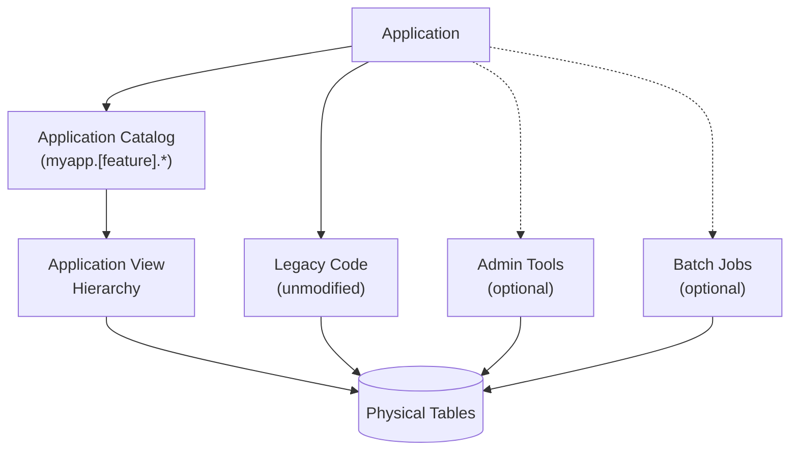
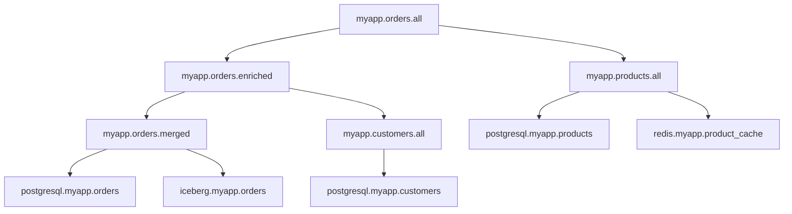

---

## Principles of Virtual View Hierarchies

1. [Virtual Views Belong to Applications, Not Physical Schemas](#principle-1-virtual-views-belong-to-applications-not-physical-schemas)
2. [Applications Query Virtual Views (Usually)](#principle-2-applications-query-virtual-views-usually)
3. [Every Virtual View Has Multiple Versions](#principle-3-every-virtual-view-has-multiple-versions)
4. [Assign One Owner Per Layer](#principle-4-assign-one-owner-per-layer)
5. [Never Change Column Types](#principle-5-never-change-column-types)
6. [Use Invoker Permissions](#principle-6-use-invoker-permissions)
7. [Store Views in a Canonical Location](#principle-7-store-views-in-a-canonical-location)
8. [Map Complexity, Don't Memorize It](#principle-8-map-complexity-dont-memorize-it)

---

### Principle 1: Virtual Views Belong to Applications, Not Physical Schemas

**Rule**: Organize views by application or feature, not by physical data source.

**Why**: Physical schemas reflect storage concerns. Applications have different concerns. When views mirror physical schema organization, they are rigid and provide no abstraction value. Instead, assume that virtual views can use data from zero to many databases, and keep virtual views in catalogs of their own.

**Simple example**:
```sql
-- Good: Organized by application, by feature (customers)
CREATE VIEW myapp.customers.active AS ...

-- Bad: View stored in physical schema with tables
CREATE VIEW postgresql.myapp.active_customers AS
SELECT ... FROM postgresql.myapp.tbl_cust
```

**Realistic example**:
```sql
-- Application: E-commerce platform
-- Features: order processing, inventory, analytics

-- Good: Organized by app, then feature
CREATE VIEW myapp.orders.current AS ...
CREATE VIEW myapp.orders.historical AS ...
CREATE VIEW myapp.products.catalog AS ...
CREATE VIEW myapp.products.pricing AS ...
CREATE VIEW myapp.stock.available AS ...
CREATE VIEW myapp.stock.reserved AS ...

-- Bad: Separate catalog for views, but still mirrors physical schema
CREATE VIEW postgresql_views.myapp.orders AS
SELECT ... FROM postgresql.myapp.tbl_ord
```

**Implementation**:
- Create application-specific catalogs (`myapp`, `feature_analytics`, `ecommerce`)
- Create feature-specific schemas (`customers`, `logging`, `preferences`)
- Use domain-specific language in all names (`customer_orders`, not `table_23_denorm`)
- Avoid naming virtual schemas to directly mirror physical schemas (like `postgresql_virtual.xxx`)

---

### Principle 2: Applications Query Virtual Views (Usually)

**Rule**: Applications should reference virtual views by default to get all the benefits of this pattern. Direct physical table access is acceptable for legacy code and performance-critical paths.

**Why**: Enables major storage changes without major application changes, but recognizes pragmatic constraints of real systems. Use virtual views for new code and high-value refactoring, and direct access when necessary. Both approaches can coexist peacefully, using standard SQL in each case.



**When direct access is acceptable**:
- Legacy applications too costly to refactor
- Administrative, operational or reporting jobs
- Large queries or batch jobs with specific performance hints
- Ultra-low-latency requirements where view overhead matters (rare)

**When virtual views are preferred**:
- New development of major features
- High-level APIs and user-facing queries
- Features likely to need storage virtualization in the future
- Anywhere flexibility matters more than microseconds

**Simple example**:
```sql
-- Use virtual view (preferred, hides filtering for active customers)
SELECT * FROM myapp.customers.active

-- Use direct access (same query results, but not virtualized)
SELECT * FROM postgresql.myapp.customers WHERE active = true
```

**Realistic example**:
```sql
-- API endpoint (uses virtual view for flexibility)
@GetMapping("/orders")
public List<Order> getOrders() {
    return jdbc.query(
        "SELECT * FROM myapp.orders.pending WHERE user_id = ?", userId
    );
}

-- Nightly batch job (uses direct access for performance)
@Scheduled(cron = "0 2 * * *")
public void generateReports() {
    // Direct access acceptable - runs once daily, performance critical
    // 10M+ rows, needs partition pruning optimization
    return jdbc.query(
        "SELECT * FROM iceberg.warehouse.orders_partitioned " +
        "WHERE order_date = ? AND partition_key = ?", date, partition
    );
}
```

**Implementation**:
- For new code and new features, use virtual views by default
- For legacy code, migrate opportunistically during refactors
- Document what paths use direct access and why
---

### Principle 3: Every Virtual View Has Multiple Versions

**Rule**: Design each view expecting to be replaced with static versions (for testing), live versions (for development, staging, production) and hybrid versions (for migrations or future integrations). Assume that view definitions will change at runtime, not just during upgrades or when applications are offline.

**Why**: Enables prototyping, testing, and seamless migrations, with current and future data sources. If a view only ever has one definition, you're not using this pattern to its full potential.

**Simple example (providing data for development and testing)**:
```sql
-- Good static data: typical values
CREATE VIEW myapp.users.all SECURITY INVOKER AS
SELECT * FROM (VALUES
  (1, 'alice', 'alice@example.com'),
  (2, 'bob', 'bob@example.com')
) AS t (id, name, email);

-- Edge case static data: boundary conditions for testing
CREATE OR REPLACE VIEW myapp.users.all SECURITY INVOKER AS
SELECT * FROM (VALUES
  (1, 'alice', 'alice@example.com'),
  (9223372036854775807, 'max_id_user', 'test@example.com'),
  (3, NULL, 'no-name@example.com'),
  (4, 'unicode_user', 'emoji-👋@example.com')
) AS t (id, name, email);
```

**Realistic example (moving from prototype to live database)**:
```sql
-- Version 1: Prototype with static data
CREATE VIEW myapp.orders.all SECURITY INVOKER AS
SELECT * FROM (VALUES
  (1, 101, TIMESTAMP '2024-01-15 10:30:00', 'pending'),
  (2, 102, TIMESTAMP '2024-01-16 14:22:00', 'shipped'),
  (3, 101, TIMESTAMP '2024-01-17 09:15:00', 'delivered')
) AS t (order_id, customer_id, order_time, status);

-- Version 2: Replace with live database when ready
CREATE OR REPLACE VIEW myapp.orders.all SECURITY INVOKER AS
SELECT
  CAST(order_id AS BIGINT) as order_id,
  CAST(customer_id AS BIGINT) as customer_id,
  CAST(order_time AS TIMESTAMP(3)) as order_time,
  CAST(status AS VARCHAR) as status
FROM postgresql.myapp.orders;
```

**Implementation**:
- Start new projects and feature prototypes with static data views
- Keep test views in version control alongside production definitions
- Document expected version progression paths from development to production
- Use environment-specific catalogs if needed (`myapp_dev`, `myapp_prod`)

---

### Principle 4: Assign One Owner Per Layer

**Rule**: Assign each layer in a view hierarchy to a single actor, agent or team. Coordinate changes through that owner.

**Why**: Prevents race conditions, conflicting updates, and unclear responsibility. Views have no locking mechanism during definition replacement, and queries won't be canceled or restarted if definitions change.

**Simple example**:
```sql
-- Owned by data engineering, updated during migrations
CREATE VIEW myapp.users.merged SECURITY INVOKER AS
SELECT id, name, email, account_type, tenant_id
FROM postgresql.myapp.users
UNION ALL
SELECT id, name, email, account_type, tenant_id
FROM iceberg.myapp.users;

-- Owned by privacy system, updated when policies change
CREATE VIEW myapp.users.filtered SECURITY INVOKER AS
SELECT id, name, email, account_type
FROM myapp.users.merged
WHERE tenant_id = current_tenant() OR is_admin();

-- Owned by dev team, updated during releases
CREATE VIEW myapp.users.all SECURITY INVOKER AS
SELECT id, name, email, account_type
FROM myapp.users.filtered;
```

**Documented example with ownership matrix**:

| Layer   | View Name              | Owner            | Update Trigger    |
|---------|------------------------|------------------|-------------------|
| Entry   | `myapp.users.all`      | Dev team         | Feature release   |
| Privacy | `myapp.users.filtered` | Privacy system   | Policy change     |
| Merge   | `myapp.users.merged`   | Data engineering | Storage migration |

**Implementation**:
- Document layer ownership in team wiki or repository README
- Use synchronized/coordinated access for programmatic updates
- Avoid concurrent modifications to same view definition

> [!CAUTION]
> Trino has no locking mechanism for `ALTER VIEW` or `CREATE OR REPLACE VIEW` statements. Queries use the view definition active when query planning occurs. Replacing a view doesn't terminate or restart running queries using the old definition.

---

### Principle 5: Never Change Column Types

**Rule**: When replacing a view definition, avoid changing column types. It's a good habit to explicitly set column types using `CAST` whenever new columns are declared in a view.

**Why**: Accidentally changing column types is the easiest way to break a view hierarchy. Trino does NOT validate types when replacing views. Breaking changes only surface at query time, potentially in production.

**Working example with `CAST`**:
```sql
-- Original view
CREATE VIEW myapp.events.all SECURITY INVOKER AS
SELECT
  CAST(id AS BIGINT) as event_id,
  CAST(name AS VARCHAR) as event_name
FROM postgresql.myapp.events;

-- Good replacement: types preserved
CREATE OR REPLACE VIEW myapp.events.all SECURITY INVOKER AS
SELECT
  CAST(event_id AS BIGINT) as event_id,
  CAST(event_name AS VARCHAR) as event_name
FROM iceberg.myapp.events;
```

**Breaking example with cascading failure**:
```sql
-- Base view (originally BIGINT)
CREATE VIEW myapp.events.base SECURITY INVOKER AS
SELECT
  CAST(id AS BIGINT) as event_id,
  CAST(timestamp AS TIMESTAMP(3)) as event_time
FROM postgresql.myapp.events;

-- Dependent view (expects BIGINT)
CREATE VIEW myapp.events.hourly SECURITY INVOKER AS
SELECT
  event_id,
  date_trunc('hour', event_time) as hour,
  count(*) as event_count
FROM myapp.events.base
GROUP BY event_id, date_trunc('hour', event_time);

-- Someone changes base view type
CREATE OR REPLACE VIEW myapp.events.base SECURITY INVOKER AS
SELECT
  CAST(id AS VARCHAR) as event_id,  -- Now VARCHAR!
  CAST(timestamp AS TIMESTAMP(3)) as event_time
FROM iceberg.myapp.events;

-- Query breaks with cryptic error:
-- "Cannot apply operator: bigint = varchar" when joining
-- or "Invalid cast from varchar to bigint" in aggregations
```

**Implementation**:
- Use explicit `CAST` in base layers to lock types
- Consider using Iceberg types even in base views if Iceberg is a future target
- Document expected types in view comments or external documentation
- If you MUST change types, use a phased approach

**When you must change types**:
1. Create new view with new name (`myapp.events_v2`)
2. Deprecate old view (add comment, log warnings)
3. Migrate consumers gradually
4. Monitor old view usage until zero
5. Remove old view

---

### Principle 6: Use Invoker Permissions

**Rule**: Define virtual views with `SECURITY INVOKER` to avoid granting excessive access through views.

**Why**: Views with `SECURITY DEFINER` (the default in some systems) give all users the view creator's permissions, becoming a privilege escalation vector.

**Simple example**:
```sql
-- Preferred: Users need permissions to underlying tables
CREATE VIEW myapp.users.all
SECURITY INVOKER
AS SELECT id, name, email FROM postgresql.myapp.users;

-- Avoid: All users get view creator's permissions
CREATE VIEW myapp.users.all
SECURITY DEFINER
AS SELECT id, name, email FROM postgresql.myapp.users;
```

**Realistic example**:
```sql
-- Scenario: View spans multiple sources with different permissions

-- Sales team should only see aggregated data
CREATE VIEW myapp.sales.revenue_summary
SECURITY INVOKER
AS SELECT 
  date_trunc('month', order_date) as month,
  SUM(total) as revenue
FROM postgresql.finance.orders  -- Finance team has access, sales team does not
GROUP BY date_trunc('month', order_date);

-- With SECURITY INVOKER:
-- * Finance team: Can query the view (they have access to underlying table)
-- * Sales team: Cannot query the view (they lack access to finance.orders)

-- With SECURITY DEFINER:
-- * Both teams can query the view (using view creator's permissions)
-- * Violates principle of least privilege
```

**Implementation**:
- Default to `SECURITY INVOKER` for all virtual views
- Document permission requirements for each view
- Test views with user accounts that have minimal permissions
- Consider using `SECURITY DEFINER` only for controlled privilege escalation with strong justification

> [!TIP]
> Trino's default behavior may vary by connector. Always specify explicitly, like all our examples.

---

### Principle 7: Store Views in a Canonical Location

**Rule**: Choose one authoritative connector for virtual view storage and commit to it, or use [ViewZoo](https://github.com/robfromboulder/viewzoo) to store current and future views with minimal overhead.

**Why**: View definitions must always be persisted somewhere, even when views are backed by static data (and there are no real data sources).

**Recommended decision tree**:
```
Do you already use Iceberg?
├─ Yes → Store views in Iceberg connector
│         (Views live alongside data, one system to manage)
│
└─ No → Will you definitely use Iceberg within 6 months?
    ├─ Yes → Store views in Iceberg connector now
    │         (Prepare for eventual data migration)
    │
    └─ No → Need maximum flexibility?
        ├─ Yes → Store views in ViewZoo connector
        │         (Filesystem-based, no external dependencies)
        │         (Git integration for version control)
        │
        └─ No → Use your most stable connector
                  (PostgreSQL, MySQL, whatever won't disappear)
                  (Use ViewZoo for testing edge cases)
```

**Implementation**:
- Choose storage location during project setup
- Document the decision in project wiki or README
- If migrating storage later, use `SHOW CREATE VIEW` to export/import definitions

**Link to ViewZoo documentation**: [github.com/robfromboulder/viewzoo](https://github.com/robfromboulder/viewzoo)

---

### Principle 8: Map Complexity, Don't Memorize It

**Rule**: Use tools like [ViewMapper](https://github.com/robfromboulder/viewmapper) to discover and visualize view dependencies rather than expecting humans to parse view definitions and track relationships mentally.

**Why**: View hierarchies become complex quickly. SQL definitions don't show the dependency graph. `SHOW CREATE VIEW` is for debugging, not understanding architecture. Traditional ERD tools aren't a big help.

**Simple example**:
```sql
-- These four views form a hierarchy, but how?
CREATE VIEW myapp.users.base SECURITY INVOKER AS
  SELECT * FROM postgresql.myapp.users;
CREATE VIEW myapp.users.enriched SECURITY INVOKER AS
  SELECT * FROM myapp.users.base;
CREATE VIEW myapp.users.filtered SECURITY INVOKER AS
  SELECT * FROM myapp.users.enriched;
CREATE VIEW myapp.users.all SECURITY INVOKER AS
  SELECT * FROM myapp.users.filtered;

-- SHOW CREATE VIEW only shows one level at a time
-- Developers must manually trace dependencies
```

**Realistic example (but still small)**:
```sql
-- 10+ views spanning multiple layers
-- Some views join multiple sources
-- Manual tracking becomes difficult, even at this scale

myapp.orders.all (entry)
  ├─ depends on myapp.orders.enriched
  │   ├─ depends on myapp.orders.merged
  │   │   ├─ depends on postgresql.myapp.orders
  │   │   └─ depends on iceberg.myapp.orders
  │   └─ depends on myapp.customers.all
  │       └─ depends on postgresql.myapp.customers
  └─ depends on myapp.products.all
      ├─ depends on postgresql.myapp.products
      └─ depends on redis.myapp.product_cache
```

**Implementation**:
- Use tools to generate dependency diagrams
- Keep generated diagrams in documentation (Git repository)
- Regenerate after significant changes
- Include diagrams in code review for view changes

**Example ViewMapper output**:


**Link to ViewMapper**: [github.com/robfromboulder/viewmapper](https://github.com/robfromboulder/viewmapper)
