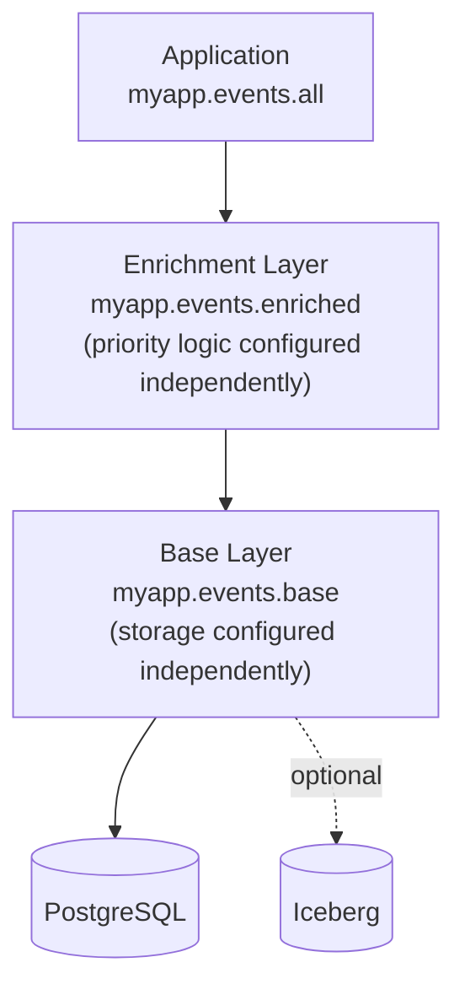
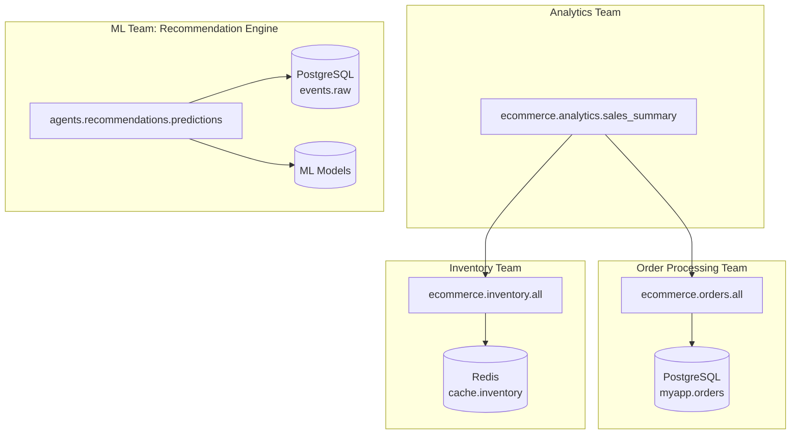
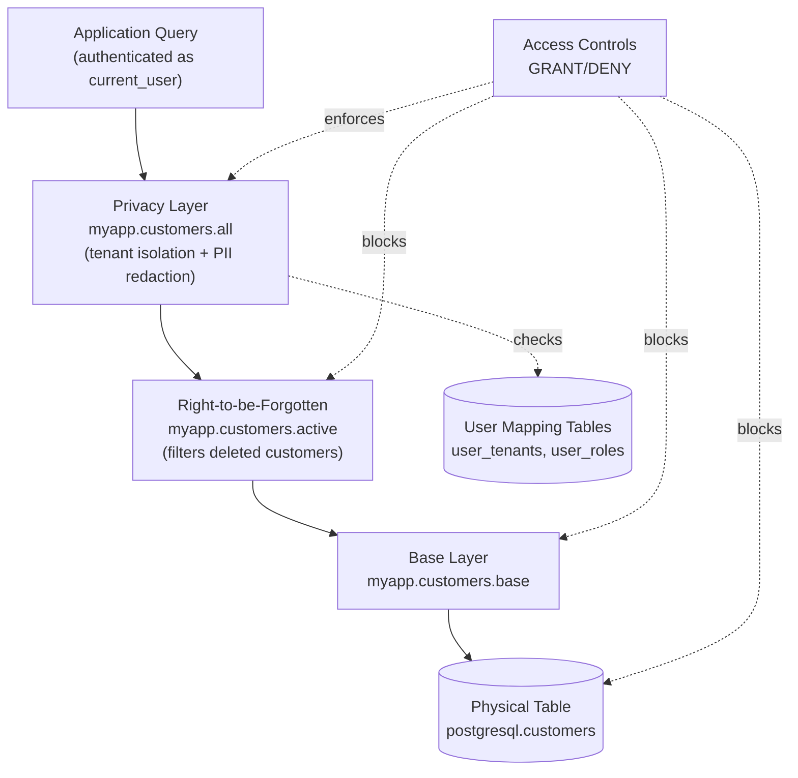

---

## Use Cases: When Virtual Views Shine

1. [Rapid Prototyping](#use-case-1-rapid-prototyping)
2. [Testing Data Edge Cases](#use-case-2-testing-data-edge-cases)
3. [Live Schema Reconfiguration](#use-case-3-live-schema-reconfiguration)
4. [Modular Storage for Features and Agents](#use-case-4-modular-storage-for-features-and-agents)
5. [Zero-Downtime Schema Evolution](#use-case-5-zero-downtime-schema-evolution)
6. [Privacy Filtering and Compliance](#use-case-6-privacy-filtering-and-compliance)
7. [Extending Applications to Iceberg](#use-case-7-extending-applications-to-iceberg)

---

### Use Case 1: Rapid Prototyping

**The Challenge**: Build, integrate, and demonstrate new applications or new features, without having to first invest time in provisioning new databases, designing physical schemas or implementing data pipelines.

**The Solution**: Define static datasets that enable UI and workflow development, system integrations, and stakeholder demos without prematurely implementing physical schemas, or even committing to a specific database platform for storage yet.

**Simple example** (prototyping a new application):
```sql
-- Day 1: No database yet, use static data
CREATE OR REPLACE VIEW myapp.customers.all SECURITY INVOKER AS
SELECT * FROM (VALUES
  (1, 'Acme Corp', 'acme@example.com'),
  (2, 'Widgets Inc', 'widgets@example.com'),
  (3, 'Gadgets LLC', 'gadgets@example.com')
) AS t (customer_id, company_name, email);
-- New application development proceeds
-- UI, workflows, integrations all work against this view

-- Day 15: Decision made to use Postgresql instead of MySQL
-- Application code: unchanged! 😀

-- Day 30: Database ready, swap in real data
CREATE OR REPLACE VIEW myapp.customers.all SECURITY INVOKER AS
SELECT
  CAST(id AS BIGINT) as customer_id,
  CAST(name AS VARCHAR) as company_name,
  CAST(email AS VARCHAR) as email
FROM postgresql.myapp.customers;
-- Application code: unchanged! 😀
```

**Realistic example** (adding a new feature to an existing application):
```sql
-- Prototyping a new analytics feature
-- Requires joining customer, order, and product data
-- Some tables don't exist yet, some APIs not ready

-- Start with mock data for all sources
CREATE OR REPLACE VIEW analytics.reports.customer_lifetime_value SECURITY INVOKER AS
SELECT
  customer_id,
  SUM(order_total) as lifetime_value,
  COUNT(*) as order_count,
  MAX(order_date) as last_order_date
FROM (VALUES
  (1, 100.00, DATE '2024-01-01'),
  (1, 250.00, DATE '2024-02-15'),
  (2, 75.00, DATE '2024-01-10'),
  (2, 125.00, DATE '2024-02-20'),
  (2, 200.00, DATE '2024-03-01')
) AS mock_orders (customer_id, order_total, order_date)
GROUP BY customer_id;

-- Build dashboards, demonstrate workflows, validate with stakeholders
-- Only implement real data pipelines after prototype is approved

-- Later: Swap to real, complex query
CREATE OR REPLACE VIEW analytics.reports.customer_lifetime_value SECURITY INVOKER AS
SELECT
  c.customer_id,
  SUM(o.total) as lifetime_value,
  COUNT(o.order_id) as order_count,
  MAX(o.order_date) as last_order_date
FROM postgresql.myapp.customers c
JOIN postgresql.myapp.orders o ON c.customer_id = o.customer_id
WHERE o.status IN ('completed', 'shipped')
GROUP BY c.customer_id;
```

**Benefits**:
- Start building and verifying before physical data sources are ready
- Verify requirements with stakeholders using realistic UI, workflows, and integrations
- Keep demo dataset definitions under source control as SQL statements 
- Rely on predictable, fast performance for small prototype datasets
- Delay implementation and optimization of physical schema until features have jelled
- Smooth out transitions between prototypes and fully working implementations

> [!TIP]
> Writing static datasets in SQL syntax can be tedious, but Claude and other AI copilots excel at generating realistic demo data, especially for larger datasets with diverse, believable values.

> [!TIP]
> For Trino users: The [Google Sheets connector](https://trino.io/docs/current/connector/googlesheets.html) and [faker connector](https://trino.io/docs/current/connector/faker.html) enable creative options for implementing static datasets, without writing SQL VALUES clauses.

---

### Use Case 2: Testing Data Edge Cases

**The Challenge**: Perform regular testing of application behaviors for common edge cases (like null values, invalid enums, duplicate keys, and broken foreign keys) before physical schemas exist, or when schemas are already configured to reject these values. Some frameworks and methods rely on disabling column or foreign key checks (literally using `ALTER TABLE` to relax these constraints), but this is awkward and doesn't reflect the normal state of the system.

**The Solution**: Use view definitions with deliberately invalid values that violate database constraints, and easily swap between these static datasets in your automated tests, without re-provisioning databases or relaxing any normal schema constraints. 

**Simple example (testing column-level checks)**:
```sql
-- Normal view used for most tests
CREATE OR REPLACE VIEW myapp.products.all SECURITY INVOKER AS
SELECT
  CAST(product_id AS BIGINT) as product_id,
  CAST(name AS VARCHAR) as name,
  CAST(price AS DECIMAL(10,2)) as price,
  CAST(inventory_count AS INTEGER) as inventory_count
FROM postgresql.myapp.products;

-- Test view used to validate edge cases
CREATE OR REPLACE VIEW myapp.products.all SECURITY INVOKER AS
SELECT * FROM (VALUES
  (1, 'Normal Product', 10.00, 100),
  (2, 'Zero Price', 0.00, 50),          -- Edge case
  (3, 'Negative Inventory', 5.00, -10), -- Edge case
  (4, NULL, 15.00, 20),                 -- NULL name
  (5, 'Very Long Name That Might Break UI Components Because It Is Extremely Long', 15.00, 5)
) AS t (product_id, name, price, inventory_count);
```

**Realistic example (testing broken foreign keys)**:

```sql
-- Parent table: departments
CREATE OR REPLACE VIEW myapp.departments AS
SELECT * FROM (VALUES
(1, 'Engineering', 'alice@example.com'),
(2, 'Sales', 'sales-mgr@example.com')
) AS t (id, name, manager_email);

-- Child table: employees with foreign key to departments
CREATE OR REPLACE VIEW myapp.employees AS
SELECT * FROM (VALUES
(101, 'Alice Chen', 1),      -- Valid: department_id=1 exists
(102, 'Bob Smith', 99)       -- Invalid: department_id=99 doesn't exist
) AS t (id, name, department_id);
```

**Benefits**:
- Exercise invalid column and foreign key values without relaxing schema constraints
- Integrate tightly with automated test cases and keep test data under version control
- Rely on predictable, fast performance for small test datasets
- Run more tests in parallel (since tests don't need to restart the database with different constraints)
- Reduce risk of accidentally applying `ALTER TABLE` modifications to production databases

> [!TIP]
> For Trino users: The [ViewZoo connector](https://github.com/robfromboulder/viewzoo) allows reading and writing views in JSON format to the local filesystem, which is convenient for temporary storage of views while running tests in isolation, or when storing test view definitions in separate git repositories or branches.

> [!CAUTION]
> This discussion is for **functional testing** of data edge cases, not performance or load testing. For testing query performance at scale, use real infrastructure with representative data volumes.

---

### Use Case 3: Live Schema Reconfiguration

**The Challenge**: Dynamically alter and adapt data sources based on environment, feature flags, or runtime configuration, without redeploying application code or interrupting application queries.

**The Solution**: Use view hierarchies where layers can be independently replaced, and coordinate changes to each layer through a single owner or team.

**Simple example (switching data providers)**:
```python
def configure_base_layer(config):
    """Update view definitions based on current configuration"""

    if config.environment == 'staging':
        # Staging database
        execute_sql("""
            CREATE OR REPLACE VIEW myapp.events.base SECURITY INVOKER AS
            SELECT * FROM postgresql.staging.events
        """)
    elif config.environment == 'production' and config.feature_flags.get('use_iceberg'):
        # Production with Iceberg hybrid (hot + cold storage)
        execute_sql("""
            CREATE OR REPLACE VIEW myapp.events.base SECURITY INVOKER AS
            SELECT * FROM postgresql.prod.events
            WHERE event_time > CURRENT_DATE - INTERVAL '7' DAYS
            UNION ALL
            SELECT * FROM iceberg.warehouse.events
            WHERE event_time <= CURRENT_DATE - INTERVAL '7' DAYS
        """)
    else:
        # Production PostgreSQL only
        execute_sql("""
            CREATE OR REPLACE VIEW myapp.events.base SECURITY INVOKER AS
            SELECT * FROM postgresql.prod.events
        """)

# Called at application startup, or whenever config changes 😀
configure_base_layer(current_config)
```

**Realistic example (computed columns with runtime business logic)**:

A. Define a three-layer hierarchy with independent configuration points

```sql
-- Base layer: physical data source (initialized via configure_base_layer above)

-- Enrichment layer: adds computed priority column (configurable)
CREATE OR REPLACE VIEW myapp.events.enriched SECURITY INVOKER AS
SELECT
  *,
  'unknown' as priority  -- Default: everything is unknown priority
FROM myapp.events.base;

-- Application layer: stable interface
CREATE OR REPLACE VIEW myapp.events.all SECURITY INVOKER AS
SELECT * FROM myapp.events.enriched;
```



B. Configure the enrichment layer independently to change how priority is computed

```python
def configure_priority_logic(priority_config):
    """Dynamically reconfigure priority computation without application restart"""

    if priority_config.mode == 'simple':
        # Simple type-based priority
        execute_sql("""
            CREATE OR REPLACE VIEW myapp.events.enriched SECURITY INVOKER AS
            SELECT
              *,
              CASE event_type
                WHEN 'error' THEN 'high'
                WHEN 'warning' THEN 'medium'
                ELSE 'low'
              END as priority
            FROM myapp.events.base
        """)

    elif priority_config.mode == 'pattern':
        # Pattern matching for critical events
        execute_sql(f"""
            CREATE OR REPLACE VIEW myapp.events.enriched SECURITY INVOKER AS
            SELECT
              *,
              CASE
                WHEN regexp_like(event_type, '{priority_config.critical_pattern}')
                  THEN 'critical'
                WHEN regexp_like(event_type, '{priority_config.high_pattern}')
                  THEN 'high'
                ELSE 'low'
              END as priority
            FROM myapp.events.base
        """)

    elif priority_config.mode == 'multifactor':
        # Multi-factor priority based on type, source, and payload
        execute_sql(f"""
            CREATE OR REPLACE VIEW myapp.events.enriched SECURITY INVOKER AS
            SELECT
              *,
              CASE
                -- Critical: errors from production systems with specific payload patterns
                WHEN event_type = 'error'
                  AND source IN {priority_config.production_sources}
                  AND json_extract_scalar(payload, '$.severity') = 'fatal'
                  THEN 'critical'
                -- High: errors from production, or warnings with escalation flag
                WHEN (event_type = 'error' AND source IN {priority_config.production_sources})
                  OR (event_type = 'warning' AND json_extract_scalar(payload, '$.escalate') = 'true')
                  THEN 'high'
                -- Medium: warnings from production
                WHEN event_type = 'warning'
                  AND source IN {priority_config.production_sources}
                  THEN 'medium'
                -- Low: everything else
                ELSE 'low'
              END as priority
            FROM myapp.events.base
        """)
```

C. Example configurations at runtime

```python
# Simple type-based priority
configure_priority_logic(PriorityConfig(mode='simple'))

# Pattern-based priority (incidents with specific keywords)
configure_priority_logic(PriorityConfig(
    mode='pattern',
    critical_pattern='(outage|breach|down)',
    high_pattern='(degraded|slow|timeout)'
))

# Multi-factor priority (production context matters)
configure_priority_logic(PriorityConfig(
    mode='multifactor',
    production_sources="('api-gateway', 'payment-processor', 'auth-service')"
))
```

> [!IMPORTANT]
> `configure_base_layer()` and `configure_priority_logic()` operate on different layers independently. The base layer can switch between storage backends while the enrichment layer's business logic remains unchanged, or vice versa.

**Benefits**:
- Allow applications to dynamically control data sources and data policies
- Easily enrich data sources with configurable custom functions
- Seamlessly switch between single and multiple data sources
- Configure base storage and data enrichment views independently
- Change data sources and policies without restarting Trino or applications
- Scale out to multiple layers (base → transform → filter → application) with minimal overhead

> [!CAUTION]
> The easiest way to break an existing view hierarchy is by accidentally changing column types. Using `CAST` to specify column types is a good habit.

---

### Use Case 4: Modular Storage for Features and Agents

**The Challenge**: Teams need independent control over designing, implementing, and migrating their databases and view hierarchies, without unexpectedly blocking or breaking work by other teams.

**The Solution**: Create isolated view hierarchies per feature or agent, enabling teams to develop, test, and deploy their data layers independently with less cross-team coordination. New features and agents often need data that doesn't naturally align to existing tables or view schemas. Virtual views let teams define new base layers tailored to their specific requirements, then build hierarchies on top without constantly relitigating physical infrastructure.

**Example**:
```sql
-- Feature 1: Order Processing (owned by checkout team)
CREATE OR REPLACE VIEW ecommerce.orders.all SECURITY INVOKER AS
SELECT
  order_id, customer_id, order_date, status, total
FROM postgresql.myapp.orders;

-- Feature 2: Inventory Management (owned by warehouse team)
CREATE OR REPLACE VIEW ecommerce.inventory.all SECURITY INVOKER AS
SELECT
  product_id, warehouse_id, quantity_available, last_updated
FROM redis.cache.inventory;

-- Feature 3: Analytics (owned by data team, references other teams' views)
CREATE OR REPLACE VIEW ecommerce.analytics.sales_summary SECURITY INVOKER AS
SELECT
  o.order_date,
  COUNT(*) as order_count,
  SUM(o.total) as revenue,
  COUNT(DISTINCT i.product_id) as products_sold
FROM ecommerce.orders.all o
JOIN ecommerce.inventory.all i ON o.product_id = i.product_id
GROUP BY o.order_date;

-- Agent: Recommendation Engine (owned by ML team, custom base layer)
CREATE OR REPLACE VIEW agents.recommendations.predictions SECURITY INVOKER AS
SELECT
  user_id,
  product_id,
  prediction_score,
  model_version
FROM (
  -- Custom base layer filtering and transforming raw events
  SELECT
    user_id,
    event_type,
    product_id,
    json_extract_scalar(payload, '$.session_id') as session_id
  FROM postgresql.events.raw
  WHERE event_type IN ('view', 'click', 'purchase')
) events
JOIN ml_models.trained_model ON ...;
```

**Architecture visualization**:


**Benefits**:
- Use views as data contracts between teams just as between applications
- Build and maintain related applications across multiple teams with greater autonomy and less friction
- Understand scope and blast radius of changes more easily, especially those with trickle-down effects
- De-provision agents simply by dropping view hierarchies without changing permissions on physical tables

> [!TIP]
> Use mapping tools like [ViewMapper](https://github.com/robfromboulder/viewmapper) or use `SHOW CREATE VIEW catalog.schema.view` to inspect current view definitions and understand team contracts. The database should be the single source of truth for how hierarchies are structured.

---

### Use Case 5: Zero-Downtime Schema Evolution

**The Challenge**: Schema evolution usually requires coordinating changes across teams, maintaining backward compatibility during transitions, and rehearsing migrations in production-like environments. Traditional approaches involve extensive planning, off-hours deployment windows, dedicated tooling, and risk of breaking changes that affect multiple teams simultaneously.

**The Solution**: Allow teams to incrementally change their own view hierarchies or create updated copies, enabling schema migrations under direct application control, without downtime or after-hours coordination across teams.

> [!NOTE]
> Virtual views complement migration tools like Flyway and Liquibase by scoping migrations to **team-owned view hierarchies** rather than company-wide database schemas, reducing the coordination surface area and blast radius of changes.

**Simple example (renaming columns)**:
```sql
-- Original physical schema (poor naming)
-- postgresql.myapp.users_v1 (columns: userid, fname, lname, addr)

-- Virtual view provides better names
CREATE OR REPLACE VIEW myapp.users.all SECURITY INVOKER AS
SELECT
  userid as user_id,
  fname as first_name,
  lname as last_name,
  addr as address
FROM postgresql.myapp.users_v1;

-- Later: Migrate to improved physical schema
-- postgresql.myapp.users_v2 (columns: user_id, first_name, last_name, street_address)

-- Update view, application unchanged
CREATE OR REPLACE VIEW myapp.users.all SECURITY INVOKER AS
SELECT
  user_id,
  first_name,
  last_name,
  street_address as address
FROM postgresql.myapp.users_v2;
```

**Realistic example (backward compatibility between stages)**:
```sql
-- V1 schema: Monolithic user table
CREATE OR REPLACE VIEW myapp.users.all SECURITY INVOKER AS
SELECT
  CAST(user_id AS BIGINT) as user_id,
  CAST(email AS VARCHAR) as email,
  CAST(first_name AS VARCHAR) as first_name,
  CAST(last_name AS VARCHAR) as last_name,
  CAST(address AS VARCHAR) as address,
  CAST(city AS VARCHAR) as city,
  CAST(state AS VARCHAR) as state,
  CAST(zip AS VARCHAR) as zip
FROM postgresql.myapp.users_v1;

-- V2 schema: Normalized into users + addresses tables
-- Keep backward compatibility during migration
CREATE OR REPLACE VIEW myapp.users.all SECURITY INVOKER AS
SELECT
  CAST(u.user_id AS BIGINT) as user_id,
  CAST(u.email AS VARCHAR) as email,
  CAST(u.first_name AS VARCHAR) as first_name,
  CAST(u.last_name AS VARCHAR) as last_name,
  CAST(a.street AS VARCHAR) as address,
  CAST(a.city AS VARCHAR) as city,
  CAST(a.state AS VARCHAR) as state,
  CAST(a.zip AS VARCHAR) as zip
FROM postgresql.myapp.users_v2 u
LEFT JOIN postgresql.myapp.addresses_v2 a
  ON u.user_id = a.user_id
  AND a.is_primary = true;

-- V3 schema: Changed email validation, need to handle legacy bad data
CREATE OR REPLACE VIEW myapp.users.all SECURITY INVOKER AS
SELECT
  CAST(u.user_id AS BIGINT) as user_id,
  CAST(
    CASE
      WHEN u.email LIKE '%@%' THEN u.email
      ELSE u.legacy_email  -- Fallback for pre-validation data
    END AS VARCHAR
  ) as email,
  CAST(u.first_name AS VARCHAR) as first_name,
  CAST(u.last_name AS VARCHAR) as last_name,
  CAST(a.street AS VARCHAR) as address,
  CAST(a.city AS VARCHAR) as city,
  CAST(a.state AS VARCHAR) as state,
  CAST(a.zip AS VARCHAR) as zip
FROM postgresql.myapp.users_v3 u
LEFT JOIN postgresql.myapp.addresses_v3 a
  ON u.user_id = a.user_id
  AND a.is_primary = true;
```

**Advanced example (multi-layer hierarchy evolution)**:

When evolving hierarchies where views depend on other views, use a clone-on-modify strategy to avoid breaking intermediate states during the transition.

```sql
-- Scenario: Deprecate ssn column in multi-layer hierarchy
-- Goal: Restructure hierarchy without breaking application contract

-- Current v1 hierarchy (reading ssn from physical table)
CREATE VIEW myapp.users_v1.base SECURITY INVOKER AS
SELECT user_id, first_name, last_name, email, ssn
FROM postgresql.myapp.users;

CREATE VIEW myapp.users_v1.enriched SECURITY INVOKER AS
SELECT
  user_id, first_name, last_name, email, ssn,
  first_name || ' ' || last_name as full_name
FROM myapp.users_v1.base;

CREATE VIEW myapp.users.all SECURITY INVOKER AS
SELECT user_id, first_name, last_name, email, ssn, full_name
FROM myapp.users_v1.enriched;

-- Step 1: Create v2 hierarchy that removes ssn internally but maintains contract
CREATE OR REPLACE VIEW myapp.users_v2.base SECURITY INVOKER AS
SELECT
  user_id, first_name, last_name, email
  -- ssn no longer read here
FROM postgresql.myapp.users;

CREATE OR REPLACE VIEW myapp.users_v2.enriched SECURITY INVOKER AS
SELECT
  user_id, first_name, last_name, email,
  CAST(NULL AS VARCHAR) as ssn,  -- maintain application contract during transition
  first_name || ' ' || last_name as full_name
FROM myapp.users_v2.base;

CREATE OR REPLACE VIEW myapp.users_v2.all SECURITY INVOKER AS
SELECT user_id, first_name, last_name, email, ssn, full_name
FROM myapp.users_v2.enriched;

-- Step 2: Atomic cutover - applications still see deprecated ssn column (but is now always NULL)
CREATE OR REPLACE VIEW myapp.users.all SECURITY INVOKER AS
SELECT * FROM myapp.users_v2.all;

-- Step 3: After cutover, clean up v1 hierarchy
DROP VIEW myapp.users_v1.enriched;
DROP VIEW myapp.users_v1.base;
```

**Benefits**:
- Scope schema evolution to team-owned or application-owned hierarchies, not company-wide coordination
- Evolve schemas with fewer application redeployments and downtime
- Support gradual migrations between parallel systems in stages
- Maintain backward compatibility during transitions

> [!TIP]
> Using explicit column lists in view definitions (rather than `SELECT *`) makes contracts clearer and gives you precise control over what each layer exposes during schema evolution. This is especially important when managing multi-version hierarchies where you need to control exactly which columns are present in each version.

> [!CAUTION]
> The easiest way to break an existing view hierarchy is by accidentally changing column types. Using `CAST` to specify column types is a good habit.

---

### Use Case 6: Privacy Filtering and Compliance

**The Challenge**: Implement tenant isolation, right-to-be-forgotten filtering, and PII redaction without having to repeat these restrictions in every query.

**The Solution**: Apply system-wide privacy rules and tenant isolation using dedicated layers in view hierarchies, combined with access controls that prevent bypassing these filters. This provides a centralized filtering layer and audit point that applies automatically to all queries. Require that applications connect to Trino with authenticated database users, so views enforce filtering based on those credentials.

**Simple example (right to erasure)**:

```sql
-- GDPR Article 17: Right to Erasure
-- Pattern: exclude records with approved deletion requests
CREATE OR REPLACE VIEW myapp.users.all SECURITY INVOKER AS
SELECT u.user_id, u.email, u.name, u.created_at
FROM myapp.users.base u
LEFT JOIN postgresql.myapp.gdpr_deletion_requests d
  ON u.user_id = d.user_id
  AND d.status = 'approved'
WHERE d.user_id IS NULL;
```

**Realistic example (PII redaction within a hierarchy)**:
```sql
-- User roles mapping (managed by security team)
CREATE TABLE postgresql.myapp.user_roles (
  username VARCHAR,
  role VARCHAR  -- 'admin', 'analyst', 'viewer'
);

-- Base data layer
CREATE OR REPLACE VIEW myapp.logs.raw SECURITY INVOKER AS
SELECT
  log_id, event_type, user_id,
  user_email, ip_address, event_time
FROM postgresql.myapp.logs;

-- Privacy layer (redact PII except for admins)
CREATE OR REPLACE VIEW myapp.logs.all SECURITY INVOKER AS
SELECT
  log_id, event_type, user_id,
  -- Redact based on current user's role
  CASE
    WHEN EXISTS (
      SELECT 1 FROM postgresql.myapp.user_roles
      WHERE username = current_user AND role = 'admin'
    ) THEN user_email
    ELSE 'REDACTED'
  END as user_email,
  CASE
    WHEN EXISTS (
      SELECT 1 FROM postgresql.myapp.user_roles
      WHERE username = current_user AND role = 'admin'
    ) THEN ip_address
    ELSE 'REDACTED'
  END as ip_address,
  event_time
FROM myapp.logs.raw;

-- Access control: prevent bypassing privacy layer
GRANT SELECT ON myapp.logs.all TO ROLE app_users;
DENY SELECT ON myapp.logs.raw TO ROLE app_users;
DENY SELECT ON postgresql.myapp.logs TO ROLE app_users;
```

**Advanced example (multi-layer hierarchy with tenant isolation)**:
```sql
-- Multi-tenant SaaS application
-- Requirements: tenant isolation, right-to-be-forgotten, PII redaction

-- User-to-tenant mapping (managed by security team)
CREATE TABLE postgresql.myapp.user_tenants (
  username VARCHAR,
  tenant_id INTEGER,
  is_superuser BOOLEAN
);

-- Base data layer (all tenants, all customers)
CREATE OR REPLACE VIEW myapp.customers.base SECURITY INVOKER AS
SELECT
  customer_id, tenant_id, email, name,
  address, phone, deleted_at
FROM postgresql.myapp.customers;

-- Right-to-be-forgotten filtering layer
CREATE OR REPLACE VIEW myapp.customers.active SECURITY INVOKER AS
SELECT
  c.customer_id, c.tenant_id, c.email, c.name, c.address, c.phone
FROM myapp.customers.base c
LEFT JOIN postgresql.myapp.deletion_requests d
  ON c.customer_id = d.customer_id
  AND d.status = 'approved'
WHERE c.deleted_at IS NULL
  AND d.customer_id IS NULL;  -- exclude customers with approved deletion requests

-- Application entry point (with tenant isolation + PII redaction)
CREATE OR REPLACE VIEW myapp.customers.all SECURITY INVOKER AS
SELECT
  c.customer_id, c.email, c.name,
  -- Redact address for users without privileged role
  CASE
    WHEN EXISTS (
      SELECT 1 FROM postgresql.myapp.user_roles r
      WHERE r.username = current_user AND r.role IN ('admin', 'privileged')
    ) THEN c.address
    ELSE 'REDACTED'
  END as address,
  c.phone
FROM myapp.customers.active c
WHERE EXISTS (
  SELECT 1 FROM postgresql.myapp.user_tenants ut
  WHERE ut.username = current_user
    AND (ut.tenant_id = c.tenant_id OR ut.is_superuser = true)
);

-- Access control: only application view is accessible
GRANT SELECT ON myapp.customers.all TO ROLE app_users;
DENY SELECT ON myapp.customers.active TO ROLE app_users;
DENY SELECT ON myapp.customers.base TO ROLE app_users;
DENY SELECT ON postgresql.myapp.customers TO ROLE app_users;
```



**Benefits**:
- Centralize privacy rules in view definitions instead of repeating in application queries
- Combine with access controls to prevent bypassing privacy filters
- Update privacy rules dynamically without application redeployment
- Review view definitions as part of compliance audits
- Apply consistent filtering across multiple applications querying the same views

> [!NOTE]
> Virtual views work well when privacy rules need to span multiple federated data sources, require dynamic runtime reconfiguration, or involve complex multi-layer filtering logic.

> [!CAUTION]
> Virtual views provide **data filtering** in the query layer. They complement, but don't replace, database-native security features like row-level security (RLS), column-level permissions, and encryption. Effective privacy and compliance requires defense in depth: access controls preventing direct access to base layers, proper authentication, encryption, and audit logging.

---

### Use Case 7: Extending Applications to Iceberg

**The Challenge**: Existing application runs on PostgreSQL (or MySQL, Redis, whatever). Want to optionally add Iceberg for cost-effective long-term storage, but can't require significant rewrites to application code. Need seamless storage integration whether or not Iceberg storage is enabled, without downtime or dual codebases, and without teaching customers how to change their queries based on the storage engines used.

**The Solution**: Replace physical table references with virtual views pointing to legacy storage, then optionally add Iceberg using `UNION ALL` for historical data, and finish by implementing a replication agent (usually time based) to move old records into Iceberg when enabled. Iceberg support can be gated with a licensing check or feature flag, so that evaluation or small-scale users get PostgreSQL behind the scenes by default, but large enterprise customers can use Iceberg storage at scale (without having to install a different product version). 

**Phase 1: Establish the abstraction**

Before:
```sql
-- Application queries physical table directly
SELECT * FROM postgresql.myapp.logs WHERE event_time > ?
```

After:
```sql
-- Create virtual view as intermediary
CREATE OR REPLACE VIEW myapp.data.logs SECURITY INVOKER AS
SELECT
  CAST(id AS BIGINT) as log_id,
  CAST(event AS VARCHAR) as event_type,
  CAST(timestamp AS TIMESTAMP(3)) as event_time,
  CAST(user_id AS BIGINT) as user_id
FROM postgresql.myapp.logs;

-- Application code changes once (connection string only)
-- Now queries: SELECT * FROM myapp.data.logs WHERE event_time > ?
```

**Phase 2: Test the abstraction**

* All integration tests should pass at this point
* Performance should not be measurably different than before
* It's a good time to add automated tests for any missing data edge cases
* Might include this in a minor release ahead of the Iceberg cycle

**Phase 3: Support Iceberg in hybrid mode**

Use PostgreSQL by default, but swap in Iceberg hybrid when feature flag is enabled:
```sql
-- Union PostgreSQL (hot, recent data) with Iceberg (cold, historical)
CREATE OR REPLACE VIEW myapp.data.logs SECURITY INVOKER AS
-- Recent data still in PostgreSQL
SELECT log_id, event_type, event_time, user_id
FROM postgresql.myapp.logs
WHERE event_time > CURRENT_DATE - INTERVAL '30' DAYS
  AND replicated = false
UNION ALL
-- Historical data in Iceberg
SELECT log_id, event_type, event_time, user_id
FROM iceberg.myapp.logs
WHERE event_time <= CURRENT_DATE - INTERVAL '30' DAYS;
```

**Benefits**:
- Optionally enable Iceberg with zero application downtime
- Avoid "big bang" rewrite risk by adopting Iceberg in phases
- Roll out Iceberg integration incrementally, first as beta feature
- If Iceberg storage goes down, roll back to PostgreSQL alone by replacing view definition

> [!CAUTION]
> This manifesto doesn't attempt to cover how replication should work, Iceberg table maintenance, partition strategies, compaction, or any of those details related to Iceberg databases. Virtual views provide the **mechanism** to hide replication details away from consumers, but actually implementing the replication agent (including failure recovery) is not trivial, and is beyond the scope of this document. 
