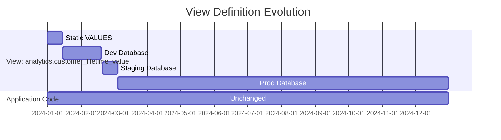
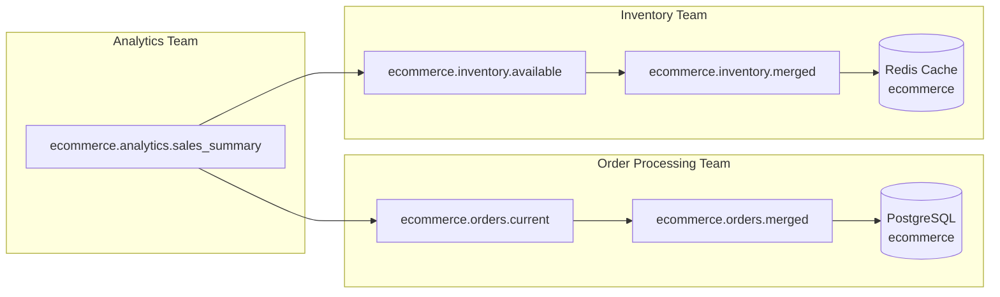
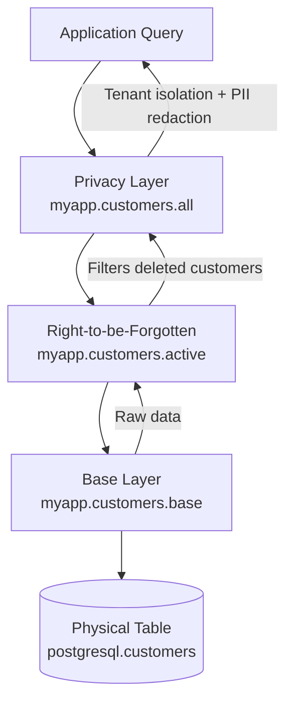
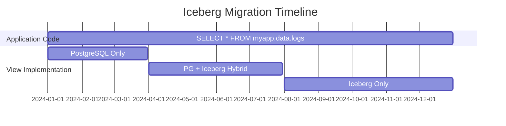

---

## Use Cases: When Virtual Views Shine

1. [Rapid Prototyping](#use-case-1-rapid-prototyping)
2. [Testing Data Edge Cases](#use-case-2-testing-data-edge-cases)
3. [Zero-Downtime Schema Evolution](#use-case-3-zero-downtime-schema-evolution)
4. [Modular Storage for Features and Agents](#use-case-4-modular-storage-for-features-and-agents)
5. [Runtime Configuration Switching](#use-case-5-runtime-configuration-switching)
6. [Ensuring Privacy and Compliance](#use-case-6-ensuring-privacy-and-compliance)
7. [Extending Applications to Iceberg](#use-case-7-extending-applications-to-iceberg)
8. [Cost and Availability Routing](#use-case-8-cost-and-availability-routing)

---

### Use Case 1: Rapid Prototyping

**The Challenge**: Build and test application logic before infrastructure exists and before physical schemas are finalized.

**The Solution**: Define static datasets that enable UI development, business logic validation, and stakeholder demos without deploying or configuring any databases.

**Simple example**:
```sql
-- Day 1: No database yet, use static data
CREATE VIEW myapp.customers.all SECURITY INVOKER AS
SELECT * FROM (VALUES
  (1, 'Acme Corp', 'acme@example.com'),
  (2, 'Widgets Inc', 'widgets@example.com'),
  (3, 'Gadgets LLC', 'gadgets@example.com')
) AS t (customer_id, company_name, email);

-- Application development proceeds
-- UI, business logic, tests all work against this view

-- Day 30: Database ready, swap in real data
CREATE OR REPLACE VIEW myapp.customers.all SECURITY INVOKER AS
SELECT
  CAST(id AS BIGINT) as customer_id,
  CAST(name AS VARCHAR) as company_name,
  CAST(email AS VARCHAR) as email
FROM postgresql.myapp.customers;

-- Application code: unchanged
```

**Realistic example**:
```sql
-- Prototyping a new analytics feature
-- Requires joining customer, order, and product data
-- Some tables don't exist yet, some APIs not ready

-- Start with mock data for all sources
CREATE VIEW analytics.reports.customer_lifetime_value SECURITY INVOKER AS
SELECT
  customer_id,
  SUM(order_total) as lifetime_value,
  COUNT(*) as order_count,
  MAX(order_date) as last_order_date
FROM (VALUES
  (1, 100.00, DATE '2024-01-01'),
  (1, 250.00, DATE '2024-02-15'),
  (2, 75.00, DATE '2024-01-10'),
  (2, 125.00, DATE '2024-02-20'),
  (2, 200.00, DATE '2024-03-01')
) AS mock_orders (customer_id, order_total, order_date)
GROUP BY customer_id;

-- Build dashboards, test business logic, validate with stakeholders
-- Only implement real data pipelines after prototype is approved

-- Later: Swap to real, complex query
CREATE OR REPLACE VIEW analytics.reports.customer_lifetime_value SECURITY INVOKER AS
SELECT
  c.customer_id,
  SUM(o.total) as lifetime_value,
  COUNT(o.order_id) as order_count,
  MAX(o.order_date) as last_order_date
FROM postgresql.myapp.customers c
JOIN postgresql.myapp.orders o ON c.customer_id = o.customer_id
WHERE o.status IN ('completed', 'shipped')
GROUP BY c.customer_id;
```

**Progression stages**:
1. **Static VALUES**: UI and business logic development
2. **Test database**: Integration testing
3. **Staging database**: Beta testing with real-like data
4. **Production database**: Live traffic
5. **Hybrid (optional)**: Add Iceberg for scale

**Timeline visualization**:


**Benefits**:
- Start building before infrastructure is ready
- Validate requirements with stakeholders using realistic UI
- Avoid wasting time on infrastructure for features that get cancelled
- Smooth transition from prototype to first implementation

---

### Use Case 2: Testing Data Edge Cases

**The Challenge**: Test application behavior with edge cases like null values, invalid enums, duplicate keys, and broken foreign keys without configuring database servers or creating an alternate version of the schema.

**The Solution**: Define static datasets with deliberately invalid data that would violate database constraints, enabling comprehensive edge case testing, without the hassle of disabling schema enforcement.

**Simple example**:
```sql
-- Production view
CREATE VIEW myapp.products.all SECURITY INVOKER AS
SELECT
  CAST(product_id AS BIGINT) as product_id,
  CAST(name AS VARCHAR) as name,
  CAST(price AS DECIMAL(10,2)) as price,
  CAST(inventory_count AS INTEGER) as inventory_count
FROM postgresql.myapp.products;

-- Test view with edge cases
CREATE OR REPLACE VIEW myapp.products.all SECURITY INVOKER AS
SELECT * FROM (VALUES
  (1, 'Normal Product', 10.00, 100),
  (2, 'Zero Price', 0.00, 50),          -- Edge case
  (3, 'Negative Inventory', 5.00, -10), -- Edge case
  (4, NULL, 15.00, 20),                 -- NULL name
  (5, 'Very Long Name That Might Break UI Components Because It Is Extremely Long', 15.00, 5)
) AS t (product_id, name, price, inventory_count);

-- Switch between production and test by replacing view definition
```

**Realistic example with git-based configuration**:

ViewZoo's filesystem-based storage enables powerful testing workflows:

```bash
# Production branch: Real database views
git checkout main
/var/trino/views/myapp/orders/all.json:
{
  "viewSql": "SELECT * FROM postgresql.prod.orders"
}

# Test branch: Static edge-case data
git checkout feature/test-edge-cases
/var/trino/views/myapp/orders/all.json:
{
  "viewSql": "SELECT * FROM (VALUES 
    (1, 100, 999999.99, 'pending'),  -- Very large amount
    (2, 101, 0.01, 'completed'),      -- Tiny amount
    (3, 102, NULL, 'shipped'),        -- NULL amount
    (4, NULL, 50.00, 'pending')       -- NULL customer
  ) AS t (order_id, customer_id, total, status)"
}

# Developer switches branches, ViewZoo reads new definitions immediately
# No database updates needed
# Each developer can have custom test data in their local branch
```

**Benefits with git-based views**:
- Version control for test scenarios
- Pull requests for test case additions
- Per-developer test configurations
- Easy rollback to previous test states
- CI/CD integration for automated testing

**Runtime configuration example**:
```python
def configure_test_mode(config):
    """Update view definitions based on test configuration"""
    
    if config.test_mode == 'edge_cases':
        execute_sql("""
            CREATE OR REPLACE VIEW myapp.payment_gateway SECURITY INVOKER AS
            SELECT * FROM (VALUES
              ('timeout', 'TIMEOUT', NULL),
              ('decline', 'DECLINED', 'Insufficient funds'),
              ('error', 'ERROR', 'Gateway unavailable')
            ) AS t (transaction_id, status, error_message)
        """)
    elif config.test_mode == 'production':
        execute_sql("""
            CREATE OR REPLACE VIEW myapp.payment_gateway SECURITY INVOKER AS
            SELECT transaction_id, status, error_message
            FROM payments_api.transactions
        """)

# Switch modes without code changes
configure_test_mode(current_config)
```

**Benefits**:
- Test failure scenarios safely
- Validate edge case handling
- No risk of corrupting production data
- Easy to switch between test and production modes
- Git branches enable team collaboration on test scenarios

---

### Use Case 3: Zero-Downtime Schema Evolution

**The Challenge**: Migrate between schema versions without application downtime, and without copying or reimporting existing datasets.

**The Solution**: Incrementally change a view hierarchy, or create an updated copy of a view hierarchy, to enable schema migrations without downtime or interrupting any queries. 

**Simple example**:
```sql
-- Original physical schema (poor naming)
-- postgresql.myapp.users_v1 (columns: userid, fname, lname, addr)

-- Virtual view provides better names
CREATE VIEW myapp.users.all SECURITY INVOKER AS
SELECT
  userid as user_id,
  fname as first_name,
  lname as last_name,
  addr as address
FROM postgresql.myapp.users_v1;

-- Later: Migrate to improved physical schema
-- postgresql.myapp.users_v2 (columns: user_id, first_name, last_name, street_address)

-- Update view, application unchanged
CREATE OR REPLACE VIEW myapp.users.all SECURITY INVOKER AS
SELECT
  user_id,
  first_name,
  last_name,
  street_address as address
FROM postgresql.myapp.users_v2;
```

**Realistic example with backward compatibility**:
```sql
-- V1 schema: Monolithic user table
CREATE VIEW myapp.users.all SECURITY INVOKER AS
SELECT
  CAST(user_id AS BIGINT) as user_id,
  CAST(email AS VARCHAR) as email,
  CAST(first_name AS VARCHAR) as first_name,
  CAST(last_name AS VARCHAR) as last_name,
  CAST(address AS VARCHAR) as address,
  CAST(city AS VARCHAR) as city,
  CAST(state AS VARCHAR) as state,
  CAST(zip AS VARCHAR) as zip
FROM postgresql.myapp.users_v1;

-- V2 schema: Normalized into users + addresses tables
-- Keep backward compatibility during migration
CREATE OR REPLACE VIEW myapp.users.all SECURITY INVOKER AS
SELECT
  CAST(u.user_id AS BIGINT) as user_id,
  CAST(u.email AS VARCHAR) as email,
  CAST(u.first_name AS VARCHAR) as first_name,
  CAST(u.last_name AS VARCHAR) as last_name,
  CAST(a.street AS VARCHAR) as address,
  CAST(a.city AS VARCHAR) as city,
  CAST(a.state AS VARCHAR) as state,
  CAST(a.zip AS VARCHAR) as zip
FROM postgresql.myapp.users_v2 u
LEFT JOIN postgresql.myapp.addresses_v2 a
  ON u.user_id = a.user_id
  AND a.is_primary = true;

-- V3 schema: Changed email validation, need to handle legacy bad data
CREATE OR REPLACE VIEW myapp.users.all SECURITY INVOKER AS
SELECT
  CAST(u.user_id AS BIGINT) as user_id,
  CAST(
    CASE
      WHEN u.email LIKE '%@%' THEN u.email
      ELSE u.legacy_email  -- Fallback for pre-validation data
    END AS VARCHAR
  ) as email,
  CAST(u.first_name AS VARCHAR) as first_name,
  CAST(u.last_name AS VARCHAR) as last_name,
  CAST(a.street AS VARCHAR) as address,
  CAST(a.city AS VARCHAR) as city,
  CAST(a.state AS VARCHAR) as state,
  CAST(a.zip AS VARCHAR) as zip
FROM postgresql.myapp.users_v3 u
LEFT JOIN postgresql.myapp.addresses_v3 a
  ON u.user_id = a.user_id
  AND a.is_primary = true;
```

**Important**: When updating multiple layers in a hierarchy, always replace bottom-up to avoid temporary inconsistencies:

```sql
-- Replace base layer first
CREATE OR REPLACE VIEW myapp.internal.users_base AS ...;

-- Then middle layer
CREATE OR REPLACE VIEW myapp.internal.users_enriched AS ...;

-- Finally top layer
CREATE OR REPLACE VIEW myapp.users AS ...;
```

This ensures dependent views always have valid sources to query from during replacement.

**Benefits**:
- Evolve schemas without application deployments
- Support gradual migrations with parallel systems
- Maintain backward compatibility during transitions
- Hide physical schema complexity from applications

---

### Use Case 4: Modular Storage for Features and Agents

**The Challenge**: Multiple teams need independent control over designing, implementing, and migrating their view hierarchies, with minimal coordination needed with other teams.

**The Solution**: Create isolated view hierarchies per feature or agent, enabling teams to develop, test, and deploy their data layers independently without cross-team coordination or risk of breaking changes.

**Example**:
```sql
-- Feature 1: Order Processing (owned by checkout team)
CREATE VIEW ecommerce.orders.current AS ...;
CREATE VIEW ecommerce.orders.historical AS ...;
CREATE VIEW ecommerce.orders.merged AS ...;

-- Feature 2: Inventory Management (owned by warehouse team)
CREATE VIEW ecommerce.inventory.available AS ...;
CREATE VIEW ecommerce.inventory.reserved AS ...;
CREATE VIEW ecommerce.inventory.merged AS ...;

-- Feature 3: Analytics (owned by data team, may reference others)
CREATE VIEW ecommerce.analytics.sales_summary AS ...;
CREATE VIEW ecommerce.analytics.inventory_turnover AS ...;
```

**Architecture visualization**:


**Benefits**:
- Teams work independently without coordination
- Clear ownership boundaries per feature
- Easy to understand scope and blast radius of changes
- Features can be developed, tested, and deployed independently
- Reduces cross-team dependencies and bottlenecks

**Development Environment Isolation**:
- Each developer gets own catalog with custom view definitions
- Test schema changes without affecting team
- Merge view definitions like code via pull requests

---

### Use Case 5: Runtime Configuration Switching

**The Challenge**: Need to dynamically switch between different data sources based on feature flags, environment, or runtime configuration without redeploying application code.

**The Solution**: Programmatically replace view definitions based on runtime configuration, enabling feature flags, A/B testing, and environment switching (dev/staging/prod), without having to restart the applications.

**Example with programmatic switching**:
```python
def configure_data_layer(config):
    """Update view definitions based on current configuration"""

    if config.feature_flags.get('use_iceberg'):
        # Production with Iceberg
        execute_sql("""
            CREATE OR REPLACE VIEW myapp.events.all SECURITY INVOKER AS
            SELECT * FROM iceberg.warehouse.events
        """)
    elif config.environment == 'staging':
        # Staging database
        execute_sql("""
            CREATE OR REPLACE VIEW myapp.events.all SECURITY INVOKER AS
            SELECT * FROM postgresql.staging.events
        """)
    elif config.environment == 'development':
        # Static test data
        execute_sql("""
            CREATE OR REPLACE VIEW myapp.events.all SECURITY INVOKER AS
            SELECT * FROM (VALUES
              (1, 'test', CURRENT_TIMESTAMP)
            ) AS t (id, event, ts)
        """)
    else:
        # Production PostgreSQL
        execute_sql("""
            CREATE OR REPLACE VIEW myapp.events.all SECURITY INVOKER AS
            SELECT * FROM postgresql.prod.events
        """)

# Called at application startup or when config changes
configure_data_layer(current_config)
```

**Git-based switching with ViewZoo**:
```bash
# Feature flag: Enable Iceberg backend
git checkout feature/iceberg-storage

# ViewZoo reads updated view definitions from filesystem
# No programmatic CREATE OR REPLACE needed
# Just switch branches and restart Trino workers

# A/B test: 50% of traffic to new backend
# Use separate Trino clusters reading different git branches
```

**Use cases**:
- Feature flags for gradual rollout of new data sources
- Environment-specific configurations (dev/staging/prod)
- Debug mode with synthetic data
- A/B testing different storage backends for performance
- Per-customer configurations in multi-tenant systems

**Benefits**:
- Zero code deployment for configuration changes
- Safe experimentation with new data sources
- Easy rollback via configuration or git branch
- Support multiple environments from single codebase

**Feature Flagging Data Sources**:
- Programmatically enable/disable data sources via view replacement
- Gradually roll out new connectors to subset of users
- A/B test different storage backends for performance comparison

**Gradual Connector Migration**:
- Move from MySQL to PostgreSQL table by table
- UNION old and new sources during transition period
- Eventually remove old source when migration complete
---

### Use Case 6: Ensuring Privacy and Compliance

**The Challenge**: Implement tenant isolation, right-to-be-forgotten filtering, and PII redaction without having to repeat these restrictions in every query.

**The Solution**: Enforce system-wide privacy rules and tenant isolation using dedicated layers in view hierarchies, providing a central audit point for compliance that applies automatically to all queries.

**Simple example**:
```sql
-- Base data layer
CREATE VIEW myapp.logs.raw SECURITY INVOKER AS
SELECT
  log_id, event_type, user_id,
  user_email, ip_address, event_time
FROM postgresql.myapp.logs;

-- Privacy layer (redact PII except for admins)
CREATE VIEW myapp.logs.all SECURITY INVOKER AS
SELECT
  log_id, event_type, user_id,
  -- Redact email and IP unless admin
  CASE WHEN is_admin() THEN user_email ELSE 'REDACTED' END as user_email,
  CASE WHEN is_admin() THEN ip_address ELSE 'REDACTED' END as ip_address,
  event_time
FROM myapp.logs.raw;
```

**Realistic example with multi-layer compliance**:
```sql
-- Multi-tenant SaaS application
-- Requirements: tenant isolation, right-to-be-forgotten, PII redaction

-- Base data layer (all tenants, all customers)
CREATE VIEW myapp.customers.base SECURITY INVOKER AS
SELECT
  customer_id, tenant_id, email, name,
  address, phone, deleted_at
FROM postgresql.myapp.customers;

-- Right-to-be-forgotten filtering layer
CREATE VIEW myapp.customers.active SECURITY INVOKER AS
SELECT
  customer_id, tenant_id, email, name, address, phone
FROM myapp.customers.base
WHERE deleted_at IS NULL
  AND customer_id NOT IN (
    SELECT customer_id
    FROM postgresql.myapp.deletion_requests
    WHERE status = 'approved'
  );

-- Application entry point (with tenant isolation + PII redaction)
CREATE VIEW myapp.customers.all SECURITY INVOKER AS
SELECT
  customer_id, email, name,
  -- Redact address for non-privileged users
  CASE
    WHEN is_privileged_user() THEN address
    ELSE 'REDACTED'
  END as address,
  phone
FROM myapp.customers.active
WHERE tenant_id = current_tenant_id() OR is_superuser();
```

**Benefits**:
- Single point of control for privacy rules
- Enforce compliance without trusting application code
- Easy to audit (one view to review, not hundreds of queries)
- Update privacy rules without application deployment



---

### Use Case 7: Extending Applications to Iceberg

**The Challenge**: Existing application runs on PostgreSQL (or MySQL, etc.). Want to add Iceberg for cost-effective long-term storage, but can't rewrite application code. Need seamless transition, no downtime, no dual codebases.

**The Solution**: Replace physical table references with virtual views pointing to legacy storage, then optionally add Iceberg using `UNION ALL` for historical data, without requiring any changes to application queries.

**Phase 1: Establish the abstraction**

Before:
```sql
-- Application queries physical table directly
SELECT * FROM postgresql.myapp.logs WHERE event_time > ?
```

After:
```sql
-- Create virtual view as intermediary
CREATE VIEW myapp.data.logs SECURITY INVOKER AS
SELECT
  CAST(id AS BIGINT) as log_id,
  CAST(event AS VARCHAR) as event_type,
  CAST(timestamp AS TIMESTAMP(3)) as event_time,
  CAST(user_id AS BIGINT) as user_id
FROM postgresql.myapp.logs;

-- Application code changes once (connection string only)
-- Now queries: SELECT * FROM myapp.data.logs WHERE event_time > ?
```

**Phase 2: Add Iceberg in hybrid mode**

```sql
-- Union PostgreSQL (hot, recent data) with Iceberg (cold, historical)
CREATE OR REPLACE VIEW myapp.data.logs SECURITY INVOKER AS
-- Recent data still in PostgreSQL
SELECT log_id, event_type, event_time, user_id
FROM postgresql.myapp.logs
WHERE event_time > CURRENT_DATE - INTERVAL '30' DAYS
  AND replicated = false
UNION ALL
-- Historical data in Iceberg
SELECT log_id, event_type, event_time, user_id
FROM iceberg.myapp.logs
WHERE event_time <= CURRENT_DATE - INTERVAL '30' DAYS;
```

Zero application changes. Behind the scenes, a replication job moves old data from PostgreSQL to Iceberg and marks rows as replicated.

**Phase 3: Eventually migrate entirely (optional)**

```sql
-- Once all data is in Iceberg and PostgreSQL is ready to decommission
CREATE OR REPLACE VIEW myapp.data.logs SECURITY INVOKER AS
SELECT log_id, event_type, event_time, user_id
FROM iceberg.myapp.logs;
```

**What we're NOT covering**: How replication works, Iceberg table maintenance, partition strategies, compaction. This manifesto focuses on the view architecture that enables migration.

**Benefits**:
- Zero application downtime during migration
- No "big bang" rewrite risk
- Test Iceberg integration incrementally
- Rollback is trivial (replace view definition)
- Works with monoliths and microservices



---

### Use Case 8: Cost and Availability Routing

**The Challenge**: Database dependencies are typically hardcoded, making it difficult to handle peak loads, service outages, or cost optimization without modifying and redeploying the application.

**The Solution**: Reconfigure views at runtime to dynamically route between closest/fastest live sources, cached layers, and static fallback datasets based on availability and load conditions, providing resilience and cost control without code changes.

**Simple example**:
(Fallback from live payment gateway to static "service unavailable" dataset)

**Realistic example**:
(Multi-tier routing with Redis cache → PostgreSQL → S3 cold storage based on query patterns and service health)
