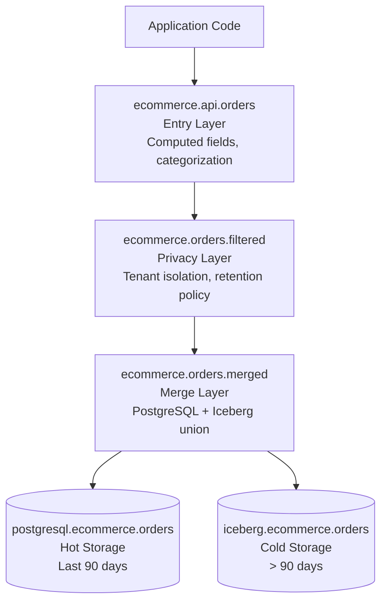

---

## Implementation Guide

### Helpful Strategies

* **Start small**: Pick one feature. Create one virtual view with static data. Build your application against it. Prove the concept works in your environment.
* **Build incrementally**: Don't design a complex 5-layer hierarchy on day one. Add layers as needs emerge. Refactor when complexity justifies abstraction.
* **Document relentlessly**: View dependencies are invisible in code. Use ViewMapper to generate diagrams. Write READMEs. Update documentation when views change. Future you will thank current you.
* **Share your patterns**: If you discover useful patterns not covered here, share them with the community. Open issues, write blog posts, give talks. This manifesto is a starting point, not the final word.
* **Question assumptions**: When writing application code that queries physical tables directly, ask: "Should this be a virtual view?" Sometimes the answer is no (performance, exploration, legacy constraints). Often it's yes (flexibility, evolution, abstraction).
* **Remember the goal**: Virtual views aren't about purity or perfection. They're about making evolution easier. Choose pragmatism over dogma.

### Getting Started Checklist

- [ ] Choose view storage location (Iceberg/ViewZoo/other)
- [ ] Create application catalog structure
- [ ] Update application connection string
- [ ] Define initial view with static data
- [ ] Build application against view interface
- [ ] Verify application queries work with mock data
- [ ] Swap in real data source
- [ ] Document view ownership and update procedures
- [ ] Set up ViewMapper for dependency visualization

### Setup: Choose Your Foundation

Before building virtual views, establish your infrastructure foundation.

**Choose View Storage**

Follow Principle 7 decision tree. Most common choices:

**Use Iceberg if**: Already using it or definitely will within 6 months
**Use ViewZoo if**: Maximum flexibility, git integration desired, no external dependencies
**Use existing connector if**: Have stable PostgreSQL/MySQL that won't disappear

**ViewZoo setup**: See [github.com/robfromboulder/viewzoo](https://github.com/robfromboulder/viewzoo) for installation.

**Git Integration** (if using ViewZoo):
```bash
# Initialize git repository for view definitions
cd /var/trino/views
git init
git remote add origin git@github.com:yourorg/trino-views.git

# Create branch structure
git checkout -b main
git checkout -b staging
git checkout -b development

# View definitions are now version controlled
# Pull requests for view changes
# Rollback via git history
```

**Create Application Catalog**:
```sql
-- Create schemas for your application
CREATE SCHEMA IF NOT EXISTS myapp.data;
CREATE SCHEMA IF NOT EXISTS myapp.orders;
CREATE SCHEMA IF NOT EXISTS myapp.api;
```

**Update Application Connection**:
```java
// Before: Direct PostgreSQL connection
Connection conn = DriverManager.getConnection(
    "jdbc:trino://localhost:8080/postgresql/myapp_schema"
);

// After: Application catalog connection
Connection conn = DriverManager.getConnection(
    "jdbc:trino://localhost:8080/myapp/data"
);

// Queries unchanged
ResultSet rs = conn.createStatement().executeQuery(
    "SELECT * FROM users WHERE user_id = 1"
);
```

### Complete Example: E-commerce Application

**Scenario**: E-commerce application needs order data. Starts as prototype, moves to PostgreSQL, eventually adds Iceberg for historical orders.

#### Phase 1: Prototype (Week 1)

**Goal**: Build UI and business logic before infrastructure exists.

```sql
-- Static test data, no database needed
CREATE VIEW ecommerce.orders.all AS
SELECT * FROM (VALUES
  (1, 101, 50.00, 'pending', TIMESTAMP '2024-01-01 10:00:00'),
  (2, 102, 75.00, 'shipped', TIMESTAMP '2024-01-01 11:00:00'),
  (3, 101, 120.00, 'delivered', TIMESTAMP '2024-01-02 09:00:00')
) AS t (order_id, customer_id, total, status, created_at);

-- Application code
SELECT * FROM ecommerce.orders.all [WHERE status = 'pending'];
```

UI development, business logic tests, stakeholder demos all work with this mock data.

#### Phase 2: PostgreSQL Development (Week 3)

**Goal**: Connect to real database, validate with real data patterns.

```sql
-- Swap to development PostgreSQL
CREATE OR REPLACE VIEW ecommerce.orders.all AS
SELECT
  CAST(order_id AS BIGINT) as order_id,
  CAST(customer_id AS BIGINT) as customer_id,
  CAST(total_amount AS DECIMAL(10,2)) as total,
  CAST(order_status AS VARCHAR) as status,
  CAST(created_at AS TIMESTAMP(3)) as created_at
FROM postgresql.ecommerce.orders;

-- Application code unchanged
SELECT * FROM ecommerce.orders.all [WHERE status = 'pending'];
```

#### Phase 3: PostgreSQL Production (Week 8)

**Goal**: Launch to customers.

```sql
-- Point to production database
CREATE OR REPLACE VIEW ecommerce.orders.all AS
SELECT
  CAST(order_id AS BIGINT) as order_id,
  CAST(customer_id AS BIGINT) as customer_id,
  CAST(total_amount AS DECIMAL(10,2)) as total,
  CAST(order_status AS VARCHAR) as status,
  CAST(created_at AS TIMESTAMP(3)) as created_at
FROM postgresql.ecommerce.orders;

-- Application code still unchanged
SELECT * FROM ecommerce.orders.all [WHERE status = 'pending'];
```

#### Phase 4: Add Iceberg for Historical Data (Month 6)

**Goal**: Reduce PostgreSQL costs, move old orders to object storage.

```sql
-- Hybrid: Recent in PostgreSQL, historical in Iceberg
CREATE OR REPLACE VIEW ecommerce.orders.all AS
-- Hot data: Last 90 days in PostgreSQL
SELECT
  CAST(order_id AS BIGINT) as order_id,
  CAST(customer_id AS BIGINT) as customer_id,
  CAST(total_amount AS DECIMAL(10,2)) as total,
  CAST(order_status AS VARCHAR) as status,
  CAST(created_at AS TIMESTAMP(3)) as created_at
FROM postgresql.ecommerce.orders
WHERE created_at > CURRENT_DATE - INTERVAL '90' DAYS
  AND replicated = false
UNION ALL
-- Cold data: Older than 90 days in Iceberg
SELECT
  CAST(order_id AS BIGINT) as order_id,
  CAST(customer_id AS BIGINT) as customer_id,
  CAST(total_amount AS DECIMAL(10,2)) as total,
  CAST(order_status AS VARCHAR) as status,
  CAST(created_at AS TIMESTAMP(3)) as created_at
FROM iceberg.ecommerce.orders
WHERE created_at <= CURRENT_DATE - INTERVAL '90' DAYS;

-- Application code STILL unchanged
SELECT * FROM ecommerce.orders.all [WHERE status = 'pending'];
```

Behind the scenes, a replication job:
1. Identifies orders > 90 days old
2. Copies them to Iceberg
3. Marks as `replicated = true` in PostgreSQL
4. Eventually deletes from PostgreSQL (optional)

#### Phase 5: Build View Hierarchy (Month 12)

**Goal**: Add privacy layer, separate concerns, enable independent updates.

```sql
-- Storage merge layer (copied from Phase 4, but under a new name)
CREATE VIEW ecommerce.orders.merged AS
-- Hot data in PostgreSQL
SELECT
  CAST(order_id AS BIGINT) as order_id,
  CAST(customer_id AS BIGINT) as customer_id,
  CAST(total_amount AS DECIMAL(10,2)) as total,
  CAST(order_status AS VARCHAR) as status,
  CAST(created_at AS TIMESTAMP(3)) as created_at,
  CAST(tenant_id AS BIGINT) as tenant_id
FROM postgresql.ecommerce.orders
WHERE created_at > CURRENT_DATE - INTERVAL '90' DAYS
  AND replicated = false
UNION ALL
-- Cold data in Iceberg
SELECT
  CAST(order_id AS BIGINT) as order_id,
  CAST(customer_id AS BIGINT) as customer_id,
  CAST(total_amount AS DECIMAL(10,2)) as total,
  CAST(order_status AS VARCHAR) as status,
  CAST(created_at AS TIMESTAMP(3)) as created_at,
  CAST(tenant_id AS BIGINT) as tenant_id
FROM iceberg.ecommerce.orders
WHERE created_at <= CURRENT_DATE - INTERVAL '90' DAYS;

-- Privacy/security layer (including tenant isolation)
CREATE VIEW ecommerce.orders.filtered AS
SELECT
  order_id, customer_id, total, status, created_at, tenant_id
FROM ecommerce.orders.merged
WHERE
  -- Tenant isolation
  tenant_id = current_tenant_id()
  -- Data retention (2 year policy)
  AND created_at > CURRENT_DATE - INTERVAL '2' YEAR;

-- Application entry point with calculated fields
CREATE VIEW ecommerce.api.orders AS
SELECT
  order_id,
  customer_id,
  total,
  status,
  created_at,
  -- Computed fields
  date_trunc('day', created_at) as order_date,
  CASE
    WHEN status IN ('delivered') THEN 'complete'
    WHEN status IN ('pending', 'processing', 'shipped') THEN 'active'
    WHEN status IN ('cancelled', 'refunded') THEN 'closed'
    ELSE 'other'
  END as order_category
FROM ecommerce.orders.filtered;

-- Swap in new application entry point
CREATE OR REPLACE VIEW ecommerce.orders.all AS SELECT * FROM ecommerce.api.orders;

-- Application code STILL unchanged
SELECT * FROM ecommerce.orders.all [WHERE status = 'pending'];
```

👆 note that because the hierarchy is built in parallel and the application entry point is swapped at the end, there's no disruption to application queries

#### View Dependency Diagram



#### Key Achievements

Throughout this entire evolution:
- Zero application changes as storage changes
- No downtime during any transition
- Rollback possible at any phase (just replace view)
- Different teams own different layers
- Infrastructure complexity completely hidden from application
- Can add more layers later without disrupting existing layers

This is the power of virtual view hierarchies.

### Documentation and Tooling

**Documenting Your Implementation**

Create README in your repository:

```markdown
# MyApp Virtual Views

## View Ownership

| View | Owner | Update Trigger | Contact |
|------|-------|----------------|---------|
| myapp.data.users | Backend Team | Schema changes | @backend-team |
| myapp.data.orders | Backend Team | Schema changes | @backend-team |

## Storage Location

Views stored in: ViewZoo connector (`viewzoo.myapp.*`)

Git repository: git@github.com:yourorg/trino-views.git

## View Dependencies

See [view_dependencies.md] for visualization (generated by ViewMapper)

## Making Changes

1. Create feature branch: `git checkout -b feature/new-view`
2. Update view definition JSON files
3. Test with application
4. Create pull request
5. Merge to main (auto-deploys to production Trino cluster)
```

**Setting Up ViewMapper**

Install and run ViewMapper:

```bash
# See ViewMapper docs for installation
# github.com/robfromboulder/viewmapper

# Generate dependency diagram
viewmapper --catalog myapp --output docs/view_dependencies.md

# Commit to repository
git add docs/view_dependencies.md
git commit -m "Add view dependency visualization"
```
